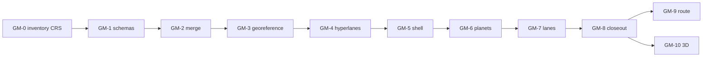

# Kakeman89's Datacron — Galaxy Map Program Roadmap

- **Document title:** Kakeman89's Datacron — Galaxy Map Program Roadmap
- **Date:** 2026-08-18
- **Status:** PLANNING DOCUMENT (controlling program specification). Implementation is separately authorized.
- **Planning-only origin:** This file is the Galaxy Map program master. It is not an implementation report.
- **Phase plans:** `docs/KAKEMAN89S_DATACRON_GALAXY_MAP_PHASE_{0-10}_*_PLAN.md`
- **Datacron master pointer:** dated addendum on `docs/KAKEMAN89S_DATACRON_ROADMAP.md` (append-only). Galaxy Map is **not** Datacron Phase 12.

SESSION DOCUMENT PROTECTION: Files under `ai/sessions/**` are append-only historical records. This Galaxy Map program lives under `docs/` and is the controlling specification for later implementation. Do not rewrite it as an implementation report. Do not delete, renumber, or silently replace Datacron Phases 0–15.

Creator attribution in new Galaxy Map materials: **Kakeman89** only.

## 1. Planning-only status

This document records locked product decisions, source-merge authority, the StarWarsMap coordinate system, GM-0 through GM-10, non-goals, legal posture, and gates.

Do not treat this file as proof that Galaxy Map is complete. Do not start runtime, data-pipeline, Foundry, pack, or packaging work until the maintainer separately authorizes a named GM phase.

## 2. Repository state at planning (2026-08-18)

| Item | Value |
|---|---|
| Repository root | `C:\Users\ckauble\OneDrive - Riverside Bank of Dublin\Documents\GitHub\Kakeman89s_Datacron` |
| Branch | `v.next` tracking `origin/v.next` (ahead 2 at planning) |
| HEAD | `c2271d3fb0ebf3f6d0783e8a972554fa413e9a7f` |
| Latest commit | `Update .gitignore` |
| Parent | `2cacf2c752b1a8d12a3177f850f609ea79fb41f3` |
| `.cursor/` | gitignored; do not modify |
| Datacron Phase 11 | NavComputer Basic complete for authorized Basic scope; Advanced not activated |
| Datacron Phase 12 | Droid Shop Calculator (reserved on the Datacron master). **Do not reuse this number.** |
| Node / Foundry | Do not treat this planning pass as a test run |

**Implementation precondition:** begin a later GM phase from a reviewed checkpoint named in that phase plan. This planning assignment must not commit, push, or change runtime/data files.

## 3. Product identity

Galaxy Map is a **fifth Datacron feature area**, isolated from:

- NavComputer (Basic 81-cell matrix; Advanced graph UI remains deferred)
- AstroCom (JournalEntry packs and ingest pipeline)
- Shipyard
- Droid Shop

Related products may later *read* Galaxy Map JSON. They must not share mutable state, sockets, or templates in GM-0–GM-8.

First shippable slice: **GM-8** (2D pan/zoom map of planets and hyperlanes). Route highlight is **GM-9**. 3D viewer is **GM-10**.

## 4. Locked product decisions

These are closed. Later implementation must not reopen them without a dated addendum on this file.

1. **First shippable viewer is 2D pan/zoom.** Planets as dots, hyperlanes as polylines. No A→B route highlight until GM-9.
2. **JPEG is calibration-only.** `docs/Galactic Map.jpg` is the visual authority for placement checks. It must not be listed in `kakeman89s-datacron/module.json`, copied into the module tree, or included in any Foundry package.
3. **Store 3D coordinates anyway.** Working `x,y` come from the StarWarsMap/CARTO cartesian frame (Coruscant = origin), scaled to parsecs after a JPEG scale-bar measurement; `z = 0` until a later source provides height.
4. **No Wookieepedia scrape.** The Wookieepedia hyperlane-by-region category is a name checklist, not an ingest source. CSV wiki URLs are not scrape seeds and are not packaged as prose.
5. **Numbering is GM-0 … GM-10.** Do not reuse Datacron Phases 12–15.
6. **Runtime stack:** Foundry 13.x, dnd5e 5.2.5, SW5e 1.4.2, JavaScript ES modules, Handlebars, CSS only, no TypeScript, no bundler, no new npm packages, no Leaflet, no Three.js, no StarWarsMap `map_ui` / Flask / NetworkX in Foundry.
7. **Local JSON only at runtime.** Offline Python merge is allowed; Foundry must not call CARTO, GitHub, Wookieepedia, or Flask.
8. **Private-table merge until rights are cleared.** StarWarsMap GitHub `license: null`; swgalaxymap.com full-resolution maps are personal use only; CARTO planets table belongs to Henry Bernberg. Public redistribution of merged datasets remains blocked. This does not block planning or private-table implementation after separate authorization.
9. **Do not change Phase 11 Basic.** The 81-cell matrix, house-rule resource profile, and NavComputer Advanced deferral stay in force.

## 5. Why this is a merge

Most catalog and geometry work already exists in the repository. Galaxy Map merges it into versioned runtime JSON and a Foundry ApplicationV2 canvas.

```mermaid
flowchart TB
  jpeg["Galactic Map.jpg - calibration only"]
  parzivail["parzivail / xlsx / Google sheet - names grid sector region"]
  csv["StarWarsMap planets.csv - CARTO Henry Bernberg"]
  swmap["grid_db + regions_db cartesian x y + is_canon"]
  lanes["hyperlanes_db.json - 60 ordered named runs"]
  geojson["hyperspace_singlepart_new.json - curved map traces"]
  modulePlanets["module data/planets.json"]
  graph["data/hyperspace-routes.json"]
  schema["galaxymap planets.v1 + hyperlanes.v1"]
  viewer["Foundry ApplicationV2 2D canvas"]
  jpeg --> schema
  parzivail --> schema
  csv --> swmap
  swmap --> schema
  lanes --> schema
  geojson --> schema
  modulePlanets --> schema
  graph --> schema
  schema --> viewer
```

### 5.1 Source inventory (planning-time; GM-0 counts exactly)

| Source | Path / URL | Role |
|---|---|---|
| JPEG | `docs/Galactic Map.jpg` | Placement calibration; not packaged |
| Spreadsheet family | `docs/Star Wars Galaxy Map Grid Coordinates.xlsx`; root `planets.json`; [parzivail/SWGalacticMap](https://github.com/parzivail/SWGalacticMap); Google sheet | Names, grid labels, sector, region, coarse `X/Y/SubGrid` |
| StarWarsMap JSON | `StarWarsMap/map_api/data/grid_db.json`, `regions_db.json`, `hyperlanes_db.json` | Cartesian `coords`, `is_canon`, 60 named-lane lists |
| StarWarsMap CSV | Upstream `map_api/data/planets.csv` (~2173 rows). **Not vendored locally at planning.** | CARTO decode; column map in §7 |
| GeoJSON | `hyperspace_singlepart_new.json` | Curved lane traces (JPEG dashed routes) |
| Module planets | `kakeman89s-datacron/data/planets.json` (~2029) | NavComputer/AstroCom identity; do not replace in GM-1 |
| Existing graph | `kakeman89s-datacron/data/hyperspace-routes.json` | GM-0 compare vs StarWarsMap hops; GM-9 candidate |
| Aliases | `kakeman89s-datacron/data/starwarsmap/planet-name-aliases.json` | Name reconciliation |
| Transform notes | `docs/hyperspace-coordinate-transform.md` | Existing affine/control-point pipeline |
| Method refs | [Sigon hyperspace routes](https://sigon.gitlab.io/post/2020-05-30-hyperspace-routes/); Wookieepedia category as checklist only | Dijkstra-on-GeoJSON method; name checklist |

### 5.2 Authority when sources disagree

Locked in GM-0; applied in GM-2/3/4.

1. **Visual placement (dots):** StarWarsMap/CARTO cartesian `coords`, then JPEG overlay check. Do not reconstruct placement from parzivail `X+SubGridX` unless cartesian is missing.
2. **Grid / sector / region labels:** parzivail / spreadsheet / JPEG. StarWarsMap grid strings can disagree (Coruscant `K-9` in CARTO vs `L-9` on the JPEG; coords sit on the shared cell corner at origin).
3. **Named-lane topology:** `StarWarsMap/map_api/data/hyperlanes_db.json` — hand-authored, not generated by `json_from_csv.py`.
4. **Lane display shape:** GeoJSON curves. Fallback: StarWarsMap straight chords through consecutive stop coordinates.
5. **Canon flag:** StarWarsMap `is_canon` from the CARTO CSV.
6. **Travel hours / NavComputer matrix:** out of Galaxy Map scope.

## 6. StarWarsMap analysis (2026-08-18)

Source: [Wason1797/StarWarsMap](https://github.com/Wason1797/StarWarsMap). README uses [swgalaxymap.com](http://www.swgalaxymap.com/search/) as the visual reference and [Henry Bernberg’s CARTO planets table](https://hbernberg.carto.com/tables/planets/public) as the CSV. GitHub `license: null`. Last push observed in prior audit: 2023-01-08.

Reuse **data and algorithms**. Do not vendor `map_ui` (React, Three.js, `STARWARS.TTF`) or `map_api` (Flask, NetworkX, matplotlib) into the Foundry module.

### 6.1 Coordinate system

From `map_api/app/constants.py` and `universe_components.py`:

```text
GRID_ALPHABET_TRANSFORM: A–X → -11 … +12
GRID_NUMBER_TRANSFORM:   1–22 → +8 … -13   (row 1 is +Y / north)
GRID_SIDE = 100
```

- Origin: Coruscant cartesian `[0, 0]` (verified in local `grid_db.json`).
- Cell `L-9`: `[0,100] × [0,100]`. Cell `K-9`: `[-100,0] × [0,100]`.
- Planet `coords` are digitized CSV columns 7–8, not parzivail subgrid math. Tatooine `[644.386, -673.274]`. Naboo `[334.442, -707.231]`.
- Parsec scale (verify in GM-3): JPEG scale bar ~3000 pc ≈ 1.5 squares → ~2000 pc / square → **~20 pc per StarWarsMap unit**. Not proven until the bar is measured in pixels.
- Stored 3D: `{x, y, z: 0}` in this frame, then scaled to parsecs. Same lift as StarWarsMap UI (`z` appended as 0).

CSV WKB (SRID 4326) trailing lon/lat-like columns do **not** match `kakeman89s-datacron/data/hyperspace-control-points.json` (Tatooine CSV ≈ `-66.8, 86.8` vs GeoJSON control ≈ `31.45, -54.05`). Treat cartesian `coords` and GeoJSON lon/lat as two Bernberg-family frames. Both still need JPEG affine fits.

### 6.2 Hyperlanes

- 60 named runs in `hyperlanes_db.json`, each an ordered planet-name list.
- Graph edges: consecutive pairs; weight = Euclidean distance.
- Their UI draws **chords**, not GeoJSON curves.
- Datacron already normalizes `Corellinan Run`, `Way Of Schesa`, `Path Of The Houses`.
- Upstream issue #32 (open): unnamed JPEG lane Triton–Xagobah–Kabal–Sharlissia is missing. Unnamed GeoJSON remains a second display layer.

### 6.3 Connectivity algorithm (GM-9)

From `edge_generator.py` / `graph_factory.py`. Cite this instead of inventing a new connector model:

1. Named-lane consecutive edges.
2. Off-lane worlds within one grid cell (`distance <= GRID_SIDE`) connect to the nearest lane world; weight `*= NO_HYPERLANE_DISTANCE_FACTOR` (1000).
3. Isolates: Last Resort Route (same 1000× penalty).
4. Separate components: Component Artificial Route (same penalty).
5. Shortest path: Dijkstra on those weights. Click origin then destination to highlight.

GM-0 compares this hop set to `hyperspace-routes.json` rather than blindly regenerating.

### 6.4 UI behaviors to copy in spirit

- Hover planet → name (GM-6).
- Vector grid squares from `GRID_*` (GM-5) so the JPEG grid exists without shipping the JPEG.
- Optional convex-hull region/sector outlines.
- Optional major-lane colors from `MapConstants.ROUTE_COLOR` (styling hint only).
- Click two planets → path (GM-9 only).

### 6.5 Explicitly do not take

- `map_ui/public/fonts/STARWARS.TTF`
- Flask `/planets` or `/hyperlanes/shortest-path` as a Foundry dependency
- matplotlib `plotgraph` as the Foundry viewer
- Wiki URLs from the CSV as packaged prose

## 7. CSV column map (offline ingest)

From StarWarsMap `json_from_csv.py`. Use as a decoder; do not port Flask.

| Index | Field |
|---|---|
| 1 | sector |
| 3 | planet name |
| 6 | grid |
| 7–8 | cartesian x, y |
| 10 | region |
| 11 | `is_canon` (int) |

Duplicate names are skipped upstream (`already_used_planets`). GM-2 must report skipped duplicates.

## 8. Program phases

| Phase | Title | First shippable? |
|---|---|---|
| GM-0 | Inventory, CRS, provenance, name identity | No |
| GM-1 | Canonical schemas | No |
| GM-2 | Offline merge pipeline | No |
| GM-3 | Georeference JPEG and emit 3D coordinates | No |
| GM-4 | Hyperlane geometry alignment | No |
| GM-5 | Foundry 2D map shell | No |
| GM-6 | Planet layer | No |
| GM-7 | Static hyperlane layer | No |
| GM-8 | First shippable map closeout | **Yes** |
| GM-9 | Route overlay | Later |
| GM-10 | 3D viewer | Later |

Each phase has a controlling plan under `docs/`. Implementation of a phase requires a separate maintainer authorization naming that phase.

### GM-0 — Inventory, CRS, provenance, name identity

Census of every source; lock CRS from StarWarsMap constants; name/alias identity; legal/package gates; hop-set compare vs `hyperspace-routes.json`. No runtime code.

### GM-1 — Canonical schemas

Versioned files under `kakeman89s-datacron/data/galaxymap/`:

- `planets.v1.json` — stableId, display name, aliases, grid, sector, region, `is_canon`, `position: {x,y,z}`, placement confidence, source citations (ids only)
- `hyperlanes.v1.json` — stableId, name, classification/tier, ordered stop ids, display polyline xyz (GeoJSON curve or chord fallback), geometry confidence, `unnamed` flag for JPEG-only traces
- JSON Schema + Node validators
- Do not replace NavComputer `planets.json`

### GM-2 — Offline merge pipeline

Python, following `scripts/build-hyperspace-graph.py`. Ingest spreadsheet family, StarWarsMap JSON, `planets.csv` if added, module planets, aliases. Conflict reports including Coruscant `K-9` vs `L-9`. Runtime unused.

### GM-3 — Georeference JPEG and emit 3D coordinates

Affine-fit StarWarsMap cartesian onto JPEG pixels. Separately fit GeoJSON lon/lat onto the same frame. Measure scale bar. Output `{x,y,z:0}`. Never package JPEG or geoTIFF.

### GM-4 — Hyperlane geometry alignment

Topology = consecutive `hyperlanes_db` stops. Display = GeoJSON curve else chords. Unnamed GeoJSON secondary layer. Visual gate on Corellian Run, Hydian Way, Perlemian, Rimma vs JPEG dashed routes.

### GM-5 — Foundry 2D map shell

ApplicationV2 + canvas 2D pan/zoom/reset. Optional vector grid from `GRID_*`. Feature setting + scene-control or hub button in `kakeman89s-datacron/scripts/main.js`. No Leaflet/Three.

### GM-6 — Planet layer

~2k dots, LOD/clustering, search, hover name, click → name/grid/sector/region/`is_canon`. AstroCom journal link is optional and later.

### GM-7 — Static hyperlane layer

Named runs as geography. Toggle named vs unnamed. Hover lane name. Not A→B routing.

### GM-8 — First shippable map closeout

Permissions, i18n, Node tests, Foundry gates, JPEG-absent package test, isolation regression.

### GM-9 — Route overlay (later)

Click origin then destination. Prefer existing `hyperspace-routes.json` if GM-0 shows it already encodes StarWarsMap hops plus penalized connectors. Else rebuild in the offline pipeline. No Flask/NetworkX in Foundry. Do not enable NavComputer Advanced UI. Do not change the 81-cell matrix.

### GM-10 — 3D viewer (later)

Consume stored `{x,y,z:0}`. StarWarsMap `map_ui` is behavior reference only. Requires separate approval to vendor a renderer. 2D canvas remains the supported viewer until then.

## 9. Locked runtime (when a GM phase is later authorized)

- Foundry 13.351 — `C:\Foundry\V13\App\Foundry Virtual Tabletop.exe`
- User Data — `C:\Foundry\V13`
- dnd5e 5.2.5
- SW5e 1.4.2
- Datacron junction — `C:\Foundry\V13\Data\modules\kakeman89s-datacron`
- SW5e junction — `C:\Foundry\V13\Data\modules\sw5e-module`
- Do not change either junction
- Do not introduce Foundry v14-only APIs or dnd5e 5.3+ assumptions
- Logging prefix: `[SW5e Nav Computer]` remains the module log prefix unless a later Datacron-wide logging change is authorized. Galaxy Map user-facing name is **Galaxy Map**.

Disposable Foundry world for later Galaxy Map gates: create a dedicated world when GM-5 is authorized. Do not use valuable worlds. Do not treat `datacron-phase10-actor` as the primary Galaxy Map fixture unless a later phase plan says otherwise.

## 10. Isolation

Do not modify during Galaxy Map work unless a named phase explicitly lists the file:

- `kakeman89s-datacron/scripts/shipyard/**`
- `kakeman89s-datacron/scripts/astrocom/**` (except a later optional journal-link slice)
- `kakeman89s-datacron/scripts/droid-ally*.js`
- `kakeman89s-datacron/data/navcomputer/region-travel-matrix.v1.json`
- Phase 11 Basic calculate path
- SW5e module source
- junctions
- `.cursor/`

`kakeman89s-datacron/data/planets.json` may be **read**. Do not replace it as the NavComputer catalog in GM-1–GM-8.

## 11. Legal and packaging

Classifications follow Phase 2 (not legal advice):

| Asset | Evidence | Galaxy Map handling |
|---|---|---|
| `Galactic Map.jpg` | UNKNOWN; swgalaxymap personal-use statement | Calibration only; exclude from module package |
| StarWarsMap JSON/CSV | GitHub license null; CARTO/Bernberg upstream | Private-table merge; do not claim GPL covers it |
| GeoJSON lanes | Provenance unverified | Private-table merge; display geometry |
| parzivail / spreadsheet | Fan dataset; redistribution unverified | Labels/identity; private-table |
| `STARWARS.TTF` | Trademark/font | Do not copy |

Package exclusion test (GM-8): module zip / `module.json` file list must not contain `Galactic Map.jpg`, geoTIFF, StarWars font, or Flask/React/Three trees.

## 12. Non-goals (program-wide)

- Enabling NavComputer Advanced UI or changing the 81-cell matrix
- Shipping the JPEG or a georeferenced raster
- Porting StarWarsMap React/Three/Flask/NetworkX
- Wookieepedia or CARTO live calls from Foundry
- Era-aware routing, hazards, or RAW travel hours
- AstroCom journal dump of the full galaxy as a GM-8 requirement
- Public distribution, packaging, commit/push/PR unless separately authorized
- Helper-text campaigns beyond what a named phase requires
- New npm packages

## 13. Open maintainer decisions

Do not silently fill these during a later implementation phase. Recommended defaults apply only if unanswered at that phase’s start, and must be recorded in the implementation report.

### Decision GM-A — Player scene-control access

- **Question:** Show Galaxy Map to players, or GM-only until a later decision?
- **Recommended default:** GM and players may open the 2D map (local JSON, no sockets), gated by world boolean `featureGalaxyMap` (default true, `requiresReload: true`), mirroring Phase 11 `featureNavComputer`.

### Decision GM-B — Unnamed GeoJSON traces in GM-7

- **Question:** Show unnamed JPEG traces on by default, off by default, or GM-only toggle?
- **Recommended default:** toggle present; default **on** for GM, **off** for players, so the 60 named runs remain the primary geography.

### Decision GM-C — Local `planets.csv`

- **Question:** Vendor `planets.csv` under `StarWarsMap/map_api/data/` for the offline pipeline, or read it from a maintainer-supplied path outside the module?
- **Recommended default:** vendor next to the existing JSON for private-table work; still exclude from `module.json`.

## 14. Dependency order



GM-5 may begin after GM-1 if the shell is empty (no data). GM-6 requires GM-3 planet xyz. GM-7 requires GM-4. GM-9 and GM-10 require GM-8 and separate authorization.

## 15. Verification policy

- Node tests for schema, merge reports, CRS transforms, and (later) canvas math that does not need Foundry.
- Foundry gates recorded PASS / FAIL / BLOCKED / NOT RUN. Do not delete a failed gate later.
- Do not claim JPEG overlay success from Node alone.
- Do not apply ECC 80% coverage as a Galaxy Map planning gate. Lock behavior that must not drift.
- JPEG overlay checks are offline (QGIS or a non-packaged script) and are not Foundry package contents.

## 16. Rollback (program)

Until a phase is authorized: no runtime to roll back.

After a phase is authorized: disable `featureGalaxyMap` if added; leave other Datacron features on; leave calibration JPEG in `docs/`; do not delete generated reports that record failures.

## 17. Approval gate

This document does **not** authorize GM-0 implementation or any later phase. Maintainer approval of this planning set authorizes **documentation only**. Each GM phase requires its own implementation authorization.

## 18. Document set

| File | Role |
|---|---|
| `docs/KAKEMAN89S_DATACRON_GALAXY_MAP_ROADMAP.md` | This program master |
| `docs/KAKEMAN89S_DATACRON_GALAXY_MAP_PHASE_0_INVENTORY_CRS_PROVENANCE_PLAN.md` | GM-0 |
| `docs/KAKEMAN89S_DATACRON_GALAXY_MAP_PHASE_1_CANONICAL_SCHEMAS_PLAN.md` | GM-1 |
| `docs/KAKEMAN89S_DATACRON_GALAXY_MAP_PHASE_2_MERGE_PIPELINE_PLAN.md` | GM-2 |
| `docs/KAKEMAN89S_DATACRON_GALAXY_MAP_PHASE_3_GEOREFERENCE_COORDINATES_PLAN.md` | GM-3 |
| `docs/KAKEMAN89S_DATACRON_GALAXY_MAP_PHASE_4_HYPERLANE_GEOMETRY_PLAN.md` | GM-4 |
| `docs/KAKEMAN89S_DATACRON_GALAXY_MAP_PHASE_5_FOUNDRY_MAP_SHELL_PLAN.md` | GM-5 |
| `docs/KAKEMAN89S_DATACRON_GALAXY_MAP_PHASE_6_PLANET_LAYER_PLAN.md` | GM-6 |
| `docs/KAKEMAN89S_DATACRON_GALAXY_MAP_PHASE_7_HYPERLANE_LAYER_PLAN.md` | GM-7 |
| `docs/KAKEMAN89S_DATACRON_GALAXY_MAP_PHASE_8_SHIPPABLE_CLOSEOUT_PLAN.md` | GM-8 |
| `docs/KAKEMAN89S_DATACRON_GALAXY_MAP_PHASE_9_ROUTE_OVERLAY_PLAN.md` | GM-9 later |
| `docs/KAKEMAN89S_DATACRON_GALAXY_MAP_PHASE_10_3D_VIEWER_PLAN.md` | GM-10 later |
| `docs/KAKEMAN89S_DATACRON_ROADMAP.md` | Datacron master; pointer addendum only |
