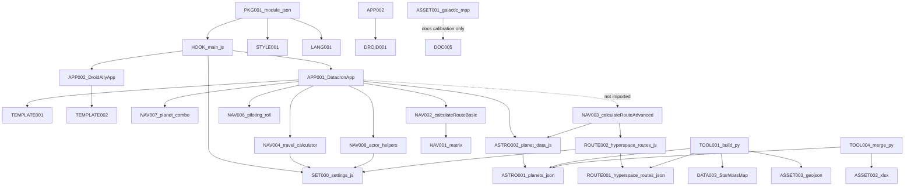

# Kakeman89's Datacron — Phase 0 Baseline Inventory

- **Document title:** Kakeman89's Datacron — Phase 0 Baseline Inventory
- **Creation date:** 2026-08-14
- **Status:** Phase 0 complete — awaiting maintainer approval before Phase 1
- **Authoritative plan:** [KAKEMAN89S_DATACRON_ROADMAP.md](KAKEMAN89S_DATACRON_ROADMAP.md)
- **Inspection method:** Read-only Git inspection of `HEAD` (`main`) and `origin/v.next`. `origin/v.next` was **not** checked out.
- **Candidate baseline:** `origin/v.next` at `a01c1d7b46a8ea62a7b1d95e39131aace3f6315b`
- **Implementation authorization:** None. This file is an investigation artifact only.
- **Disposition policy:** Every inventoried component is **UNASSESSED**. This document does not assign RETAIN, REVISE, REPLACE, REMOVE, QUARANTINE, or DEFER, and does not select reuse gate outcomes A–D.
- **Evidence policy:** Uncertain items are investigation questions. Repository presence is not licensing evidence. Apparent functionality is not proof of correctness.
- **Attribution:** Use only Kakeman89. Existing `v.next` metadata that uses a personal name is recorded as a conflict without reproducing that name.
- **Creator of this artifact:** Kakeman89 planning session (Cursor), 2026-08-14

---

## 1. Phase 0 purpose and boundary

Phase 0 produces an evidence-based inventory of the current `main` checkout and `origin/v.next` so later phases can evaluate unverified prior work.

`origin/v.next` is the approved **candidate implementation baseline**. That does not accept its architecture, code, data, assets, calculations, rules, permissions, compatibility declarations, or behavior.

This phase does **not** decide reuse as primary foundation, selective salvage, domain rebuild, or clean rebuild.

---

## 2. Git baseline captured before inspection

| Item | Value |
| --- | --- |
| Current branch | `main` |
| HEAD | `49244ad78067c77ffa1e645fe9038f8690bddc32` |
| Tracking | `main...origin/main` |
| Local branches | `main` only |
| Remote branches | `origin/main`, `origin/v.next` |
| `origin/v.next` checked out? | No |
| Tracked files modified? | No (`git diff` empty vs HEAD) |
| Untracked at start | `.cursor/` (pre-existing); `KAKEMAN89S_DATACRON_ROADMAP.md` (prior planning assignment) |
| Remote | `origin` → GitHub repository `unrealkakeman89/Kakeman89s_Datacron` (HTTPS) |

---

## 3. Method

Commands used (read-only): `git status`, `git branch -a`, `git log`, `git show`, `git ls-tree`, `git grep`, `git rev-parse`, `git merge-base`, `git rev-list --left-right --count`. JSON record counts were computed in memory from `git show` output. No HEAD, index, tracked-file, remote, or branch state was changed. No packages were installed. Foundry was not launched.

---

## 4. `main` repository baseline

| Item | Finding | Evidence |
| --- | --- | --- |
| Repository root | Workspace GitHub clone `Kakeman89s_Datacron` | `git rev-parse` / working tree |
| Current branch / SHA | `main` / `49244ad78067c77ffa1e645fe9038f8690bddc32` | `git rev-parse` |
| Upstream | `origin/main` | `git status -sb` |
| Tracked files | `LICENSE`, `README.md` | `git ls-tree -r HEAD` |
| LICENSE | GNU GPL v3 stock FSF text | `LICENSE` first lines |
| README | Single heading `# NaviComputer` | `README.md` |
| Module manifest | Absent on `main` | No `module.json` in `HEAD` |
| Source directories | Absent on `main` | `git ls-tree` |
| Test infrastructure | Absent on `main` | No `package.json`, `tests/`, CI |
| Build infrastructure | Absent on `main` | No `package.json`, bundler configs |
| Documentation directories | Absent as tracked dirs | No `docs/`, `ai/` in `HEAD` |
| Shipped Foundry package on `main` | Absent | No module folder in `HEAD` |
| Untracked | `.cursor/` (ECC/Cursor install, inspected, not modified); `KAKEMAN89S_DATACRON_ROADMAP.md` | `git status` |
| Classification | Sparse tracked tree (two files), not a Foundry scaffold, not an empty Git repository | Tracked LICENSE + README exist |

`main` is not an empty Git repository. It contains an initial commit with a GPL-3 license file and a one-line README. It does not contain the installable module.

### BASE-001 — `main` checkout

| Field | Value |
| --- | --- |
| Component ID | BASE-001 |
| Path | repository root on `main` |
| Type | Git checkout / product tree |
| Feature domain | Governance / packaging |
| Apparent purpose | Default clone branch; license + name stub |
| Entry points | None |
| Dependencies | None |
| Related settings / templates / styles / data / assets / hooks / sockets / migrations | None on this branch |
| Permissions | N/A |
| Existing documentation | `README.md` (`# NaviComputer`) |
| Tests | Absent |
| Known consumers | None |
| Known outputs | None |
| Enabled/disabled | N/A |
| Evidence | `git ls-tree -r HEAD` |
| Verification state | UNVERIFIED as a product delivery surface |
| Questions for later phases | Whether `main` remains a release branch or stays a stub while work proceeds from `v.next` after later gates |
| Preliminary disposition | **UNASSESSED** |

---

## 5. Relationship of `main` to `origin/v.next`

| Item | Finding |
| --- | --- |
| Merge-base | `49244ad78067c77ffa1e645fe9038f8690bddc32` (same as `main` HEAD) |
| Divergence | `HEAD...origin/v.next` = `0 4` (`main` is 4 commits behind `origin/v.next`, 0 unique) |
| `origin/v.next` history | `e8fe50f` scaffold → `5e1b967` v1.0.0 → `7ed65e7` Advanced Routes → `a01c1d7` Changed Direction |
| `origin/v.next` tip | `a01c1d7b46a8ea62a7b1d95e39131aace3f6315b` (2026-04-28) “Changed Direction” |
| Tracked file count on `origin/v.next` | **62** |
| Local `v.next` branch | Not present (remote-only) |

### BASE-002 — `origin/v.next` candidate baseline

| Field | Value |
| --- | --- |
| Component ID | BASE-002 |
| Path | `origin/v.next` entire tree |
| Type | Remote branch / existing module codebase |
| Feature domain | Shared / all |
| Apparent purpose | Prior Foundry module implementation (hyperspace app + droid pricing + data pipelines) |
| Entry points | See HOOK-* and APP-* |
| Dependencies | Foundry v13, dnd5e 5.2.5 declared; SW5e recommended, not required |
| Evidence | `git ls-tree -r -l origin/v.next`; `git log origin/v.next` |
| Verification state | UNVERIFIED prior work |
| Questions | Compatibility with actual SW5e 1.4.2; licensing of datasets; rules accuracy |
| Preliminary disposition | **UNASSESSED** |

---

## 6. Complete `origin/v.next` file appendix (62 files)

Every tracked file is listed once and mapped to a parent component. No tracked file is omitted.

| Path | Bytes | Parent component | Group |
| --- | ---: | --- | --- |
| `.cursor/rules/SHARED-MASTER-CONTEXT.mdc` | 4004 | GOV-001 | Governance |
| `.cursor/rules/karpathy-guidelines.mdc` | 2665 | GOV-001 | Governance |
| `.gitignore` | 126 | PKG-003 | Package |
| `CHANGELOG.md` | 4403 | DOC-002 | Documentation |
| `Galactic Map.jpg` | 37878510 | ASSET-001 | Assets |
| `LICENSE` | 35149 | LEGAL-001 | Licensing |
| `README.md` | 6578 | DOC-001 | Documentation |
| `Star Wars Galaxy Map Grid Coordinates.xlsx` | 61530 | ASSET-002 | Assets / geography |
| `StarWarsMap/map_api/data/grid_db.json` | 353145 | DATA-003 | Data / StarWarsMap |
| `StarWarsMap/map_api/data/hyperlanes_db.json` | 17613 | DATA-003 | Data / StarWarsMap |
| `StarWarsMap/map_api/data/regions_db.json` | 427030 | DATA-003 | Data / StarWarsMap |
| `docs/compatibility-notes.md` | 8501 | DOC-003 | Compatibility notes |
| `docs/droid-allies-sw5e.md` | 5092 | DOC-004 | Documentation |
| `docs/hyperspace-coordinate-transform.md` | 6103 | DOC-005 | Documentation |
| `hyperspace_singlepart_new.json` | 1205894 | ASSET-003 | Route / GeoJSON |
| `kakeman89s-datacron/data/grid-to-geo.json` | 387 | DATA-004 | Data |
| `kakeman89s-datacron/data/hyperspace-control-points.json` | 774 | DATA-005 | Data |
| `kakeman89s-datacron/data/hyperspace-routes-catalog.json` | 1142 | ROUTE-004 | Route graph |
| `kakeman89s-datacron/data/hyperspace-routes.hand.json` | 7447 | ROUTE-005 | Route graph |
| `kakeman89s-datacron/data/hyperspace-routes.json` | 601201 | ROUTE-001 | Route graph |
| `kakeman89s-datacron/data/planets-merge-report.txt` | 5251 | DATA-006 | Planetary geography |
| `kakeman89s-datacron/data/planets.json` | 215993 | ASTRO-001 | Planetary geography |
| `kakeman89s-datacron/data/random-events.json` | 612 | DATA-007 | Data / unused at runtime |
| `kakeman89s-datacron/data/route-tier-overrides.json` | 1041 | ROUTE-006 | Route graph |
| `kakeman89s-datacron/data/starwarsmap/hyperlanes_db.json` | 17613 | DATA-008 | Data / StarWarsMap copy |
| `kakeman89s-datacron/data/starwarsmap/planet-name-aliases.json` | 146 | DATA-009 | Data |
| `kakeman89s-datacron/docs/compatibility-notes.md` | 8524 | DOC-003 | Compatibility notes (duplicate path) |
| `kakeman89s-datacron/lang/en.json` | 11934 | LANG-001 | Localization |
| `kakeman89s-datacron/module.json` | 1051 | PKG-001 | Package and manifest |
| `kakeman89s-datacron/scripts/actor-helpers.js` | 4856 | NAV-008 | JavaScript / actors |
| `kakeman89s-datacron/scripts/datacron-app.js` | 10358 | APP-001 | Applications |
| `kakeman89s-datacron/scripts/droid-ally-app.js` | 6679 | APP-002 | Applications |
| `kakeman89s-datacron/scripts/droid-ally-pricing.js` | 5131 | DROID-001 | Droid calculations |
| `kakeman89s-datacron/scripts/hyperspace-routes.js` | 4492 | ROUTE-002 | Route graph |
| `kakeman89s-datacron/scripts/logger.js` | 659 | LOG-001 | JavaScript |
| `kakeman89s-datacron/scripts/main.js` | 3962 | HOOK-001 | Hooks and initialization |
| `kakeman89s-datacron/scripts/piloting-roll.js` | 2017 | NAV-006 | NavComputer |
| `kakeman89s-datacron/scripts/planet-combo.js` | 4634 | NAV-007 | NavComputer / planet selection |
| `kakeman89s-datacron/scripts/planet-data.js` | 3020 | ASTRO-002 | Planetary geography |
| `kakeman89s-datacron/scripts/route-calculator.js` | 23941 | NAV-001 | NavComputer calculations |
| `kakeman89s-datacron/scripts/settings.js` | 3569 | SET-000 | Settings |
| `kakeman89s-datacron/scripts/time-display.js` | 1296 | NAV-009 | NavComputer |
| `kakeman89s-datacron/scripts/travel-calculator.js` | 5570 | NAV-004 | NavComputer calculations |
| `kakeman89s-datacron/styles/datacron.css` | 8970 | STYLE-001 | Styles |
| `kakeman89s-datacron/templates/datacron.hbs` | 7939 | TEMPLATE-001 | Templates |
| `kakeman89s-datacron/templates/droid-ally-pricing.hbs` | 6340 | TEMPLATE-002 | Templates |
| `planets.json` | 2454418 | DATA-001 | Planetary geography (root dump) |
| `scripts/__pycache__/generate_starwarsmap_integration_review.cpython-313.pyc` | 20797 | TOOL-009 | Deprecated / accidental |
| `scripts/build-hyperspace-graph.py` | 28740 | TOOL-001 | Build or tooling |
| `scripts/debug/phase0-runtime-inspector.js` | 4948 | TOOL-002 | Tooling / debug |
| `scripts/generate_starwarsmap_integration_review.py` | 18556 | TOOL-003 | Tooling |
| `scripts/merge-planet-data.py` | 7145 | TOOL-004 | Tooling |
| `scripts/normalize_planet_names.py` | 7953 | TOOL-005 | Tooling |
| `scripts/output/hyperspace_validation_report.json` | 67848 | TEST-001 | Tests / reports |
| `scripts/output/planets_name_map.json` | 171242 | TOOL-006 | Tooling output |
| `scripts/output/planets_name_report.csv` | 61333 | TOOL-006 | Tooling output |
| `scripts/output/starwarsmap_audit_report.json` | 3757 | TOOL-007 | Tooling output |
| `scripts/output/starwarsmap_audit_summary.md` | 4253 | DOC-006 | Documentation / audit |
| `scripts/output/starwarsmap_integration_review.json` | 14816 | TOOL-007 | Tooling output |
| `scripts/output/starwarsmap_integration_review.md` | 6247 | DOC-006 | Documentation / audit |
| `scripts/starwarsmap_audit.py` | 17351 | TOOL-008 | Tooling |
| `scripts/validate-hyperspace-routes.py` | 19895 | TEST-001 | Tests / validation scripts |

Tracked file count: **62**. Appendix rows: **62**.

---

## 7. Module manifest and package inventory

### PKG-001 — `kakeman89s-datacron/module.json`

| Field | Recorded value (not approved) |
| --- | --- |
| Component ID | PKG-001 |
| Path | `kakeman89s-datacron/module.json` |
| Type | Foundry module manifest |
| Feature domain | Shared / packaging |
| Module ID | `kakeman89s-datacron` |
| Display title | Kakeman89s Datacron |
| Version | `1.0.1` |
| Authors | Personal name present; **not** Kakeman89. Conflicts with Kakeman89-only attribution rule. |
| Description | Hyperspace estimates, travel resources, optional random events |
| compatibility.minimum / verified | `13` / `13` (no maximum) |
| relationships.systems | `dnd5e` minimum/verified `5.2.5` |
| relationships.recommends | modules `sw5e` and `sw5e-module` (no version pins) |
| esmodules | `scripts/main.js` — file exists |
| styles | `styles/datacron.css` — file exists |
| languages | `en` → `lang/en.json` — file exists |
| packs | **Absent** |
| socket | `true` |
| url | `https://github.com/placeholder/kakeman89s-datacron` |
| download / manifest | **Absent** |
| license / readme / bugs / media | **Absent** from manifest |
| Module-local LICENSE | **Absent** inside `kakeman89s-datacron/` |
| Discrepancies | Socket declared but no handlers (SOCKET-001). Random events described but JSON unused (DATA-007). Authors not Kakeman89. Placeholder URL. |
| Tests | Absent |
| Evidence | `git show origin/v.next:kakeman89s-datacron/module.json` |
| Verification state | UNVERIFIED |
| Questions | SW5e 1.4.2 vs recommended unpinned modules; whether socket should be true; packaging of root assets |
| Preliminary disposition | **UNASSESSED** |

### PKG-002 — installable module directory

Path `kakeman89s-datacron/`. Apparent Foundry install unit. Root-level maps, xlsx, GeoJSON, Python scripts, and `Galactic Map.jpg` sit **outside** this folder and are not listed in the manifest. Runtime load of the module folder would not automatically include those root assets.

### PKG-003 — `.gitignore`

Ignores only `kakeman89s-datacron/data/planets.json.backup-*`. Does not ignore `__pycache__`, `node_modules`, or OS junk. A `__pycache__/*.pyc` file is tracked (TOOL-009).

---

## 8. Hooks, initialization, and entry points

### HOOK-001 / HOOK-002 / HOOK-003 / HOOK-004 — `kakeman89s-datacron/scripts/main.js`

| Field | Value |
| --- | --- |
| Component ID | HOOK-001 (file); HOOK-002 `init`; HOOK-003 `ready`; HOOK-004 `getSceneControlButtons`; HOOK-005 `closeApplicationV2` |
| Path | `kakeman89s-datacron/scripts/main.js` |
| Type | ES module entry / hooks |
| Domain | Shared |
| Apparent purpose | Register settings; GM scene-control buttons; open apps; log environment |
| Registration | Manifest `esmodules` |
| Launch path | Foundry loads `scripts/main.js` |
| Hooks | `Hooks.once("init")` → `registerSettings()`, subscribe `closeApplicationV2`. `Hooks.on("getSceneControlButtons")` GM-only. `Hooks.once("ready")` logs Foundry/system/SW5e snapshot and warnings. |
| Permissions | Scene tools and droid opener require `game.user.isGM`. Hyperspace `openHyperspaceNavigationApp()` has **no isGM guard** in the function itself; the scene-control host returns early for non-GM. |
| Keybindings | None found |
| Sidebar / header / sheet / macro APIs | None found |
| Sockets | None registered |
| Migrations | None |
| Document operations | None at init/ready |
| External links | None |
| Error handling | `logWarn` if token scene control missing; environment warnings localized |
| Enabled | Scene tools registered when GM |
| Disabled / unreachable | Advanced UI not launched from this file |
| Tests | Absent |
| Evidence | `git show origin/v.next:kakeman89s-datacron/scripts/main.js` |
| Verification state | UNVERIFIED |
| Questions | Can players invoke `openHyperspaceNavigationApp` if given a macro? No public API export audit beyond module scope. |
| Preliminary disposition | **UNASSESSED** |

Scene-control tools:

- `${MODULE_ID}-open-hyperspace` icon `fa-solid fa-route`, title i18n `OpenHyperspace`
- `${MODULE_ID}-open-droid-ally` icon `fa-solid fa-robot`, title i18n `OpenDroidAlly`, opener returns null if not GM

Settings menu: world/client settings via `game.settings.register` (SET-*). No `registerMenu`.

---

## 9. Applications

### APP-001 — DatacronApp (Hyperspace Navigation)

| Field | Value |
| --- | --- |
| Component ID | APP-001 |
| Path | `kakeman89s-datacron/scripts/datacron-app.js` |
| Type | ApplicationV2 + HandlebarsApplicationMixin |
| Domain | NavComputer (product name in UI: Hyperspace Navigation / Datacron) |
| Apparent purpose | Origin/destination planet comboboxes, Basic route estimate, travel resources, private GM piloting roll |
| Registration | Instantiated from `openHyperspaceNavigationApp` in `main.js` |
| Launch | GM scene control |
| Permissions | Scene button GM-only; app class itself does not re-check GM on calculate |
| Data preparation | `_prepareContext` loads planets; `currentMode` **hardcoded** `"basic"` |
| Event handling | Calculate, roll piloting, planet combos, pilot/ship selects |
| Calculation calls | `calculateRouteBasic` only. **Does not import** `calculateRouteAdvanced` |
| Templates | TEMPLATE-001 `templates/datacron.hbs` |
| Styles | STYLE-001 |
| Settings dependencies | Indirect via travel-calculator (fuel/food) and actor-helpers (piloting fallback) |
| Document operations | None (no Actor/Journal create) |
| External links | None in app source |
| Socket behavior | None |
| Error handling | Localized route errors; `ui.notifications` on roll failures |
| Notifications | GM info when piloting roll sent |
| Enabled/disabled | Basic path enabled. Advanced graph UI disabled (mode not selectable; `calculationMode` setting `config: false` with only `basic` choice) |
| Naming | Window title “Hyperspace Navigation”; module title “Kakeman89s Datacron”; README/repo historically “NaviComputer”; roadmap name **NavComputer** |
| Tests | Absent |
| Evidence | `datacron-app.js`; `settings.js` calculationMode |
| Verification state | UNVERIFIED |
| Questions | Player visibility if opened by non-GM; live ApplicationV2 compatibility |
| Preliminary disposition | **UNASSESSED** |

### APP-002 — DroidAllyApp

| Field | Value |
| --- | --- |
| Component ID | APP-002 |
| Path | `kakeman89s-datacron/scripts/droid-ally-app.js` |
| Type | ApplicationV2 + HandlebarsApplicationMixin |
| Domain | Droid (not the requested Droid Shop model) |
| Apparent purpose | GM-only companion price estimate; optional share-to-chat |
| Registration / launch | `openDroidAllyPricingApp` GM-only |
| Permissions | `isGM` on calculate and share; opener GM-only |
| Calculation | `calculateDroidAllyPrice` |
| Templates | TEMPLATE-002 |
| Styles | STYLE-001 (shared classes) |
| Settings | None for prices |
| Document operations | `ChatMessage.create` with escaped HTML card |
| Socket | None |
| Error handling | Chat-no-result warning |
| Enabled | Yes, GM scene tool |
| Tests | Absent |
| Evidence | `droid-ally-app.js` |
| Verification state | UNVERIFIED |
| Preliminary disposition | **UNASSESSED** |

No other ApplicationV2 classes found.

---

## 10. Settings inventory

Namespace: `kakeman89s-datacron` (`MODULE_ID`). Registration: `registerSettings()` from `init`. No `requiresReload` flags found. No migration of settings found. Changing world settings can persist in the world database. Defaults are **not approved**.

| ID | Key | Scope | Config | Type | Default | Choices / range | Influences rules calc? | Consumers | Docs | Permissions | Preliminary disposition |
| --- | --- | --- | --- | --- | --- | --- | --- | --- | --- | --- | --- |
| SET-001 | `calculationMode` | world | false | String | `basic` | only `basic` | Selects mode if read; app ignores and hardcodes basic | settings.js; **not read by datacron-app.js** | lang + README Advanced disabled | None beyond world setting ACL | **UNASSESSED** |
| SET-002 | `enableRandomEvents` | world | true | Boolean | false | — | Reserved; **no JS consumer** of the flag beyond register | settings.js only | README reserved | — | **UNASSESSED** |
| SET-003 | `randomEventChance` | world | true | Number | 20 | 1–100 step 1 | Reserved; no consumer | settings.js only | README reserved | — | **UNASSESSED** |
| SET-004 | `fuelPerHour` | world | true | Number | 1 | none | Yes — fuel formula | travel-calculator.js | README | — | **UNASSESSED** |
| SET-005 | `foodPerCrewPerDay` | world | true | Number | 1 | none | Yes — food formula | travel-calculator.js | README | — | **UNASSESSED** |
| SET-006 | `pilotingFallbackSkill` | world | true | String | `acr` | none | Skill fallback, not travel time | actor-helpers.js | README | — | **UNASSESSED** |
| SET-007 | `debugMode` | client | true | Boolean | false | — | Logging only | logger.js | README | — | **UNASSESSED** |
| SET-008 | `advancedMaxTier` | world | false | Number | 3 | 1–5 | Yes if Advanced graph used | hyperspace-routes.js filter | Hidden | — | **UNASSESSED** |
| SET-009 | `advancedIncludeObscureRoutes` | world | false | Boolean | false | — | Yes if Advanced graph used | hyperspace-routes.js filter | Hidden | — | **UNASSESSED** |
| SET-010 | `advancedTier5ExtraDc` | world | false | Number | 0 | 0–10 | Yes if Advanced path DC | route-calculator.js Advanced | Hidden | — | **UNASSESSED** |

SET-000 is the settings module file itself.

---

## 11. NavComputer inventory

Naming observed: repository README heading “NaviComputer”; module/app “Kakeman89s Datacron” / “Hyperspace Navigation”; roadmap “NavComputer”.

### NAV-001 — Basic region matrix

**EXISTING UNVERIFIED BEHAVIOR** stored as hardcoded `REGION_TRAVEL_MATRIX` in `kakeman89s-datacron/scripts/route-calculator.js`.

Programmatic cell-by-cell comparison against the roadmap-supplied matrix (81 cells): **0 mismatches**. Asymmetric values preserved (example: Deep Core→Core 18; Core→Deep Core 24). Matching code is **not** a rules-source verification.

`REGION_ORDER` is the nine matrix regions only. It does **not** include `Hutt Space` or the misspelled planet-data values `Inner RIm`, `Outer RIm`, `Expansion Regions`.

### NAV-002 — `calculateRouteBasic`

**EXISTING UNVERIFIED BEHAVIOR**

- Inputs: planet records with `.name` and `.region`
- Lookup: `REGION_TRAVEL_MATRIX[originRegion][destinationRegion]`
- Same-name origin/destination: 0 hours
- Missing/unrecognized region: travelTimeHours 0 + warnings
- Output: hours, regionsCrossed via ring slice of `REGION_ORDER`, narrative `routeDescription`
- Hyperdrive: **not applied** in Basic
- Tests: Absent

### NAV-003 — `calculateRouteAdvanced`

**EXISTING UNVERIFIED BEHAVIOR** (code present; UI disabled)

- Exported from `route-calculator.js`
- **Not imported** by `datacron-app.js`
- Uses `loadHyperspaceRoutes`, `filterHyperspaceRoutesForSettings`, `buildGraph`, A* with `travelTimeBase * hyperdriveMult`
- Graph edges added **both directions** from each JSON segment (`hyperspace-routes.js` `buildGraph`)
- Fallback to regional estimate with warning codes when no path
- Enabled/disabled: disabled in Foundry UI per README, changelog, hardcoded basic mode, and `calculationMode` config:false

### NAV-004 — Fuel, food, supplies

**EXISTING UNVERIFIED BEHAVIOR** in `travel-calculator.js` `calculateTravelResources`:

```
safeHours = finite hours >= 0 else 0
fuelRate = settings fuelPerHour (default 1) if finite >= 0 else 1
foodRate = settings foodPerCrewPerDay (default 1) if finite >= 0 else 1
crewSize = getCrewSizeFromShipActor(ship) ?? 4
travelDays = safeHours / 24
fuelRequired = ceil(safeHours * fuelRate)
foodRequired = ceil(travelDays * crewSize * foodRate)
suppliesRequired = ceil(foodRequired * 0.5)
fuelUnit = "Fuel Cells"   // hardcoded English
foodUnit = "Ration Packs" // hardcoded English
```

No repository source establishes these as SW5e RAW. Defaults are not approved.

Crew resolution **EXISTING UNVERIFIED BEHAVIOR**: `system.attributes.deployment.crew.items.length` if array nonempty; else `ceil(system.attributes.equip.size.crewMinWorkforce)` if finite > 0; else null → default 4.

### NAV-005 — Piloting DC helper

**EXISTING UNVERIFIED BEHAVIOR** `getPilotingCheckDC`: base 10; +2 per outward `REGION_ORDER` step if destination index > origin; +5 if destination Wild Space or Unknown Regions; Advanced-only hop/danger caps. Not a verified SW5e table.

### NAV-006 — Piloting roll

`piloting-roll.js`: private GM skill roll. Skill key from NAV-008. No travel-time mutation from roll result.

### NAV-007 — Planet selection

`planet-combo.js` + APP-001: name combobox over loaded planet list. Search/filter by name. Not an AstroCom gazetteer.

### NAV-008 — Actor helpers

`actor-helpers.js`:

- Starship if `character` + `flags.sw5e.starshipCharacter.enabled`, or vehicle + `flags.sw5e.legacyStarshipActor.type === "starship"`, or `type === "starship"`
- Pilots: character/npc excluding normalized starships
- Hyperdrive multiplier **EXISTING UNVERIFIED BEHAVIOR**: equip hyperdrive class, else item `hdclass.value`, else legacy `travel.hyperdriveClass`, else text parse `class N`, else 1.0 with warning
- Used by NavComputer, **not** a Shipyard builder

### NAV-009 — `time-display.js`

Formats hours for display. Consumer: travel and route calculators.

Validation: origin/destination required; unknown planet names; unrecognized regions warn. No schema validation of planet records.

Result presentation: results panel + status string; Basic narrative summary; resource numbers; DC notes. Not a full formula breakdown of fuel/food/supplies settings.

Player/GM access: launch GM-gated via scene controls; calculation inside app not independently GM-checked.

Map integration: none in the ApplicationV2 UI. `Galactic Map.jpg` is a repo-root calibration asset, not referenced from `module.json` or app templates (DOC-005 describes calibration use).

Cache: in-memory planet and route JSON caches in planet-data.js / hyperspace-routes.js.

Failure handling: load failures log and surface planet-load warning; Basic missing matrix cell warns.

Tests: no JS unit tests. Python graph validation exists (TEST-001) for Advanced data, not for the 81-cell matrix.

---

## 12. Droid functionality inventory

### DROID-001 — pricing engine

Path `kakeman89s-datacron/scripts/droid-ally-pricing.js`.

**EXISTING UNVERIFIED BEHAVIOR**

Presets: class-i..class-v ranks 1–5; tracker rank 2; custom rank 1.

```
baseChassisCost = chassisCostRank * 1000
systemsCost = GM-entered non-negative integer
abilityCost = max(0, abilityModifierTotal) * 1000
traitProtocolCost = traitProtocolCount * 2000
proficiencyCost = trainedSkillToolCount * 500
featOrUpgradeCost = featUpgradeCount * 1000
levelCost = companionLevel * 1000
subtotal = sum of the above
finalCost = floor(subtotal / 2)
```

| Requested Droid Shop element | Presence |
| --- | --- |
| Tier I–VI chassis prices | **Absent** (Class I–V ranks + tracker/custom) |
| 10 percent class markup | **Absent** |
| Condition modifiers | **Absent** |
| Companion pricing UI | **Partial** (different model) |
| Actor creation | **Absent** |
| Tests | **Absent** |

Documentation `docs/droid-allies-sw5e.md` describes a Saga Edition-inspired estimate and states it does not replace SW5e companion rules. That is a repository claim, not acceptance of RAW.

No droid settings. GM-only app. Chat share uses `escapeHtml`.

Preliminary disposition: **UNASSESSED**.

---

## 13. AstroCom-related inventory (not an AstroCom implementation)

Existing planet JSON + combobox is a travel origin/destination picker. It is **not** a JournalEntry compendium.

| Requested AstroCom requirement | Presence | Evidence |
| --- | --- | --- |
| JournalEntry compendium | **Absent** | No `packs` in manifest; no Journal APIs in JS |
| Folder hierarchy Canon/Legends/Grid | **Absent** | — |
| Canon classification | **Absent** | No canon field in module planets.json keys |
| Legends classification | **Absent** | Catalog JSON comment says “Legends-style” names for some routes only |
| Planet JSON names | **Present** | `name` |
| Region | **Partial** | Present; includes values outside matrix (`Hutt Space`, typos) |
| Sector | **Partial** | 449/2029 null |
| System | **Absent** | No system field |
| Grid | **Partial** | 3 names missing grid |
| Coordinates | **Partial** | 38/2029 have `coordinates` |
| Enriched description/type/affiliation | **Partial** | 38/2029 |
| Hyperspace lanes / routes | **Partial** | Separate route JSON; not journal-linked |
| Source URLs | **Absent** | No url field |
| Provenance / attribution in file | **Absent** | No license/source keys in records |
| Stable IDs independent of name | **Absent** | Name identity; 1 duplicate name `Noe'ha'on` (count 2) |
| Aliases | **Partial** | One alias file: `Kailor V` → `Kailor` |
| Search/filter | **Partial** | Name combobox only |
| Journal/compendium/folder handling | **Absent** | — |
| External-source links | **Absent** | — |

### ASTRO-001 — module `planets.json`

- Format JSON array. Size 215993 bytes. Record count **2029** (reproducible `len(json)`).
- Keys: `affiliation`, `coordinates`, `description`, `grid`, `name`, `region`, `sector`, `type`
- Regions counted: Outer Rim 803, Mid Rim 396, Inner Rim 205, Expansion Region 158, Core 153, Colonies 101, Hutt Space 85, Wild Space 51, Unknown Regions 38, Deep Core 32, Expansion Regions 4, Outer RIm 2, Inner RIm 1
- Runtime required: yes (APP-001 fetch)
- Generated vs hand: merge script documented as spreadsheet + JSON
- License in file: none. Licensing state: **UNKNOWN**. Verification: **UNVERIFIED**
- Preliminary disposition: **UNASSESSED**

### ASTRO-002 — `planet-data.js`

Loads `modules/kakeman89s-datacron/data/planets.json` via `fetch`. In-memory cache. `getPlanetByName` first match. `getRandomPlanetsInRegion` uses `Math.random` shuffle. Fetch is module-local path, not an absolute `http(s)` URL. Whether Foundry module-file fetch is “network activity” is a Phase 1/security question.

---

## 14. Shipyard inventory

Searched `origin/v.next` JS/HBS/MD/PY/JSON for shipyard, ship builder, starship builder, Actor.create, workbook/openpyxl (openpyxl appears only in `merge-planet-data.py` for the **geography** xlsx).

**No Shipyard implementation identified in the inspected branch.**

The geography workbook is not the SW5e ship-builder workbook.

NAV-008 actor helpers select existing starship actors for provision estimates. They do not create Actors, parse a ship-builder workbook, or run a collaborative builder. Inventoried as UNASSESSED generic utilities **without** labeling them reusable.

---

## 15. Dataset inventory

All licensing states **UNKNOWN** unless a file contains an explicit license (none of the data files do). Verification **UNVERIFIED**. Presence ≠ license.

| ID | Path | Format | Bytes | Count | Purpose | Runtime? | Consumers | Generated? | Provenance in file |
| --- | --- | --- | ---: | --- | --- | --- | --- | --- | --- |
| ASTRO-001 | `kakeman89s-datacron/data/planets.json` | JSON array | 215993 | 2029 | Travel planet list | Yes | planet-data.js | Merge script | None |
| DATA-001 | `planets.json` (root) | JSON array | 2454418 | 5444 | Broader dump; fields Name, Coord, Image, X, Y, Region, Sector, Diameter, Gravity, Moons, etc. | No (not in module folder) | merge/normalize scripts | Unclear | None; Image field present (media refs, not packaged binaries) |
| DATA-003 | `StarWarsMap/map_api/data/*.json` | JSON | see appendix | hyperlanes object **60** named lanes | Vendored map API | No | Python build/audit | Vendored | README/docs cite Wason1797/StarWarsMap; **no license text in files** |
| DATA-008 | module copy of `hyperlanes_db.json` | JSON | 17613 | 60 keys | Same blob hash as StarWarsMap hyperlanes file | Build-time / Advanced data | build script, docs | Copy | Same |
| DATA-009 | `planet-name-aliases.json` | JSON | 146 | 1 alias | Name mapping | Build | build scripts | Hand | comment only |
| ROUTE-001 | `hyperspace-routes.json` | JSON `{routes:[]}` | 601201 | **2094** edges | Advanced graph | Loaded if Advanced used; UI disabled | hyperspace-routes.js | Generated + hand merge (README) | None |
| ROUTE-004 | catalog | JSON | 1142 | 12 named routes in sample list | Authoring reference | No | docs/build | Hand | comment: Legends-style names |
| ROUTE-005 | hand edges | JSON | 7447 | 26 routes | Gap fills | Build merge | build script | Hand | comment |
| ROUTE-006 | tier overrides | JSON | 1041 | n/a | Build | Build | build script | Hand | None |
| DATA-004 | grid-to-geo.json | JSON | 387 | small | Optional CRS84 overrides | Build | build script | Hand | None |
| DATA-005 | hyperspace-control-points.json | JSON | 774 | small | Affine transform | Build | build script | Hand | None |
| DATA-006 | planets-merge-report.txt | text | 5251 | n/a | Merge disagreements | No | humans | Generated | None |
| DATA-007 | random-events.json | JSON array | 612 | 3 placeholder events | Reserved random events | **No JS loader found** | none in scripts | Hand | None |
| ASSET-003 | hyperspace_singlepart_new.json | GeoJSON | 1205894 | large | Hyperlane traces | Build | build script | Unclear | None |
| TOOL outputs | `scripts/output/*` | JSON/CSV/MD | see appendix | n/a | Audit/validation artifacts | No | humans | Generated | None |

Malformed/quality observations (non-destructive): duplicate planet name `Noe'ha'on`; region typos and `Hutt Space` outside matrix; StarWarsMap sample key `Corellinan Run` (spelling); 3 planets without grid.

---

## 16. Asset and provenance inventory

| ID | Path | Type | Bytes | Runtime use | Referenced by | Attribution | License in artifact | Packaged by manifest? | State |
| --- | --- | --- | ---: | --- | --- | --- | --- | --- | --- |
| ASSET-001 | `Galactic Map.jpg` | JPEG | 37878510 | Not loaded by module.json or app templates. Docs: calibration backdrop, not georeferenced | README, DOC-005 | Absent in inspection | Absent | **No** | UNVERIFIED / license UNKNOWN |
| ASSET-002 | `Star Wars Galaxy Map Grid Coordinates.xlsx` | xlsx | 61530 | Not runtime; merge-planet-data.py sheet `planets` | README, TOOL-004 | Absent | Absent | **No** | UNVERIFIED / license UNKNOWN |
| ASSET-003 | `hyperspace_singlepart_new.json` | GeoJSON | 1205894 | Build input | README, TOOL-001 | Absent | Absent | **No** | UNVERIFIED / license UNKNOWN |
| DATA-003/008 | StarWarsMap JSON | JSON | see above | Build / Advanced data | docs cite GitHub Wason1797/StarWarsMap and say comply with that license when redistributing | Citation in docs, not a license grant | Not in-file | Module copy of hyperlanes is inside module `data/` | UNVERIFIED / license UNKNOWN |

Embedded image metadata was not extracted (no asset mutation/export). Do not treat commit presence as lawful redistribution.

---

## 17. Socket and permission inventory

### SOCKET-001

- Manifest `"socket": true`
- Registration path: **none found**
- Message names / payloads / sender validation: **none found**
- `game.socket` / `socketOn` / emit: **not present** in `kakeman89s-datacron/scripts/*.js`
- Shared synchronized builder state: **not present**
- Unsupported declaration: **yes** — flag without handlers

Permissions:

- GM-only: scene tools; droid opener; droid calculate/share
- Hyperspace calculate: no extra GM check inside APP-001
- Players: no player-facing scene control; no observer sync
- Chat: droid quote is a standard ChatMessage (visibility follows Foundry chat, not audited live)
- Ownership checks: none (no document create except chat)
- Document create: `ChatMessage.create` only

Do not exercise sockets. Preliminary disposition: **UNASSESSED**.

---

## 18. Migration and data-safety inventory

Searched for migrate, Actor.create, Item.create, Journal updates, bulk updates, startup writes.

**No migration implementation was identified in the inspected files.**

- No version flags or ready-time upgrades
- `ready` hook logs environment only
- No Actor/Token/Journal/Item/image field writes in module JS except `ChatMessage.create`
- `fetch` loads local module JSON into memory caches only
- Catch-and-continue: planet load catch in APP-001 sets warning; `getPlanetList` catch returns `[]`; Advanced graph try/catch falls back to regional estimate **in unused UI path**
- Success notifications: piloting “sent as private GM roll”; droid “chat posted” — not migration success
- Automatic imports / cleanup routines: none in runtime JS
- Python scripts can rewrite `planets.json` if executed; they were **not** executed in Phase 0

This does not guarantee absence of behavior outside the inspected 62 files or inside Foundry itself.

### MIG-001

Path: none. Type: absence record. Domain: shared. Preliminary disposition: **UNASSESSED**.

---

## 19. Test and quality inventory

| ID | Item | Finding |
| --- | --- | --- |
| TEST-001 | Automated JS tests | **Absent** (no package.json, jest, vitest) |
| TEST-001 | Python validation | `scripts/validate-hyperspace-routes.py` + committed `scripts/output/hyperspace_validation_report.json` |
| TEST-002 | Lint/format/typecheck | **Absent** |
| TEST-003 | Packaging validation | **Absent** |
| TEST-004 | Foundry runtime evidence | Not captured live in Phase 0 |
| DOC-003 | Compatibility notes | Offline schema notes; live `game.version` still listed unresolved |
| Dead/disabled | Advanced UI disabled; `calculateRouteAdvanced` unused by app; random-events.json unused; calculationMode unread by app |
| Duplicate logic | Dual compatibility-notes paths; dual hyperlanes_db.json identical blob `58368b5e…` |
| Hardcoded rules | Matrix, droid formula, supplies `0.5`, crew default 4, fuel/food units |
| Hardcoded paths | `modules/${MODULE_ID}/data/...` |
| Unsafe HTML | Droid chat HTML built as strings after `escapeHtml` — still HTML injection surface if escape incomplete (Phase 1/security) |
| External URLs | Manifest placeholder GitHub URL; README/docs GitHub links; no runtime scrape |
| Network | `fetch` of module-relative data files only |
| Accessibility | No dedicated a11y implementation found; custom combobox |
| Localization | English `lang/en.json`; leftover hardcoded English units |
| TODO/FIXME | No matches in inspected JS via git grep |
| Console logging | logger.js info/warn/error; debug gated |
| Accidental commit | `scripts/__pycache__/*.pyc` |
| Personal attribution | module.json authors + README license section (personal name, not Kakeman89) |

Absence of tests is recorded as **absence**, not test failure.

---

## 20. Localization, templates, styles, logging

| ID | Path | Notes | Disposition |
| --- | --- | --- | --- |
| LANG-001 | `kakeman89s-datacron/lang/en.json` | Namespace `KAKEMAN89SDATACRON`; includes Advanced strings despite disabled UI | **UNASSESSED** |
| TEMPLATE-001 | `templates/datacron.hbs` | Hyperspace UI | **UNASSESSED** |
| TEMPLATE-002 | `templates/droid-ally-pricing.hbs` | Droid UI | **UNASSESSED** |
| STYLE-001 | `styles/datacron.css` | Shared dark styling | **UNASSESSED** |
| LOG-001 | `scripts/logger.js` | Prefix `[Kakeman89s Datacron]`; MODULE_ID `kakeman89s-datacron` | **UNASSESSED** |

---

## 21. Tooling and governance files on `v.next`

| ID | Path / group | Apparent purpose | Disposition |
| --- | --- | --- | --- |
| TOOL-001 | `scripts/build-hyperspace-graph.py` | Builds ROUTE-001 | **UNASSESSED** |
| TOOL-002 | `scripts/debug/phase0-runtime-inspector.js` | Manual Foundry console inspector (not a module esmodule) | **UNASSESSED** |
| TOOL-003–008 | other Python + outputs | Audits, merge, normalize | **UNASSESSED** |
| TOOL-009 | `__pycache__/*.pyc` | Accidental bytecode | **UNASSESSED** |
| GOV-001 | `.cursor/rules/*` on **v.next** | Older “SW5e Nav Computer” / karpathy rules — not this repo’s untracked ECC tree | **UNASSESSED** |
| GOV-002 | Untracked `.cursor/` on **main** | ECC 2.1.0; rules `00–05` misidentify this repo as the SW5e conversion module. Inspected, not modified. Must not redefine Datacron product identity. | **UNASSESSED** |
| DOC-001–006 | README, CHANGELOG, docs, audit md | Product/history/audit | **UNASSESSED** |
| LEGAL-001 | root `LICENSE` GPL-3 | Code license candidate; **not** a dataset license | **UNASSESSED** |
| LEGAL-002 | authors / README credit | Personal name vs Kakeman89-only | **UNASSESSED** |

---

## 22. Requirements-presence crosswalk

Presence ≠ acceptance. Verification state for all rows: **UNVERIFIED**. Disposition not assigned.

| Requirement ID | Summary | Component ID | Path | Presence | Existing behavior | Evidence | Rules source | Provenance | Tests | Later phase | Notes |
| --- | --- | --- | --- | --- | --- | --- | --- | --- | --- | --- | --- |
| ASTRO-001 | GM planetary reference | NAV-007, ASTRO-001 | planet-combo + planets.json | Partial | Name picker for travel | datacron-app.js | No | No | No | 4–6 | Not a gazetteer |
| ASTRO-002 | JournalEntry compendium | — | — | Absent | No packs | module.json | No | No | No | 4–6 | |
| ASTRO-003 | Canon/Legends/Grid top-level | — | — | Absent | No continuity field | planets.json keys | No | No | No | 4 | |
| ASTRO-004 | Region/sector/system folders | ASTRO-001 | planets.json | Partial | Flat region/sector; no system; no folders | JSON keys | No | No | No | 4 | |
| ASTRO-005 | Lanes/routes organization | ROUTE-001 | hyperspace-routes.json | Partial | Graph data; not journals | JSON + README | No | No | Partial python | 4–5 / future | UI disabled |
| ASTRO-006 | Grid dual index | ASTRO-001 | grid field | Partial | Single grid string | JSON | No | No | No | 4 | |
| ASTRO-007 | Naming Canon/Legends | ASTRO-001 | name | Absent | Bare names | JSON | No | No | No | 4–6 | Duplicate `Noe'ha'on` |
| ASTRO-008 | GM snapshot fields | ASTRO-001 | description etc. | Partial | 38 enriched | JSON | No | No | No | 5–6 | |
| ASTRO-009 | No invented facts | — | — | Unclear | Unknown source quality | — | No | No | No | 5–6 | |
| ASTRO-010 | External source link | — | — | Absent | No URL field | JSON keys | No | No | No | 5–6 | |
| ASTRO-011 | Snapshot vs licensed text | — | — | Absent | Undifferentiated | — | No | No | No | 2, 5 | |
| ASTRO-012 | Moons/stations/aliases | DATA-001, DATA-009 | root dump / 1 alias | Partial | Root has Moons; module list planet-centric | JSON | No | No | No | 4–5 | |
| ASTRO-013 | Stable IDs/search/sort | ASTRO-002 | name sort | Partial | Name identity + localeCompare | planet-data.js | No | No | No | 4–6 | |
| ASTRO-014 | Folder-depth PoC | — | — | Absent | No packs | — | No | No | No | 4 | |
| ASTRO-015 | JSON normalization candidate | ASTRO-001 | planets.json | Partial | Candidate data only | 2029 records | No | No | No | 3–5 | |
| SHIP-001 | Workbook builder | — | — | Absent | No Shipyard | grep | No | No | No | 7–9 | |
| SHIP-002 | Player observe build | — | — | Absent | — | — | No | No | No | 9 | |
| SHIP-003 | Construction cost | — | — | Absent | — | — | No | No | No | 8 | |
| SHIP-004 | Create Starship Actor | NAV-008 | actor-helpers.js | Absent | Selects existing ships | actor-helpers.js | No | No | No | 10 | Not a builder |
| SHIP-005 | Player cannot create | SOCKET-001 | — | Unclear | No builder exists | — | No | No | No | 9–10 | |
| SHIP-006 | Preview/duplicates/sheet | — | — | Absent | — | — | No | No | No | 10 | |
| SHIP-007 | Do not infer Shipyard | NAV-008 | actor-helpers.js | Present (as constraint) | Helpers are not Shipyard | this inventory | N/A | N/A | N/A | 0, 7 | Confirmed absence |
| NAV-001 | Basic calculator | NAV-002, APP-001 | route-calculator / app | Present | Basic UI live | datacron-app.js | No | N/A | No | 11 | |
| NAV-002 | Exact matrix | NAV-001 | REGION_TRAVEL_MATRIX | Present | 81/81 match | programmatic compare | No | N/A | No | 11 | Values match; source unverified |
| NAV-003 | Time/fuel/supplies | NAV-004 | travel-calculator.js | Partial | Settings heuristics | travel-calculator.js | No | N/A | No | 11 | |
| NAV-004 | Hyperdrive verified | NAV-008 | actor-helpers.js | Partial | Used in Advanced only | actor-helpers.js | Unclear | N/A | No | 1, 11 | Basic ignores hyperdrive |
| NAV-005 | Calculation breakdown | APP-001 | narrative string | Partial | Route prose; not full formula sheet | datacron-app.js | No | N/A | No | 11 | |
| NAV-006 | Invalid inputs | NAV-002 | warnings | Partial | Missing planet/region | route-calculator.js | N/A | N/A | No | 11 | |
| NAV-007 | Data-driven matrix | NAV-001 | hardcoded object | Partial | In JS, not a data file | route-calculator.js | No | N/A | No | 11 | |
| NAV-008 | Route-based later | NAV-003, ROUTE-001 | Advanced + JSON | Partial | Code+data; UI off | README + app import | No | No | Partial python | Future | |
| NAV-009 | Name NavComputer | APP-001, LANG-001 | mixed titles | Partial | Datacron / Hyperspace / NaviComputer | lang/README | N/A | N/A | No | 3, 11, 13 | |
| NAV-010 | Planet picker vs AstroCom | NAV-007 | planet-combo.js | Partial | Travel picker | planet-combo.js | No | No | No | 3, 11 | |
| DROID-001 | Tier I–VI | DROID-001 | droid-ally-pricing.js | Absent | Class ranks I–V | pricing.js | No | No | No | 12 | |
| DROID-002 | 10% markup | DROID-001 | — | Absent | Not implemented | pricing.js | No | No | No | 12 | |
| DROID-003 | Condition | DROID-001 | — | Absent | Not implemented | pricing.js | No | No | No | 12 | |
| DROID-004 | No invented rounding | DROID-001 | floor(subtotal/2) | Partial | Different rounding | pricing.js | No | No | No | 12 | |
| DROID-005 | Pricing-only scope | APP-002 | droid app | Present | No Actor create | droid-ally-app.js | N/A | N/A | No | 12 | Scope match only |
| DROID-006 | GM override/validation | DROID-001 | systemsCost | Partial | GM-entered systems | pricing.js | No | N/A | No | 12 | |
| DROID-007 | GM-only permissions | APP-002 | isGM | Present | GM-only | main.js / app | N/A | N/A | No | 3, 12 | |
| SHARED-001 | Isolated domains | APP-001, APP-002 | two apps | Partial | Shared CSS/logger | tree | N/A | N/A | No | 3, 13 | |
| SHARED-002 | Feature flags | SET-001, SET-002 | hidden/reserved | Partial | Advanced hidden | settings.js | N/A | N/A | No | 3, 13 | |
| SHARED-003 | ApplicationV2 | APP-001, APP-002 | ApplicationV2 | Present | In use | app sources | N/A | N/A | No | 1, 3 | Live compat unverified |
| SHARED-004 | Localization | LANG-001 | en.json | Partial | EN + hardcoded units | lang + travel-calculator | N/A | N/A | No | 3, 13 | |
| SHARED-005 | Logging/errors | LOG-001 | logger.js | Partial | Console + some UI | logger.js | N/A | N/A | No | 3, 14 | |
| SHARED-006 | Security gates | SOCKET-001, fetch | — | Partial | No sockets; local fetch; escaped chat HTML | grep | N/A | N/A | No | 1, 3 | |
| SHARED-007 | Accessibility | APP-001 | custom combo | Unclear | Not audited live | planet-combo.js | N/A | N/A | No | 13 | |
| SHARED-008 | JS; no core edits | PKG-002 | JS ESM | Present | JS module overlay | tree | N/A | N/A | No | 0–3 | Language fact |
| SHARED-009 | Kakeman89 only | LEGAL-002 | module.json | Absent | Personal name in authors | module.json | N/A | N/A | No | 0, 15 | Do not copy the name |
| SHARED-010 | Candidate baseline unaccepted | BASE-002 | origin/v.next | Present | Entire tree unaccepted | this file | N/A | N/A | N/A | 0–3 | |
| LEGAL-001–005 | Licenses/images/datasets | ASSET-*, DATA-* | various | Partial / Absent | Docs cite StarWarsMap; no grants | README/docs | Unclear | No | No | 2 | |
| MIG-001–002 | Safe migrations | MIG-001 | — | Absent | No migration code found | grep | N/A | N/A | No | 14 | |
| REL-001–002 | Release packaging | PKG-001 | placeholder URL | Partial | README/CHANGELOG exist; not publishable | module.json | N/A | N/A | No | 15 | |
| VNEXT-001 | Disposition audit | this inventory | — | Partial | Inventory only; no dispositions | this file | N/A | N/A | N/A | 0–3 | |
| VNEXT-002 | Reuse gate A–D | — | — | Absent | Not selected | roadmap §18 | N/A | N/A | N/A | 3 | |

---

## 23. Preliminary dependency map

Edges below are tied to imports, manifest fields, `fetch` paths, or documented build inputs.



Written map:

- Manifest loads main.js, css, lang.
- main.js registers settings and both apps; GM scene controls.
- DatacronApp depends on planet JSON via planet-data fetch, Basic calculator, travel resources, actor helpers, piloting roll, datacron.hbs, shared CSS.
- DatacronApp does **not** depend on calculateRouteAdvanced at import time.
- calculateRouteAdvanced depends on hyperspace-routes.js and planets; hyperspace-routes.js fetches hyperspace-routes.json and reads hidden Advanced settings.
- DroidAllyApp depends only on droid-ally-pricing.js plus shared logger/CSS/template.
- Python build/merge depend on root xlsx, GeoJSON, StarWarsMap JSON, and write module JSON. Those scripts are not Foundry hooks.
- Galactic Map.jpg is documented as calibration, not a runtime module asset.
- Sockets and migrations have no runtime edges.

---

## 24. Phase 0 risk observations (no likelihood scores)

Evidence-backed items for later phases:

- SW5e recommended as unpinned `sw5e` / `sw5e-module`; compatibility notes describe a local checkout that is not 1.4.2. Live target unverified (Phase 1).
- Fuel/food/supplies/droid/matrix formulas lack authoritative rule citations in-repo.
- Planet, lane, map, and GeoJSON data lack in-file licenses. Docs tell redistributors to comply with StarWarsMap’s license but do not include that license.
- `Galactic Map.jpg` (~37.9 MB) has no attribution/license and is not in the module manifest.
- Personal name in package metadata and README conflicts with Kakeman89-only attribution.
- Advanced graph code and 2094-edge JSON remain while UI is disabled.
- `socket: true` without handlers.
- No JS tests; no npm toolchain.
- Hardcoded matrix, droid math, supplies 0.5, crew 4.
- Disabled/unread settings and unused random-events.json.
- Duplicate compatibility-notes and identical hyperlanes copies.
- Tracked `__pycache__`.
- Planet region values outside the matrix (`Hutt Space` 85; typos) cause Basic-mode failure for those worlds.
- Duplicate planet display name.
- `fetch` of module JSON at runtime (local path).
- HTML chat cards.
- Scope mismatch: prior product is hyperspace + droid-ally estimate; roadmap adds AstroCom journals and Shipyard Actor creation.
- Untracked main `.cursor/` rules misidentify this repository as the SW5e system/module.

No destructive startup migration was identified. That is not a guarantee.

---

## 25. Phase 0 exit criteria checklist

- [x] Complete `main` baseline recorded
- [x] Every tracked `origin/v.next` file inventoried or mapped (62/62)
- [x] Applications and entry points identified
- [x] NavComputer calculations transcribed as EXISTING UNVERIFIED BEHAVIOR
- [x] Droid calculations transcribed as EXISTING UNVERIFIED BEHAVIOR
- [x] AstroCom-related data inventoried without calling it an AstroCom implementation
- [x] Shipyard absence verified
- [x] Datasets and assets have provenance/licensing status (UNKNOWN / UNVERIFIED)
- [x] Settings fully inventoried
- [x] Socket behavior inventoried
- [x] Migration and startup-writing inventoried
- [x] Test and quality infrastructure inventoried
- [x] Requirements-presence crosswalk complete
- [x] Dependencies mapped from imports/manifest/fetch/docs
- [x] All components remain UNASSESSED
- [x] No final disposition selected
- [x] No reuse gate outcome selected
- [x] No code or product file changed
- [x] Phase 1 not started

---

## 26. Git baseline after inspection

Captured after writing this artifact and appending the dated Phase 0 addendum to the roadmap:

| Item | Value |
| --- | --- |
| Current branch | `main` |
| HEAD | `49244ad78067c77ffa1e645fe9038f8690bddc32` |
| Tracking | `main...origin/main` |
| `git diff HEAD` | Empty (no tracked files modified) |
| `origin/v.next` checked out? | No |
| Untracked | `.cursor/` (pre-existing, unmodified); `KAKEMAN89S_DATACRON_ROADMAP.md` (planning assignment + dated addendum); `KAKEMAN89S_DATACRON_PHASE_0_BASELINE_INVENTORY.md` (this file) |

---

## 27. Approval gate before Phase 1

Phase 0 is complete as an investigation deliverable when the maintainer accepts this inventory as the input to Phase 1–3 audits.

**Recommended approval decision:** Accept this Phase 0 inventory and authorize Phase 1 as a read-only live compatibility and API investigation against Foundry v13, dnd5e 5.2.5, and the actual SW5e 1.4.2 package. Do not authorize implementation, cleanup, ingestion, Git writes, or reuse-gate selection.

Phase 1 must not begin until that approval is explicit.
