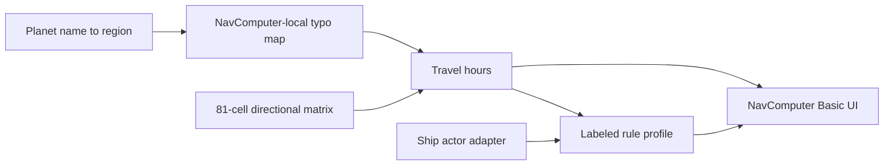

# Phase 11 Plan: NavComputer Basic Calculator

- **Date:** 2026-08-17
- **Status:** PLANNING DOCUMENT (controlling implementation specification). Implementation is separately authorized.
- **Planning-only origin:** This file is the accepted Phase 11 plan. It is not the implementation report.
- **Implementation report (later):** `docs/KAKEMAN89S_DATACRON_PHASE_11_NAVCOMPUTER_BASIC_CALCULATOR.md`

SESSION DOCUMENT PROTECTION: Files under `ai/sessions/**` are append-only historical records. This Phase 11 plan lives under `docs/` and is the controlling specification for implementation. Do not rewrite it as an implementation report.

## 1. Planning-only status

This document records the accepted Phase 11 architecture, locked runtime, locked product decisions, open maintainer decisions, slices, gates, and non-goals.

Do not treat this file as proof that Phase 11 is complete. Do not start runtime work until the maintainer separately authorizes implementation.

## 2. Repository state at planning (2026-08-17)

| Item | Value |
|---|---|
| Repository root | `C:\Users\ckauble\OneDrive - Riverside Bank of Dublin\Documents\GitHub\Kakeman89s_Datacron` |
| Branch | `v.next` tracking `origin/v.next` |
| HEAD | `af1af00577308a825a672d774d984b26d7da142d` |
| Latest commit | `feat(shipyard): add native SW5e starship actor creation` |
| Parent | `999bc118ba5c16f75271d99f3f26452e6d9b1686` |
| Working tree at planning | clean vs `origin/v.next` |
| `.cursor/` | gitignored; do not modify |
| Prior Phase 11 plan | none (this file is the first) |
| Node baseline | 120/120 (AstroCom + Phase 8 + Phase 9 + Phase 10) |
| Checkpoint | Phase 10 committed and pushed |

**Implementation precondition:** begin from this reviewed checkpoint unless the maintainer authorizes a later tree. Do not commit as part of Phase 11 execution unless separately authorized.

## 3. Accepted baseline

### 3.1 Phase 3 disposition (controlling)

From `docs/KAKEMAN89S_DATACRON_PHASE_3_ARCHITECTURE_DISPOSITION_PLAN.md` §10 and §16.3:

| ID | Disposition | Phase 11 meaning |
|---|---|---|
| NAV-001 | REVISE | Retain exact 81 matrix values; extract to versioned data; test every cell; authority unverified; private use allowed; do not symmetrize |
| NAV-002 | REVISE | Basic matrix lookup; ignore hyperdrive; improve unknown-region handling |
| NAV-003 | DEFER | Do not enable Advanced pathfinding or Advanced UI |
| NAV-004 | REVISE | Fuel/food/supplies become a named house-rule profile; call the replaced adapter; not RAW |
| NAV-005 | REVISE | Piloting DC remains a private heuristic; do not label RAW |
| NAV-006 | REVISE | Keep current GM-private piloting roll; no skill-key hunt unless a live miss is recorded |
| NAV-007 | REVISE | Planet picker stays NavComputer input, not AstroCom |
| NAV-008 | REPLACE | Ship adapter must read SW5e 1.4.2 vehicle+flag storage |
| NAV-009 | RETAIN | `formatTravelTime` unchanged |
| APP-001 / TEMPLATE-001 / LANG-001 | REVISE | Rename to NavComputer; explanation panel; do not enable Advanced |
| SET-001 | REVISE | `calculationMode` is unread; replace or keep hardcoded Basic — see open Decision A |
| SET-004 / SET-005 | REVISE | Keep fuel/food rates as labeled profile inputs |
| SET-008–010 | DEFER | Advanced settings stay unused by Basic |

### 3.2 Phase 10 Actor identity (locked)

Create-new Starships from Shipyard:

```text
type: "vehicle"
flags.sw5e.legacyStarshipActor.type: "starship"
```

Unmapped optional fields on those Actors (Phase 10 mapping, not to be filled in Phase 11): `hyperdrive`, `fuel`, `supplies`, `cargo`, `crew`, `deployments`.

`actor-helpers.js` already detects this identity via `isLegacyStarshipVehicle`. Phase 11 revises **read adapters only**. It does not change Shipyard create mapping.

### 3.3 Current Basic runtime (facts, not RAW)

- UI: [`kakeman89s-datacron/scripts/datacron-app.js`](kakeman89s-datacron/scripts/datacron-app.js) hardcodes `currentMode = "basic"`, then `calculateRouteBasic` then `calculateTravelResources`.
- Scene control: Hyperspace tool is registered only inside `if (game.user?.isGM)`. `openHyperspaceNavigationApp()` itself has no GM check. Players have no scene button today.
- Matrix: [`kakeman89s-datacron/scripts/route-calculator.js`](kakeman89s-datacron/scripts/route-calculator.js) `REGION_ORDER` (9 names) and `REGION_TRAVEL_MATRIX` (81 cells). Phase 0/roadmap: **0 mismatches** vs the supplied table. Asymmetry is intentional (Deep Core→Core **18**, Core→Deep Core **24**).
- Basic hours ignore hyperdrive. Same-name worlds return 0 hours. Unknown region: warn, 0 hours.
- Resources: [`kakeman89s-datacron/scripts/travel-calculator.js`](kakeman89s-datacron/scripts/travel-calculator.js) unverified heuristics (see §12). Default crew **4**.
- Crew/hyperdrive adapters read `actor.system` only. SW5e 1.4.2 stores starship data primarily on `flags.sw5e.legacyStarshipActor.system` (Phase 1 F7).
- Planet list: [`kakeman89s-datacron/data/planets.json`](kakeman89s-datacron/data/planets.json) (2029 records). NavComputer lookup does not normalize region typos.



## 4. Scope

Implement later (separate authorization): versioned matrix JSON; Basic lookup over that file; every-cell tests; named house-rule resource profile; Phase 10-aware ship adapter; calculation explanation; NavComputer naming; NavComputer-local region typo map; unsupported-region warnings; Foundry gates against the Phase 10 Starship; Node suite addition; implementation report; optional roadmap addendum.

## 5. Non-goals

- Advanced route navigation, Advanced UI, `calculateRouteAdvanced` pathfinding changes, or use of `advancedMaxTier` / obscure-route / tier-5 DC settings by Basic
- AstroCom ingest, packs, journals, pipeline, or `REGION_CAPITALIZATION` / `DATA_REGION_ALIASES` edits
- Shipyard create/mapping (`scripts/shipyard/**`) and Droid Shop (`droid-ally*.js`)
- Phase 8 `calculateBuild` math
- Filling Phase 10 unmapped hyperdrive/fuel/crew onto created Actors
- Adding Hutt Space, Expansion Regions, or any 10th region to the matrix
- Treating current fuel/food/supplies/DC as SW5e RAW
- Treating SW5e `#{VERSION}#` as a defect
- Public release, packaging, commit/push/PR unless separately authorized
- Helper-text / tooltip campaigns beyond the required explanation panel
- Changing Foundry/SW5e junctions or `.cursor/`
- Inventing Shipyard-style sockets for NavComputer

## 6. Locked runtime

- Foundry 13.351 — `C:\Foundry\V13\App\Foundry Virtual Tabletop.exe`
- User Data — `C:\Foundry\V13`
- dnd5e 5.2.5
- SW5e 1.4.2 — `C:\Users\ckauble\OneDrive - Riverside Bank of Dublin\Documents\GitHub\sw5e-module` (`v.next`, HEAD `294fe31018817dc07f5f38d9a326b8aa3669622b`, tag `1.4.2`)
- Datacron junction — `C:\Foundry\V13\Data\modules\kakeman89s-datacron`
- SW5e junction — `C:\Foundry\V13\Data\modules\sw5e-module`
- JavaScript ES modules; no TypeScript; no bundler; no new npm packages
- SW5e `#{VERSION}#` is intentional
- Do not change either junction

**Foundry world:** `datacron-phase10-actor` / title `Datacron Phase 10 Actor Creation` / system `dnd5e`. Modules: `lib-wrapper`, `sw5e-module`, `kakeman89s-datacron` only. Do not open valuable worlds. Do not use `datacron-phase9-shipyard` as the primary ship fixture.

**Live fixtures already on disk:**

| Name | Id | Role |
|---|---|---|
| Shipyard Created Small | `TX0zPUJDj3lByDbD` | Primary Phase 11 ship |
| Phase10 Discovery Blank | `ItNeJICABLwDhKDt` | Native blank comparison |
| Phase10 Nested Items Probe | `rMl1LnG5wHwvAzIg` | Do not treat as NavComputer fixture |
| Shipyard CreatedAt Probe | `uaKLr7IgDw7HOTHD` | Do not treat as NavComputer fixture |
| Phase10Player | `q5hy0BmJkOQGWReR` | Player client |

## 7. Locked product decisions

These are closed. Implementation must not reopen them without a dated addendum.

1. **Retain the exact 81 matrix values.** Do not symmetrize, scale, average, or “fix” cells. Deep Core→Core remains 18; Core→Deep Core remains 24.
2. **Matrix authority stays unverified** until the maintainer names a source. Private-use retention is allowed.
3. **Basic mode continues to ignore hyperdrive.** Hours come from the matrix (or 0). Do not multiply Basic hours by class.
4. **Default resource model is a named house-rule profile**, not RAW. Profile id: `existing-unverified.v1`.
5. **Do not add regions to `REGION_ORDER`** to invent cells. Hutt Space and other unsupported regions warn and return 0 hours.
6. **NavComputer-local typo map only:** `Inner RIm` → `Inner Rim`, `Outer RIm` → `Outer Rim`. Disclose the correction in the explanation. Do not change AstroCom ingest to “fix” NavComputer.
7. **Soft-fail ship fields.** Missing crew/fuel/food/hyperdrive warn and use profile defaults. Do not block matrix hours.
8. **Revise NavComputer helpers only.** Do not change Shipyard mapping to populate crew/hyperdrive for NavComputer.
9. **Do not enable Advanced** as a way to “use” hyperdrive.
10. **Units stay “Fuel Cells” and “Ration Packs”** unless the maintainer supplies SW5e unit names.
11. **A second verified SotG/RAW profile is allowed later** as an additive profile. Do not silently replace `existing-unverified.v1`.
12. **No NavComputer sockets.** Player calculate uses the existing app if the maintainer opens it to players (Decision D).

## 8. Open maintainer decisions

Do not silently fill these during implementation. Use the recommended default only if the maintainer has not answered by implementation start, and record which default was used in the implementation report.

### Decision A — Feature naming vs hardcoded Basic

- **Question:** Replace unread `calculationMode` with world boolean `featureNavComputer`, or keep Basic hardcoded and leave `calculationMode` unused?
- **Recommended default:** add `featureNavComputer` (world, config true, `requiresReload: true`, **default true** to preserve current always-on Basic). Hide/leave `calculationMode` unread. Do not add an Advanced choice.
- **Not this decision:** enabling Advanced.

### Decision B — Override UX

- **Question:** Keep `fuelPerHour` / `foodPerCrewPerDay` as the only profile inputs; add a profile picker; and/or allow GM per-calculation override of hours/crew?
- **Recommended default:** keep the two existing world settings as inputs to `existing-unverified.v1`. No profile picker until a second profile exists. No per-calculation hours/crew override in Phase 11.
- Soft validation: allow homebrew rates; warn when a rate is outside the named profile defaults (default fuel 1, food 1) without blocking calculate.

### Decision C — Second RAW profile

- **Question:** Will the maintainer supply SotG page-level fuel/food/supplies/crew rules for a second profile in this phase?
- **Recommended default:** **no**. Ship only `existing-unverified.v1`. Architecture must accept a later additive profile id without deleting the house-rule profile.

### Decision D — Player scene-control access

- **Current fact:** Hyperspace scene tool is GM-only. The open function has no permission check.
- **Question:** Show the NavComputer scene tool to players for the roadmap GM+player gates, or keep GM-only UI?
- **Recommended default:** show the existing Basic app to players via the scene tool (no sockets, no Shipyard permission model). GM and player both calculate locally.
- If rejected: Foundry player gates are BLOCKED for UI open; document that and still test GM calculate.

## 9. Matrix data isolation and validation

### 9.1 Canonical file

Create:

`kakeman89s-datacron/data/navcomputer/region-travel-matrix.v1.json`

Required shape:

```json
{
  "profileId": "region-travel-matrix.v1",
  "authority": "unverified",
  "units": "hours",
  "directional": true,
  "regionOrder": ["Deep Core", "Core", "Colonies", "Inner Rim", "Expansion Region", "Mid Rim", "Outer Rim", "Wild Space", "Unknown Regions"],
  "matrix": { }
}
```

`matrix` must contain the exact current `REGION_TRAVEL_MATRIX` object (all 81 cells). Do not include copyrighted sourcebook prose.

### 9.2 Runtime loader

Create `kakeman89s-datacron/scripts/navcomputer/region-matrix.js`:

- Parse and validate: nine `regionOrder` names, 9×9 numeric finite hours, every pair present.
- Cache the parsed document.
- Foundry: `fetch` `modules/kakeman89s-datacron/data/navcomputer/region-travel-matrix.v1.json` (same pattern as `planet-data.js`).
- Node tests: `fs.readFileSync` of that JSON. Do not require Foundry.
- Re-export `REGION_ORDER` and `REGION_TRAVEL_MATRIX` so existing Advanced fallback can keep reading the same 81 values without copying cells.

`calculateRouteBasic` becomes a lookup over the loaded document. Keep the function synchronous once the document is in cache. `DatacronApp` already awaits `loadPlanetData` before calculate; await matrix load in the same place.

`calculateRouteAdvanced` may await the same loader next to its existing `loadPlanetData` call so Advanced fallback does not lose the 81 cells. Do not change A*, graph filters, fallback reasons, or Advanced hyperdrive multiplication.

### 9.3 Frozen expected table (copy from current code / roadmap §10.2)

| From / To | Deep Core | Core | Colonies | Inner Rim | Expansion Region | Mid Rim | Outer Rim | Wild Space | Unknown Regions |
| ---: | ---: | ---: | ---: | ---: | ---: | ---: | ---: | ---: | ---: |
| Deep Core | 12 | 18 | 24 | 48 | 72 | 96 | 120 | 144 | 168 |
| Core | 24 | 6 | 24 | 36 | 60 | 84 | 96 | 120 | 144 |
| Colonies | 48 | 24 | 12 | 24 | 48 | 72 | 96 | 120 | 96 |
| Inner Rim | 72 | 36 | 24 | 18 | 24 | 48 | 72 | 96 | 72 |
| Expansion Region | 96 | 60 | 48 | 24 | 24 | 24 | 48 | 72 | 96 |
| Mid Rim | 120 | 84 | 72 | 48 | 24 | 36 | 24 | 48 | 72 |
| Outer Rim | 144 | 96 | 96 | 72 | 48 | 24 | 48 | 24 | 60 |
| Wild Space | 168 | 120 | 120 | 96 | 72 | 48 | 24 | 12 | 120 |
| Unknown Regions | 192 | 144 | 96 | 72 | 60 | 72 | 96 | 120 | 48 |

Node tests must assert this table equals the JSON file and equals the runtime export. A single cell drift is a failure.

Same-region diagonal is **not** uniform (Core 6, Colonies 12, Unknown Regions 48, and others). Tests must not assume a constant diagonal.

## 10. Hyperdrive

Basic hours **must not** be multiplied by hyperdrive class.

Adapter **may** read hyperdrive from the Phase 10 / SW5e actor for explanation/display (resolved class, source path, or “unresolved”). Display must not change Basic hours.

Read order (display only):

1. `flags.sw5e.legacyStarshipActor.system.attributes.equip.hyperdrive.class`
2. `flags.sw5e.legacyStarshipActor.system.attributes.travel.hyperdriveClass`
3. Prepared `actor.system` equivalents
4. Equipped item `system.attributes.hdclass.value` if present

Phase 10 created ships leave hyperdrive unmapped. Expect unresolved on `TX0zPUJDj3lByDbD`. That is a warning, not a calculate blocker.

Do not import SW5e `starship-data.mjs` internals. Duplicate the read paths in NavComputer helpers.

Do not turn on Advanced to consume hyperdrive.

## 11. Ship-data adapter vs Phase 10 Actors

Target identity: `type === "vehicle"` && `flags.sw5e.legacyStarshipActor.type === "starship"`.

Keep `isLegacyStarshipVehicle` / `isStarshipActor` as the picker filter. Continue listing character-backed and unmigrated `starship` types if they already appear; do not remove those detections unless live evidence shows they crash Basic.

Replace `getCrewSizeFromShipActor` so it reads **flag system first, then prepared system**:

1. `deployment.crew.items` length if it is a non-empty array
2. `attributes.equip.size.crewMinWorkforce` if finite and `> 0` (ceil)
3. dnd5e vehicle `system.attributes.crew.value` UUID array length if non-empty
4. else `null` → caller uses **4** and records `crewSource: "profile-default"` plus a warning

Do not call Shipyard mapping. Do not write crew onto the Actor.

Live inspect in `datacron-phase10-actor` (implementation Slice 11.1) against **Shipyard Created Small** and the discovery blank. Record which of crew / fuel / food / hyperdrive are actually present vs unmapped. Planning-time evidence (Phase 10 report): those fields are unmapped optional, so the adapter must soft-fail on the primary fixture.

## 12. Fuel, food, supplies, crew, rounding

Do not present these as SW5e RAW. Label them as profile `existing-unverified.v1`.

Exact current arithmetic, retained as the house-rule functions:

```text
fuelRequired     = ceil(hours * fuelPerHour)
travelDays       = hours / 24
foodRequired     = ceil(travelDays * crewSize * foodPerCrewPerDay)
suppliesRequired = ceil(foodRequired * 0.5)
travelDaysDisplay = (round(travelDays * 100) / 100).toFixed(2)
```

Setting defaults: `fuelPerHour = 1`, `foodPerCrewPerDay = 1`. Invalid/negative rates fall back to 1.

`travelDaysDisplay` rounding is independent of consumption `ceil`. Do not “fix” that split unless a later sourced profile says otherwise.

`formatTravelTime` (NAV-009) remains the hours display. Same-world 0 hours still formats via that helper.

Piloting DC (NAV-005) stays the existing heuristic for Basic (base 10, outward steps, remote destination). Do not label it RAW. Do not feed Advanced hop/lane bonuses into Basic.

## 13. Calculation explanations

Required breakdown in the results panel (not a tooltip campaign):

- Origin and destination world names
- Raw region strings from planet data
- Normalized regions used for lookup, and whether a typo map was applied
- Matrix profile id `region-travel-matrix.v1` and authority `unverified`
- Matrix cell hours, or the same-world 0 rule, or unsupported-region 0 rule
- Resource profile id `existing-unverified.v1`
- Crew size, crew source (`deployment` / `crewMinWorkforce` / `vehicle-crew` / `profile-default`)
- Fuel/food/supplies arithmetic with the live rates
- Rounding (`ceil` on fuel/food/supplies; two-decimal travel-days display)
- Hyperdrive resolved or unresolved, plus an explicit line that Basic hours ignored it
- Warnings list

Show the resource profile name in the UI (APP-001). Rename window/copy from “Hyperspace Navigation” to **NavComputer** where Phase 11 touches UI (`datacron-app.js` title, `datacron.hbs` kicker/title, `lang/en.json` App + SceneControl strings). Drop Advanced result copy from the Basic template; do not delete Advanced functions.

## 14. Invalid and unsupported regions

Planning-time `planets.json` region counts (2029 records):

| Region string | Count | Matrix? |
|---|---|---|
| Outer Rim | 803 | yes |
| Mid Rim | 396 | yes |
| Inner Rim | 205 | yes |
| Expansion Region | 158 | yes |
| Core | 153 | yes |
| Colonies | 101 | yes |
| Hutt Space | 85 | **no** |
| Wild Space | 51 | yes |
| Unknown Regions | 38 | yes |
| Deep Core | 32 | yes |
| Expansion Regions | 4 | **no** |
| Outer RIm | 2 | typo → Outer Rim |
| Inner RIm | 1 | typo → Inner Rim |

NavComputer-local map (lookup only; do not mutate `planets.json`):

| Raw | Lookup region | Example world |
|---|---|---|
| Inner RIm | Inner Rim | Eshan |
| Outer RIm | Outer Rim | Lenico IV, Nim Drovis |

Unsupported (warn, 0 hours, no silent Mid Rim substitution): `Hutt Space` (example Alee), `Expansion Regions`, missing region, any other string not in `regionOrder` after the typo map.

AstroCom ingest already maps Inner RIm / Outer RIm and already warns that Hutt Space is outside the matrix. Phase 11 must not change that pipeline. Shared [`planet-data.js`](kakeman89s-datacron/scripts/planet-data.js) may be read; ingest writes are out of scope.

`getPlanetByName` continues to match exact world names. Region normalization happens inside Basic calculate, not by rewriting planet records.

## 15. Isolation from other products

Touch only NavComputer files listed in §19.

Do not modify:

- `kakeman89s-datacron/scripts/shipyard/**`
- `kakeman89s-datacron/scripts/astrocom/**`
- `kakeman89s-datacron/scripts/droid-ally*.js`
- Phase 8 `calculate.js`
- SW5e module source
- junctions
- `.cursor/`

Advanced settings remain `config: false` and unused by Basic. `calculationMode` stays Basic-only if retained.

Random-event settings stay unused (Phase 3 DEFER). Do not wire them in Phase 11.

## 16. Implementation slices (later authorization only)

| Slice | Purpose | Verify |
|---|---|---|
| 11.0 | Reconfirm HEAD contains Phase 10; Node 120/120 | git + `npm test` |
| 11.1 | Read-only inspect `TX0zPUJDj3lByDbD` and `ItNeJICABLwDhKDt` for crew/fuel/food/hyperdrive surfaces | recorded field table |
| 11.2 | Extract matrix JSON + loader; re-export for Advanced fallback | JSON equals frozen table |
| 11.3 | Basic lookup + typo map + unsupported-region warnings | Node: 81 cells + Eshan + Alee |
| 11.4 | Replace crew/hyperdrive adapters; house-rule profile wrapper | fixtures: flag vehicle, blank, no ship |
| 11.5 | Explanation object + NavComputer UI/i18n | template shows profile id |
| 11.6 | Settings: Decision A/B defaults; label fuel/food as house rules | settings names/hints |
| 11.7 | Node suite + `package.json` test script | full Node green |
| 11.8 | Foundry gates in `datacron-phase10-actor` | every gate recorded |
| 11.9 | Implementation report; optional one-line roadmap addendum only if the maintainer wants it | no history rewrite |

Per-slice entry: prior slice complete. Per-slice rollback: disable `featureNavComputer` if added; leave the Phase 10 world and Actors on disk.

Do not append a “Phase 11 started” closeout that rewrites earlier roadmap text. Prefer no roadmap edit until implementation is authorized; then a dated addendum only.

## 17. Node testing

Preserve existing 120 tests. Add `kakeman89s-datacron/scripts/navcomputer/tests/navcomputer-phase11.test.js` to the root [`package.json`](package.json) `test` script.

Required cases:

- All 81 matrix cells vs the frozen table
- Deep Core→Core 18 and Core→Deep Core 24
- Same-region diagonal values (at least Core 6, Colonies 12, Unknown Regions 48)
- Same-world name → 0 hours even when regions match
- Missing planet name → warning
- Unsupported region `Hutt Space` → warn, 0 hours
- Typo `Inner RIm` / `Outer RIm` → lookup Inner/Outer Rim, explanation discloses correction
- `Expansion Regions` → unsupported, 0 hours
- Missing matrix cell → warn, 0 hours
- Resource profile id present; fuel/food/supplies match the ceil formulas
- Crew unresolved → 4 + warning
- Crew from flag `crewMinWorkforce` / deployment items
- Hyperdrive resolved does **not** change Basic hours
- Adapter fixtures: vehicle+legacy flag, character+enabled, plain vehicle, null ship
- Advanced functions are not imported by the new Basic tests in a way that enables UI; do not rewrite Advanced tests into this phase

Harness: Node built-in test runner. Mock `game.settings.get` for rates. Do not claim Foundry sheet success from Node.

Do not apply ECC 80% coverage as a gate. Lock behavior that must not drift.

## 18. Foundry runtime gates

Record PASS / FAIL / BLOCKED / NOT RUN. Do not delete a failed gate later.

World: `datacron-phase10-actor` only.

| Gate | Steps | Expected |
|---|---|---|
| A Environment | Confirm Foundry 13.351, dnd5e 5.2.5, SW5e 1.4.2, three modules only | versions match; `#{VERSION}#` ignored |
| B Feature flag | If Decision A default: `featureNavComputer` true | app opens; false hides scene tool after reload |
| C GM open | GM scene tool | window titled NavComputer, Basic mode |
| D Matrix hours | Origin Byss (Deep Core) → destination Abregado-rae (Core) | **18** hours; hyperdrive ignored |
| E Asymmetry | Reverse: Abregado-rae → Byss | **24** hours |
| F Same world | Byss → Byss | 0 hours; same-world explanation |
| G Typo Inner RIm | Origin or destination **Eshan** | lookup Inner Rim; explanation discloses Inner RIm → Inner Rim |
| H Typo Outer RIm | **Lenico IV** | lookup Outer Rim; disclosure |
| I Hutt Space | **Alee** as origin or destination | warn, 0 hours, no Mid Rim substitute |
| J Phase 10 ship picker | Select **Shipyard Created Small** | appears via `isStarshipActor` |
| K Adapter soft-fail | Calculate with that ship | hours still matrix; crew default 4 unless 11.1 found crew; warning names unresolved fields |
| L No-ship | Clear ship | crew 4; profile default |
| M Explanation | Read results panel | profile id, matrix cell, rounding, hyperdrive-ignored line |
| N House-rule rates | Change `fuelPerHour` to 2, recalculate a known hour cell | fuel ceil updates; hours unchanged |
| O Piloting roll | Select a character pilot; roll | existing GM-private roll still works |
| P Player | Log in `Phase10Player` | if Decision D yes: player can open and calculate; if no: scene tool absent, record BLOCKED for player UI |
| Q No Advanced | Confirm no Advanced mode control | Basic only |
| R Isolation | Open Shipyard/AstroCom if enabled | unchanged; no new Actors from NavComputer |
| S Reload | Reload world; recalculate D | still 18 |
| T Shutdown | Close windows; leave world on disk; stop Foundry V13 | process count 0; Phase 10 Actors still present |

Do not create Actors from NavComputer. Do not update existing Actors.

Manual clicks: Token scene controls → Open NavComputer → origin combo → destination combo → optional ship → Calculate Route.

## 19. Files proposed

**Create:**

- `kakeman89s-datacron/data/navcomputer/region-travel-matrix.v1.json`
- `kakeman89s-datacron/scripts/navcomputer/region-matrix.js`
- `kakeman89s-datacron/scripts/navcomputer/tests/navcomputer-phase11.test.js`
- this plan
- later implementation report `docs/KAKEMAN89S_DATACRON_PHASE_11_NAVCOMPUTER_BASIC_CALCULATOR.md`

**Modify (implementation only):**

- `kakeman89s-datacron/scripts/route-calculator.js` (Basic lookup + re-export; Advanced load hook only)
- `kakeman89s-datacron/scripts/travel-calculator.js`
- `kakeman89s-datacron/scripts/actor-helpers.js` (read adapters; keep identity helpers)
- `kakeman89s-datacron/scripts/datacron-app.js`
- `kakeman89s-datacron/templates/datacron.hbs`
- `kakeman89s-datacron/lang/en.json`
- `kakeman89s-datacron/scripts/settings.js` (Decision A/B)
- `kakeman89s-datacron/scripts/main.js` (Decision A/D scene tool only)
- `package.json` test script
- `docs/KAKEMAN89S_DATACRON_ROADMAP.md` (dated addendum only, if authorized)

**Do not modify:** `scripts/shipyard/**`, `scripts/astrocom/**`, `droid-ally*.js`, Phase 8 `calculate.js`, SW5e, junctions, `.cursor/`, `planets.json` records, AstroCom packs.

## 20. Whole-phase Definition of Done (implementation)

- JSON matrix equals the frozen 81-cell table
- Every cell tested
- Basic ignores hyperdrive
- Resources labeled `existing-unverified.v1`
- Phase 10 Starship selectable; adapter soft-fails without blocking hours
- Explanations include matrix cell, profile id, crew source, rounding, and any region normalization
- Inner RIm / Outer RIm disclosed; Hutt Space 0 hours
- Advanced still deferred
- AstroCom / Shipyard / Droid Shop unchanged
- Node suite includes the new file and stays green
- Every Foundry gate recorded
- Foundry stopped; no valuable world opened
- No commit unless separately authorized

## 21. Planning-assignment Definition of Done

This planning assignment is complete when this file exists and is execution-ready. No Phase 11 product code. No git commit unless the maintainer separately authorizes committing this plan document.

## 22. Exact recommended implementation action (after separate authorization)

1. Revalidate checkpoint and runtime (11.0).
2. Read-only inspect the Phase 10 Actors (11.1).
3. Extract matrix, adapters, explanation, UI (11.2–11.7).
4. Run Foundry gates (11.8).
5. Write the implementation report and optional roadmap addendum (11.9).
6. Stop. Do not start Advanced, AstroCom, Shipyard, or Droid Shop work.
