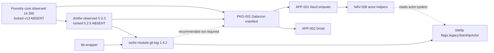

# Kakeman89's Datacron — Phase 1 Compatibility, API, and Existing-Code Verification

- **Document title:** Kakeman89's Datacron — Phase 1 Compatibility Verification
- **Creation date:** 2026-08-14
- **Status:** Phase 1 complete as static investigation — awaiting maintainer approval before Phase 2 / remaining runtime work
- **Authoritative plan:** [KAKEMAN89S_DATACRON_ROADMAP.md](KAKEMAN89S_DATACRON_ROADMAP.md)
- **Phase 0 input:** [KAKEMAN89S_DATACRON_PHASE_0_BASELINE_INVENTORY.md](KAKEMAN89S_DATACRON_PHASE_0_BASELINE_INVENTORY.md)
- **Candidate baseline:** `origin/v.next` at `a01c1d7b46a8ea62a7b1d95e39131aace3f6315b` (not checked out)
- **Implementation authorization:** None
- **Disposition policy:** Every Phase 0 component remains **UNASSESSED**. No RETAIN / REVISE / REPLACE / REMOVE / QUARANTINE / DEFER. Reuse gate A–D remains unselected.
- **Runtime policy:** No world was opened. Foundry was not launched. No Actor, Journal, Item, Token, ChatMessage, setting, folder, or pack was created or updated.
- **Attribution:** Kakeman89 only. Existing `v.next` package metadata that uses a personal name is recorded as a conflict without reproducing that name.
- **Evidence order used:** installed package files → (no safe runtime) → version-matched docs in the environment (none for Foundry v13 / dnd5e 5.2.5) → `origin/v.next` source via `git show` → repository compatibility notes

### Verification classifications used in this report

| Label | Meaning |
| --- | --- |
| VERIFIED STATIC | Directly established from target-version files or manifests |
| VERIFIED RUNTIME | Directly observed in a safe target runtime without mutation (**none in this phase**) |
| REPOSITORY CLAIM | Claimed by `v.next` documentation or comments, not independently verified |
| INFERRED | Strongly suggested by imports, schemas, or usage, not directly established |
| UNVERIFIED | Evidence missing, conflicting, unsafe to obtain, or unavailable |
| NOT APPLICABLE | Question does not apply to the verified package arrangement |
| COMPARISON ONLY | Observed on a **different** installed version than the locked baseline; not proof of the target |

---

## 1. Pre-investigation repository check

| Item | Value | Classification |
| --- | --- | --- |
| Current branch | `main` | VERIFIED STATIC |
| HEAD | `49244ad78067c77ffa1e645fe9038f8690bddc32` | VERIFIED STATIC |
| Upstream | `main...origin/main` | VERIFIED STATIC |
| `git diff HEAD` | Empty | VERIFIED STATIC |
| `origin/v.next` SHA | `a01c1d7b46a8ea62a7b1d95e39131aace3f6315b` | VERIFIED STATIC |
| `origin/v.next` checked out? | No. Local branches: `main` only | VERIFIED STATIC |
| Untracked | `.cursor/` (pre-existing); `KAKEMAN89S_DATACRON_ROADMAP.md`; `KAKEMAN89S_DATACRON_PHASE_0_BASELINE_INVENTORY.md` | VERIFIED STATIC |
| Unexpected product changes | None | VERIFIED STATIC |
| Phase 0 recorded HEAD match | Yes | VERIFIED STATIC |

Read-only investigation was safe to continue.

---

## 2. Target installation discovery

Live-world inspection was **not** performed. Reasons are in Section 2.5.

### 2.1 Foundry Virtual Tabletop

| Field | Observed |
| --- | --- |
| Installation path | `C:\Program Files\Foundry Virtual Tabletop` |
| User Data path | `C:\Users\ckauble\AppData\Local\FoundryVTT` (`options.json` `dataPath`) |
| Core product version | **14.365.0** (`resources/app/package.json` `"version"`) |
| Generation / channel / build | generation **14**, channel `stable`, build **365** |
| Selected world in `options.json` | `null` (no world auto-selected at last recorded config) |
| Other Foundry installs found | None |
| Intended test target vs locked baseline | **Mismatch.** Locked baseline is Foundry **v13**. Observed install is Foundry **v14**. |

**Classification:** VERIFIED STATIC for the observed v14 install. Foundry **v13 is absent** as an installed application. **Blocker** for Foundry v13 runtime and for treating this install as the Phase 1 live target.

Document schemas in this v14 tree still declare `schemaVersion: "13.341"` on JournalEntry / Folder. That is a v14-source fact, **not** proof that a v13 binary is installed.

### 2.2 dnd5e

| Field | Observed |
| --- | --- |
| Package path | `C:\Users\ckauble\AppData\Local\FoundryVTT\Data\systems\dnd5e` |
| Package type | Foundry **system** |
| Package ID | `dnd5e` |
| Title | Dungeons & Dragons Fifth Edition |
| Installed version | **5.3.3** (`system.json`) |
| Compatibility | minimum `13.347`, verified `14` |
| Download field | `dnd5e-release-5.3.3.zip` |
| Exact 5.2.5? | **No** |
| Other dnd5e system folders | None |

**Classification:** VERIFIED STATIC that 5.3.3 is installed. dnd5e **5.2.5 package files are absent**. World metadata (Section 2.5) records that some worlds last ran 5.2.5, which does **not** restore those system files. **Blocker** for dnd5e 5.2.5 schema verification. 5.3.3 findings below are **COMPARISON ONLY**.

### 2.3 SW5e

| Field | Observed |
| --- | --- |
| Foundry module path | `Data\modules\sw5e-module` |
| Filesystem type | Junction → GitHub checkout `sw5e-module` (official remote `sw5e-foundry/sw5e-module`) |
| Package type | Foundry **module** (not a game system) |
| Package ID | `sw5e-module` |
| Display title | SW5E |
| Manifest `version` | `#{VERSION}#` (unsubstituted release template) |
| Git identity | Branch `v.next`, working tree clean, `HEAD` = `origin/v.next` = tag **`1.4.2`** = `294fe31018817dc07f5f38d9a326b8aa3669622b` (2026-08-13) |
| Exact 1.4.2? | **Git tag 1.4.2 matches HEAD.** Manifest string is not the literal `1.4.2`. This is a source checkout, not a Foundry release zip with substituted URLs. |
| Foundry compatibility in manifest | minimum 13, verified **13** |
| dnd5e relationship | requires system `dnd5e` minimum `5.0.0`, verified **`5.2.5`** |
| Other required module | `lib-wrapper` 1.13.4.0 installed |
| Other SW5e-related packages | No `sw5e` system folder. No second SW5e module id. |
| Local fork? | Remote is the official `sw5e-foundry/sw5e-module` repository. Clean tree at tag 1.4.2. Not a separately named fork. Still a **dev checkout**, not a packaged release. |
| Origin URLs | Manifest `url` / `manifest` / `download` are `#{URL}#` / `#{MANIFEST}#` / `#{DOWNLOAD}#` placeholders |
| README claim | “Current target compatibility: Foundry VTT 13 with dnd5e 5.2.5”; beta guide titled v1.4.0 | REPOSITORY CLAIM of that module, not Datacron acceptance |
| Datacron redistribution attribution | SW5e authors field is “The Dev Team”; not a Datacron metadata issue. Datacron `v.next` `module.json` still has a personal-name authors conflict (LEGAL-002). |

**Classification:** VERIFIED STATIC that SW5e **1.4.2 exists locally as module `sw5e-module`**. It is **not** a Foundry system. It overlays/patches dnd5e. It **does** declare Foundry 13 / dnd5e 5.2.5, which **do not match** the currently installed Foundry 14.365 / dnd5e 5.3.3.

No public 1.2.5 package was used as a substitute.

### 2.4 Other packages in User Data

| Path | Note |
| --- | --- |
| `modules/lib-wrapper` | Required by SW5e 1.4.2. Version 1.13.4.0. Foundry compatibility verified 13. |
| `modules/kakeman89s-datacron` | Junction to a **different** GitHub checkout (`NaviComputer\kakeman89s-datacron`), not this `Kakeman89s_Datacron` `main` tree. Inspected only as an environment pointer. Not modified. |

### 2.5 Worlds and why runtime inspection was refused

`options.json` `world` is `null`. Foundry was **not running**.

| World id | `coreVersion` | `systemVersion` | Implication |
| --- | --- | --- | --- |
| `dnd` | **13.351** | **5.2.5** | Opening on Foundry 14.365 would invoke core + likely system migration |
| `vanilla-backup-20260727-141808` | **13.351** | **5.2.5** | Same |
| `world-test` | **13.351** | **5.2.5** | Same |
| `fresh` | 14.365 | 5.3.3 | Already a v14 world; not the locked baseline; SW5e `ready` can still `migrateWorld` |
| `vanilla` | 14.365 | 5.3.3 | Same; `playtime` indicates a used world, not a proven disposable fixture |
| `sw5e-v14-clean-control` | 14.365 | 5.3.3 | Name indicates v14 SW5e testing; not authorized as Datacron fixture |
| `sw5e-v14-init-probe` | 14.365 | 5.3.3 | Same |

Before-state mutation detection was not established. Worlds were **not** proven expendable Datacron compatibility fixtures. SW5e 1.4.2 `Hooks.once('ready')` calls `migrations.migrateWorld()` when `needsMigration()` is true (GM, documents present, `moduleMigrationVersion` older than `flags.needsMigrationVersion` `1.3.6`). dnd5e 5.3.3 `ready` calls `migrateWorld()` when `systemMigrationVersion` is older than `flags.needsMigrationVersion` `5.3.0`.

**Decision:** static package inspection only. All VERIFIED RUNTIME cells in this report are empty by design.

---

## 3. Version alignment matrix

| Component | Required target | Actually observed | Exact match | Evidence | Verification state | Compatibility implication | Blocker |
| --- | --- | --- | --- | --- | --- | --- | --- |
| Foundry core | v13 | v14.365.0 | No | `package.json` version 14.365.0 | VERIFIED STATIC (observed); v13 UNVERIFIED (absent) | Cannot treat this host as the locked runtime | **Yes** for v13 live API |
| dnd5e | 5.2.5 | 5.3.3 | No | `systems/dnd5e/system.json` | VERIFIED STATIC (5.3.3); 5.2.5 UNVERIFIED | 5.3.3 is COMPARISON ONLY; Activities/Actor types may differ | **Yes** for 5.2.5 schema |
| SW5e | 1.4.2 | Git tag 1.4.2 module `sw5e-module`; manifest `#{VERSION}#` | Partial (tag yes, packaged version field no) | `git log -1 1.4.2`; `module.json` | VERIFIED STATIC identity; runtime UNVERIFIED | Module overlay on dnd5e; declared for Foundry 13 / dnd5e 5.2.5 | **Yes** for runtime against declared targets; **No** for identifying package type |
| Candidate Datacron | Foundry 13 / dnd5e 5.2.5 (`PKG-001`) | `origin/v.next` manifest min/verified 13 and dnd5e 5.2.5 | Manifest matches locked baseline, not current host | `git show origin/v.next:.../module.json` | VERIFIED STATIC vs v.next; runtime UNVERIFIED | Module would be unverified on this v14 host | Host mismatch |
| Application framework | ApplicationV2 (investigate) | Present in Foundry **14** as `foundry.applications.api.ApplicationV2` | v14 yes; v13 UNVERIFIED | `client/applications/api/application.mjs` | COMPARISON ONLY (v14) | v.next already uses this namespace | v13 contract UNVERIFIED |
| Handlebars/template | HandlebarsApplicationMixin | Present in Foundry 14 | v14 yes; v13 UNVERIFIED | `handlebars-application.mjs` | COMPARISON ONLY | v.next `PARTS` + mixin match v14 shape | v13 UNVERIFIED |
| Actor schema | SW5e 1.4.2 + dnd5e 5.2.5 | SW5e 1.4.2 source yes; dnd5e 5.2.5 files no | Partial | `starship-data.mjs`; dnd5e 5.3.3 `VehicleData` | SW5e STATIC; dnd5e 5.2.5 UNVERIFIED | Starship is vehicle + flags, not a new Actor type | Shipyard Actor creation blocked until 5.2.5 + runtime |
| Item schema | dnd5e 5.2.5 + SW5e maneuver | SW5e adds `Item.maneuver`; dnd5e 5.3.3 item types COMPARISON | Partial | SW5e `module.json` `documentTypes` | Partial | Maneuver is a module document type | 5.2.5 item list UNVERIFIED |
| Journal schema | Foundry v13 | Foundry 14 `BaseJournalEntry` schemaVersion 13.341 | UNVERIFIED for v13 binary | `common/documents/journal-entry.mjs` | COMPARISON ONLY | Pages, single `folder` field | Folder-depth PoC still Phase 4 |
| Compendium support | Foundry v13 | Foundry 14 `CompendiumCollection` | UNVERIFIED for v13 | `compendium-collection.mjs` | COMPARISON ONLY | Packs + in-pack folders exist | Dual-index still undecided |
| Folder support | Foundry v13 | v14 `FOLDER_MAX_DEPTH = 4`; packs `maxFolderDepth - 1` | UNVERIFIED for v13 numeric limit | `constants.mjs`; `compendium-collection.mjs` | COMPARISON ONLY | Deep Canon/Legends/Grid trees may not fit | Phase 4 PoC |
| Socket API | Foundry v13 | v14 `game.socket` + `handleCustomSocket` | UNVERIFIED for v13 | `dist/server/sockets.mjs`; `game.mjs` | COMPARISON ONLY | Collaboration technically possible later | Do not design sync |
| Settings API | Foundry v13 | v14 `game.settings.register` world/client/user | UNVERIFIED for v13 | `client-settings.mjs` | COMPARISON ONLY | v.next String/Number/Boolean types are Functions | Rule defaults not approved |
| Scene controls API | Foundry v13 | v14 hook receives `Record<string, SceneControl>` | UNVERIFIED for v13 | `hooks.mjs`; `scene-controls.mjs` | COMPARISON ONLY | v.next already uses object `controls.tokens.tools` | Array-style v11/v12 would mismatch v14 |

---

## 4. Finding records (required fields)

Each subsection uses the required evidence fields. Component IDs are Phase 0 identifiers.

### F1 — Foundry v13 target missing

- **Evidence source:** Installed `package.json`; filesystem search for other Foundry executables
- **Path / API:** `C:\Program Files\Foundry Virtual Tabletop\resources\app\package.json` `release.generation` 14, `version` 14.365.0
- **Target package:** Foundry core (locked v13; observed v14)
- **Classification:** VERIFIED STATIC (v14 present); UNVERIFIED (v13 APIs as a running target)
- **Conflict with v.next:** `PKG-001` declares compatibility minimum/verified **13**
- **Affected components:** PKG-001, HOOK-001, APP-001, APP-002, SHARED-*
- **Affected requirements:** SHARED-003, REL-001, Phase 1 exit criteria
- **Later action:** Install or locate Foundry v13.x matching the locked baseline, or maintainer explicitly retargets the baseline
- **Blocks implementation:** **Yes** for claiming v13 compatibility

### F2 — dnd5e 5.2.5 package missing

- **Evidence source:** `Data/systems/dnd5e/system.json` version 5.3.3
- **Path:** `systems/dnd5e/system.json`
- **Target package:** dnd5e 5.2.5
- **Classification:** VERIFIED STATIC absence of 5.2.5 files; 5.3.3 COMPARISON ONLY
- **Conflict with v.next:** `PKG-001` relationships.systems dnd5e verified 5.2.5; SW5e 1.4.2 also verifies 5.2.5
- **Affected components:** NAV-008, SHIP-* (absent), PKG-001
- **Affected requirements:** SHIP-004, NAV-004, SHARED-008
- **Later action:** Restore dnd5e 5.2.5 system files for schema capture; do not use 5.3.3 as silent proof
- **Blocks implementation:** **Yes** for Actor/Item/Activity planning that depends on 5.2.5

### F3 — SW5e 1.4.2 is a module overlay

- **Evidence source:** `sw5e-module/module.json`; git tag 1.4.2
- **Path:** `module.json` `id`, `relationships.systems`, `documentTypes`
- **Target package:** SW5e 1.4.2
- **Classification:** VERIFIED STATIC
- **Conflict with v.next:** `PKG-001` **recommends** both `sw5e` and `sw5e-module`. HOOK-001 looks up either. Installed id is `sw5e-module` only.
- **Affected components:** PKG-001, HOOK-001, NAV-008, BASE-002
- **Affected requirements:** SHARED-010; SW5e identity investigation
- **Later action:** Treat SW5e as module `sw5e-module` depending on system `dnd5e`. Do not plan Datacron as a system.
- **Blocks implementation:** **No** for identity; **Yes** for runtime until Foundry 13 + dnd5e 5.2.5 exist

### F4 — ApplicationV2 exists on the observed Foundry 14 tree

- **Evidence source:** Foundry 14 `client/applications/api/application.mjs`, `handlebars-application.mjs`, `api/_module.mjs`
- **Path / access:** `foundry.applications.api.ApplicationV2`, `foundry.applications.api.HandlebarsApplicationMixin`
- **Target package:** Foundry (observed 14; locked 13)
- **Classification:** VERIFIED STATIC for v14; UNVERIFIED for v13
- **Conflict with v.next:** None observed against v14 files. APP-001 / APP-002 use the same namespace, `DEFAULT_OPTIONS`, `PARTS`, `_prepareContext`, `HandlebarsApplicationMixin(ApplicationV2)`.
- **Affected components:** APP-001, APP-002, TEMPLATE-001, TEMPLATE-002
- **Affected requirements:** SHARED-003
- **Later action:** Confirm the same classes on a Foundry v13 install. Phase 3 may still choose other UI shells.
- **Blocks implementation:** **No** for “ApplicationV2 is a viable candidate on v14”; **Yes** for declaring v13 support proven

v14 `DEFAULT_OPTIONS` includes window attach/detach controls. v.next `mergeObject(super.DEFAULT_OPTIONS, …)` would inherit those on v14. Whether v13 `DEFAULT_OPTIONS` matches is UNVERIFIED.

Use is **available** in v14 core applications. Whether it is “officially required” for modules is UNVERIFIED. It is **not** deprecated in the inspected v14 sources.

ApplicationV2 can **technically host** separate AstroCom / Shipyard / NavComputer / Droid Shop windows. That is not a decision that every feature must use it.

### F5 — Scene control hook shape on Foundry 14

- **Evidence source:** `client/hooks.mjs` `getSceneControlButtons`; `scene-controls.mjs` `#prepareControls`
- **Path:** Hook param `Record<string, SceneControl>`; example assigns `controls.tokens.tools.myTool`
- **Classification:** VERIFIED STATIC (v14); UNVERIFIED (v13)
- **Conflict with v.next:** HOOK-001 already uses `controls.tokens ?? controls.token` and object `tools` with `onChange`. That **matches the v14 example**, not the legacy array-`.find()` pattern.
- **Affected components:** HOOK-001, APP-001, APP-002
- **Affected requirements:** SHARED-003
- **Later action:** Confirm v13.351 (last world coreVersion) uses the same Record shape
- **Blocks implementation:** Not for v14 object-style; v13 still UNVERIFIED

### F6 — Starship representation in SW5e 1.4.2

- **Evidence source:** `scripts/starship-data.mjs`, `scripts/patch/starship-create.mjs`, `module.json`
- **Path:** `isStarshipFlagVehicle`: `actor.type === "vehicle" && flags.sw5e.legacyStarshipActor.type === "starship"`
- **Target package:** SW5e 1.4.2
- **Classification:** VERIFIED STATIC
- **Conflict with v.next:** NAV-008 `isNormalizedStarship` = `character` + `flags.sw5e.starshipCharacter.enabled === true`. SW5e 1.4.2 still **detects** that shape as `isCharacterBackedStarship` and **normalizes it to vehicle** via `normalizeLegacyStarshipActorData` (`data.type = "vehicle"`; writes `flags.legacyStarshipActor`). Current creation path `createBlankLegacyStarshipActorData` creates a **vehicle**, not a character.
- **Comparison:** MATCH on legacy vehicle flag; PARTIAL MATCH on character+enabled (legacy input, not current created form); MATCH on `type === "starship"` as legacy-like detection; NOT APPLICABLE as a native Actor type (SW5e `documentTypes` adds Item `maneuver` only)
- **Affected components:** NAV-008, APP-001
- **Affected requirements:** SHIP-004, NAV-004, NAV-003
- **Later action:** Re-read live prepared Actor on Foundry 13 + dnd5e 5.2.5. Do not create a Starship in this phase (none created).
- **Blocks implementation:** **Yes** for Shipyard Actor creation until live schema + 5.2.5 confirmed

Additional SW5e 1.4.2 static notes (UNVERIFIED at runtime):

| Topic | Static evidence | vs v.next |
| --- | --- | --- |
| Sheet | `patchStarshipSheet()` wraps dnd5e vehicle sheet | UNVERIFIED live editability |
| Creation UI | Injects `__sw5e_starship__` radio beside vehicle | Not used by Datacron |
| Crew | `flags.sw5e.legacyStarshipActor.system.attributes.deployment` (pilot/crew/passenger UUID lists); comment that vehicle `system.skills` is not stock dnd5e | NAV-004 `getCrewSizeFromShipActor` reads `shipActor.system.attributes.deployment.crew.items` — likely **MISMATCH** if deployment lives only on flags |
| Hyperdrive | `applyDerivedStarshipTravel` writes `attributes.travel.hyperdriveClass` and `attributes.equip.hyperdrive.class` on **legacy system** | NAV-008 reads `shipActor.system` first — PARTIAL / likely flags miss |
| Fuel / food | Dedicated SW5e stores (`starship-fuel-refuel.mjs`, `starship-food.mjs`, ships-stores config) on legacy attributes | Datacron fuel/food are **settings heuristics**, not SW5e stores — rules UNVERIFIED |
| Hull / shields | Token resources `sw5e.starshipHull` / `sw5e.starshipShields`; CHANGELOG 1.4.0 | Not used by Datacron |
| Size / tier | `system.traits.size`; `system.details.tier` in merged legacy system | Not used by Datacron calculator |
| Activities | `patchStarshipActivityConfigUi`; wraps `AttackActivity.rollAttack` via libWrapper | COMPARISON: Activities exist in dnd5e 5.3.3 bundled code |
| Token defaults | `getStarshipPrototypeTokenDimensions`; size map in `STARSHIP_TOKEN_GRID_SPACES` | Not used by Datacron |
| Ownership | Crew hide/reveal GM-only (CHANGELOG / `starship-permissions.mjs`) | Datacron does not sync ships |

### F7 — v.next crew/hyperdrive vs SW5e 1.4.2 storage

- **Evidence source:** `origin/v.next` `travel-calculator.js` `getCrewSizeFromShipActor`; `actor-helpers.js` hyperdrive; SW5e `getLegacyStarshipActorSystem`
- **Classification:** VERIFIED STATIC comparison; runtime UNVERIFIED
- **Conflict:** v.next treats `actor.system` as the starship data surface. SW5e 1.4.2 treats `flags.sw5e.legacyStarshipActor.system` as the starship store for vehicle actors.
- **Affected components:** NAV-004, NAV-008
- **Affected requirements:** NAV-003, NAV-004
- **Later action:** Disposable-world inspection of `actor.system` vs flags after prepare
- **Blocks implementation:** **Yes** for trusting current NavComputer ship-derived fuel/food/hyperdrive on SW5e 1.4.2

Formulas remain **EXISTING UNVERIFIED BEHAVIOR** (Phase 0). Not RAW.

### F8 — Journal / folder / dual-index (Foundry 14 files)

- **Evidence source:** `common/documents/journal-entry.mjs`, `journal-entry-page.mjs`, `folder.mjs`, `constants.mjs` `FOLDER_MAX_DEPTH`, `compendium-collection.mjs`
- **Classification:** VERIFIED STATIC for **Foundry 14**; UNVERIFIED for Foundry v13 numeric limits
- **Conflict with v.next:** ASTRO-001 is JSON fetch, not journals. No conflict with missing AstroCom.
- **Affected components:** ASTRO-001, ASTRO-002
- **Affected requirements:** ASTRO-002, ASTRO-003, ASTRO-006, ASTRO-014
- **Later action:** Phase 4 disposable-world folder-depth PoC on **Foundry v13**
- **Blocks implementation:** **No** for recording API shape; **Yes** for choosing dual-index architecture (not chosen)

Verified on v14 sources:

- One JournalEntry has a **single** `folder` ForeignDocumentField. It cannot belong to two folders.
- Therefore a JournalEntry **cannot physically appear** under both a Canon/Legends tree and a Grid tree as two folder memberships.
- Page types core: `text`, `image`, `pdf`, `video`. HTML lives in `pages[].text.content` (`HTMLField`).
- Ownership: JournalEntry `ownership`; pages may INHERIT.
- UUID links to compendium documents are a Foundry document feature (standard `Compendium.` UUID form). Runtime link rendering UNVERIFIED.
- Default journal index fields: `_id`, `name`, `sort`, `folder`. Custom flags are **not** in that default set. `CompendiumCollection.getIndex({ fields })` can request extra fields. Whether `flags.sw5e.*` or Datacron flags index without request is UNVERIFIED at runtime.
- World folder max depth: `CONST.FOLDER_MAX_DEPTH` = **4** (v14).
- Compendium pack folder max depth: `super.maxFolderDepth - 1` → **3** if super is 4 (v14).
- Pack folder declarations (`packFolders` in manifests) organize **packs**, not JournalEntry geography folders.
- A custom browser could query extra index fields **if** those fields are requested and present. Not designed here.

### F9 — Sockets and permissions

- **Evidence source:** v.next `module.json` `"socket": true`; Phase 0 SOCKET-001; Foundry 14 `handleCustomSocket`; HOOK-001 / APP-002 `game.user.isGM`
- **Classification:** VERIFIED STATIC that v.next has **no handlers**; v14 custom sockets exist as COMPARISON ONLY; v13 UNVERIFIED
- **Conflict:** Manifest declares sockets; scripts do not register `game.socket.on`
- **Affected components:** SOCKET-001, PKG-001, APP-002, HOOK-001
- **Affected requirements:** SHARED-006, SHIP-005
- **Later action:** Phase 3/9 may use sockets after sender/GM validation design. Do not execute messages (none executed).
- **Blocks implementation:** **No** for NavComputer/Droid as currently written (no socket use). **Yes** for assuming Shipyard sync already exists.

v14 `handleCustomSocket` includes sender user id in broadcast. Trusting client payloads remains unsafe. Document create authority remains Foundry permission flags (`JOURNAL_CREATE`, Actor create, GM). Collaborative UI is **technically possible** later; design not selected.

### F10 — Settings registration vs Foundry 14

- **Evidence source:** v.next `settings.js`; Foundry 14 `ClientSettings.register`
- **Classification:** VERIFIED STATIC for v.next keys; COMPARISON ONLY for v14 API; UNVERIFIED for v13
- **Conflict:** None obvious for namespace `kakeman89s-datacron`, scopes `world`/`client`, types String/Number/Boolean (constructors satisfy `instanceof Function` on v14)
- **Affected components:** SET-001 through SET-010
- **Affected requirements:** NAV-003, SHARED-002
- **Later action:** Confirm registration on Foundry v13. Defaults remain unapproved rules.
- **Blocks implementation:** **No** for technical register shape on v14; **Yes** for treating fuel/food defaults as RAW

v14 also has `user` scope. v.next does not use it.

### F11 — Migration / startup writes

- **Evidence source:** SW5e `module.mjs` ready → `migrateWorld`; `migration.mjs` `needsMigration`; `image-path-migration.mjs`; dnd5e 5.3.3 ready `migrateWorld`; Foundry core version on worlds
- **Classification:** VERIFIED STATIC that these paths exist; VERIFIED RUNTIME of mutation: not performed
- **Conflict:** Phase 0 found no Datacron migrations (MIG-001). SW5e and dnd5e **do** migrate worlds.
- **Affected components:** MIG-001, BASE-002, NAV-008
- **Affected requirements:** MIG-001, MIG-002
- **Later action:** Only open a **new empty** world on Foundry v13 / dnd5e 5.2.5 / SW5e 1.4.2 after proving `needsMigration()` is false or the world is disposable
- **Blocks implementation:** **Yes** for using existing User Data worlds as test fixtures

SW5e image-path migration remaps known legacy artwork paths on Actors, Items, Effects, Macros, Tables, Journals, Tokens during `migrateWorld`. Documented, **not tested** against a real world.

SW5e `needsMigration` with unsubstituted `#{VERSION}#` and empty `moduleMigrationVersion` on a world **with documents** can return true (the empty-world shortcut that writes the version only runs when `totalDocuments === 0` and version is not the placeholder). Opening a populated world against this checkout can therefore start migration. Another reason existing worlds were not opened.

### F12 — dnd5e Activities (5.3.3 comparison only)

- **Evidence source:** dnd5e 5.3.3 `system.json` `documentTypes.Item.*.filePathFields.activities`; bundled `Activity` mixin in `dnd5e.mjs`
- **Classification:** COMPARISON ONLY (5.3.3). 5.2.5 UNVERIFIED
- **Conflict with v.next:** Datacron does not create Activities
- **Affected components:** none directly; Shipyard future SHIP-004
- **Affected requirements:** SHIP-004
- **Later action:** Capture Activity schema from **5.2.5** files
- **Blocks implementation:** **Yes** for assuming 5.2.5 Activity shape equals 5.3.3

5.3.3 Actor types: `character`, `encounter`, `group`, `npc`, `vehicle`. **`encounter` may be newer than 5.2.5** — do not assume 5.2.5 has it.

---

## 5. Foundry v13 API crosswalk used by v.next

All rows: v13 column is UNVERIFIED unless noted. v14 column is VERIFIED STATIC comparison. Runtime: none.

| API | v.next usage | v14 observed | Match vs v14 | Deprecation in v14 files | Components | v13 blocker |
| --- | --- | --- | --- | --- | --- | --- |
| Module manifest | `PKG-001` | Standard Foundry package fields | Compatible shape | No | PKG-001 | Host version mismatch |
| ES modules | `esmodules: scripts/main.js` | Supported | Compatible | No | HOOK-001 | No |
| `Hooks.once("init")` | register settings, closeApplicationV2 | Exists | Compatible | No | HOOK-001, SET-* | No |
| `Hooks.once("ready")` | env log | Exists | Compatible | No | HOOK-001 | No |
| `getSceneControlButtons` | object tools on tokens | Record of controls | Compatible with v14 | No | HOOK-001 | v13 shape UNVERIFIED |
| `closeApplicationV2` | clear singletons | Hook exists | Compatible with v14 | No | HOOK-001, APP-* | v13 UNVERIFIED |
| `game.settings.register` | SET-001–010 | Exists; world/client | Compatible with v14 | No | SET-* | v13 UNVERIFIED |
| `game.i18n.localize` | LANG-001 | Exists | Compatible | No | LANG-001 | No |
| Handlebars `PARTS` | APP-001, APP-002 | Mixin `static PARTS` | Compatible with v14 | No | APP-*, TEMPLATE-* | v13 UNVERIFIED |
| `_prepareContext` | both apps | Handlebars mixin pattern | INFERRED compatible | No | APP-* | v13 UNVERIFIED |
| `actions` map | not used (inline listeners) | Supported on ApplicationV2 | N/A unused | No | APP-* | No |
| `render(true)` | `openHyperspaceNavigationApp` | Instance `render` | INFERRED | No | HOOK-001 | v13 UNVERIFIED |
| `game.user.isGM` | scene buttons; droid app | Exists | Compatible | No | HOOK-001, APP-002 | No |
| `ChatMessage.create` | droid quote | Exists | Compatible | No | APP-002 | No |
| `fetch('modules/kakeman89s-datacron/data/...')` | ASTRO-002, ROUTE-* | Module-local URL | UNVERIFIED at runtime | No | ASTRO-002, ROUTE-001 | No |
| `game.socket` | none | Custom module sockets exist | N/A unused | No | SOCKET-001 | No |
| Actor.create / Journal.create | none | Exist | N/A unused | No | — | Shipyard later |
| `fromUuid` | actor-helpers UUID | Exists in v14 | INFERRED | No | NAV-008 | No |
| `ui.notifications` / logger | warnings | Exists | Compatible | No | LOG-001 | No |
| HTML | `escapeHtml` in droid chat | Not TextEditor | Partial (manual escape) | No | APP-002 | Security still a question |

---

## 6. dnd5e 5.2.5 schema report

**Status:** Package **not installed**. The following 5.3.3 notes are **COMPARISON ONLY** and must not be used as 5.2.5 proof.

| Document | 5.3.3 comparison (not 5.2.5) | 5.2.5 | Creation implications |
| --- | --- | --- | --- |
| Actor types | character, npc, vehicle, group, encounter | UNVERIFIED | No `starship` type in 5.3.3 `documentTypes.Actor` |
| VehicleData | `systems/dnd5e` bundled `VehicleData.defineSchema`: attributes.ac/hp/actions/capacity/price/travel; `crew.value` UUID array; `passengers` | UNVERIFIED | SW5e starship **reuses** vehicle, extra data in flags |
| CharacterData | present | UNVERIFIED | Legacy character-backed starships are migration input in SW5e 1.4.2 |
| Item types | weapon, equipment, consumable, tool, loot, race, background, class, subclass, spell, feat, container, backpack, facility | UNVERIFIED | SW5e adds `maneuver` |
| Activity | PseudoDocument on items; `activities.*` in manifest | UNVERIFIED | Shipyard weapons may need Activities later |
| Sheets | ApplicationV2 actor sheets in 5.3.3 | UNVERIFIED | SW5e patches vehicle sheet |
| Flags | `flags.dnd5e` (e.g. `showVehicleAbilities` seeded by SW5e create) | UNVERIFIED | |
| Startup | GM `ready` may `migrateWorld` if version &lt; 5.3.0 | 5.2.5 migration behavior UNVERIFIED | Do not open old worlds on 5.3.3 |

---

## 7. SW5e 1.4.2 identity answers

| Question | Answer | Classification |
| --- | --- | --- |
| Module or system? | **Module** `sw5e-module` | VERIFIED STATIC |
| Manifest name | Title “SW5E” | VERIFIED STATIC |
| Requires dnd5e? | Yes, system relationship | VERIFIED STATIC |
| Declared dnd5e versions | min 5.0.0, verified 5.2.5 | VERIFIED STATIC |
| Modify dnd5e Actor types? | Does not add Actor types in `documentTypes`. Converts starship-like actors **to** `vehicle`. | VERIFIED STATIC |
| Add Actor types? | No | VERIFIED STATIC |
| Flags to extend characters? | `flags.sw5e.starshipCharacter.enabled` is **legacy detection**, then normalized to vehicle | VERIFIED STATIC |
| Custom sheets? | Patches dnd5e starship/vehicle sheet (`patchStarshipSheet`) | VERIFIED STATIC (registration); runtime UNVERIFIED |
| Embedded Item types? | Adds Item type `maneuver`. Starship size/mod/deployment items normalized to feat/loot/feat. | VERIFIED STATIC |
| Activities? | Patches Activity attack rolls / config UI; depends on dnd5e Activities | VERIFIED STATIC existence of patches; 5.2.5 Activity contract UNVERIFIED |
| Starship-specific data? | Yes, primarily `flags.sw5e.legacyStarshipActor` | VERIFIED STATIC |
| Migration logic? | Yes, `scripts/migration.mjs`, ready-time for GM | VERIFIED STATIC |
| Ready-time writes? | `migrateWorld` when `needsMigration()` | VERIFIED STATIC |
| Assumes dnd5e version? | Manifest verified 5.2.5 | VERIFIED STATIC |
| Declares Foundry v13? | Yes, verified 13 | VERIFIED STATIC |
| Public API? | `globalThis.sw5e` (migrations, chassis, augmentations, droidCustomizations, deployments, characterImporter) | VERIFIED STATIC |
| Patch/wrap dnd5e? | Yes, libWrapper + patch modules | VERIFIED STATIC |
| Third-party libs? | **Requires lib-wrapper** | VERIFIED STATIC |
| Compendiums relevant to Datacron? | Starships **Items** pack; Drake’s Shipyard **vehicle Actors**; journals for PHB/EC/WH (copyrighted rules text — Phase 2). Not an AstroCom planet gazetteer. | VERIFIED STATIC |
| Ship-building / nav / droid-pricing utilities? | No workbook builder. No hyperspace matrix calculator. Droid **customizations** manager is character chrome, not Tier I–VI shop pricing. CHANGELOG “Droid Shop” hit is Vesh Holodex test source-section text, not a shop app. | VERIFIED STATIC |

---

## 8. Feature-specific compatibility

### 8.1 AstroCom

Journal/compendium/folder APIs exist on Foundry 14 (Section F8). v.next planet JSON + `fetch` (ASTRO-001, ASTRO-002, NAV-007) can technically feed a combobox; it is **not** JournalEntry compendium behavior. Data licensing remains Phase 2 / UNKNOWN.

Do not approve the data or architecture.

Presence vs roadmap: JournalEntry pack **Absent**; folder PoC **deferred**; UUID/flags **possible** on v14 files, UNVERIFIED on v13.

### 8.2 Shipyard

No Shipyard in `v.next` (Phase 0). SW5e 1.4.2 **can** create vehicle starships via its own create UI. Datacron must not call that untested. Collaborative UI is technically possible via sockets + permissions later. Workbook still absent. Actor creation **blocked** pending Foundry 13 + dnd5e 5.2.5 live schema.

`createBlankLegacyStarshipActorData` shows required flags: `type: vehicle`, `flags.sw5e.legacyStarshipActor.type: starship`, optional `flags.dnd5e.showVehicleAbilities`. Embedded size/role items expected for a complete ship. Newly created actors remaining editable on the native sheet: UNVERIFIED (no Actor created).

### 8.3 NavComputer

ApplicationV2 + settings + Handlebars parts: compatible with **Foundry 14 files**. Matrix implementation is JS (NAV-001); independent of SW5e schema. Local JSON loading: UNVERIFIED runtime. Fuel/food/supplies/hyperdrive **not approved**. Advanced UI **not enabled**. Matrix 81/81 match is **not** source verification.

Ship-derived inputs: **compatibility risk** (F7).

### 8.4 Droid Shop

ApplicationV2 + GM gate + `ChatMessage.create` + `escapeHtml`: technically compatible with Foundry 14 ChatMessage API. Current calculator is **not** the requested Tier I–VI + 10% markup + condition model (Phase 0). SW5e droid customizations API is a **different** feature. Do not approve pricing.

---

## 9. v.next compatibility crosswalk (Phase 0 IDs)

Compatibility ≠ acceptance. Rules accuracy is not evaluated except where noted. Licensing carried from Phase 0. Disposition: **UNASSESSED** on every row.

| ID | Path | Assumption | Target | Result | Evidence | Compat state | Rules | License (P0) | Security question | Follow-up | Impl blocker |
| --- | --- | --- | --- | --- | --- | --- | --- | --- | --- | --- | --- |
| BASE-001 | `main` | Sparse checkout | N/A | N/A | git | Not applicable | N/A | GPL-3 code | — | — | No |
| BASE-002 | `origin/v.next` | Candidate module | Foundry 13 | Unverified on this host | manifest vs v14 install | Unverified | N/A | UNKNOWN assets | — | Restore v13 host | Host |
| PKG-001 | `module.json` | Foundry 13, dnd5e 5.2.5, socket true, recommends sw5e + sw5e-module | Installed v14 / 5.3.3 / sw5e-module 1.4.2 | Manifest vs host mismatch | manifests | Partially compatible (declares 13; host is 14) | N/A | N/A | Personal-name authors | Phase 2/15 metadata | Host |
| HOOK-001 | `main.js` | init/ready/scene controls/AppV2 close | Foundry 14 hooks | Object-style controls match v14 | main.js; hooks.mjs | Partially compatible (v14 yes; v13 UNVERIFIED) | N/A | N/A | GM-only buttons | v13 confirm | v13 |
| APP-001 | `datacron-app.js` | ApplicationV2 + PARTS + basic mode | Foundry AppV2 | Shape matches v14 | datacron-app.js | Partially compatible | Not evaluated | N/A | fetch JSON | v13 confirm | v13 |
| APP-002 | `droid-ally-app.js` | GM ApplicationV2 + chat | ChatMessage | Shape matches v14 | droid-ally-app.js | Partially compatible | Source missing | N/A | HTML in chat (escaped) | Phase 12 rules | Rules, not API |
| SET-001–010 | `settings.js` | world/client String/Number/Boolean | Settings API | Types valid as Functions on v14 | settings.js; client-settings.mjs | Partially compatible | Fuel/food **source missing** | N/A | World settings persist | Phase 11 | Rules |
| NAV-001 | `route-calculator.js` | Hardcoded matrix | None (pure JS) | Independent of Foundry | Phase 0 81/81 | Compatible (as JS) | Source missing | N/A | — | Phase 11 source | Rules |
| NAV-004 | `travel-calculator.js` | system.attributes.deployment / settings | SW5e 1.4.2 flags | Likely mismatch | F7 | Partially compatible / Unverified runtime | Source missing | N/A | — | Live actor inspect | Schema |
| NAV-008 | `actor-helpers.js` | character+enabled OR vehicle+legacy OR type starship | SW5e 1.4.2 | Partial: vehicle+legacy MATCH; character+enabled is legacy | starship-data.mjs | Partially compatible | N/A | N/A | — | Phase 10 | Schema |
| ASTRO-001 | `planets.json` | Runtime planet list | Not journals | Present as JSON only | Phase 0 | Not applicable as AstroCom | N/A | UNKNOWN | — | Phase 2, 4 | License |
| ASTRO-002 | `planet-data.js` | fetch module JSON | Foundry file server | Unverified runtime | planet-data.js | Unverified | N/A | UNKNOWN | local fetch | v13 load test | Runtime |
| ROUTE-001 | `hyperspace-routes.json` | Advanced graph | Disabled UI | Not exercised | Phase 0 | Unverified | N/A | UNKNOWN | — | Future route phase | License |
| DROID-001 | `droid-ally-pricing.js` | Class rank formula | None (pure JS) | Compatible as JS; wrong rules vs request | Phase 0 | Compatible (JS) | Source missing | N/A | — | Phase 12 | Rules |
| SOCKET-001 | (none) | socket true | Foundry sockets | Unused | Phase 0 | Not applicable | N/A | N/A | Unused declaration | Phase 3/9 | No |
| MIG-001 | (none in Datacron) | No Datacron migration | SW5e/dnd5e do migrate | Datacron absence stands | Phase 0; F11 | Not applicable | N/A | N/A | Host migrations | Disposable world | Host worlds |
| TEMPLATE-001/002 | `*.hbs` | Handlebars parts | Mixin | Compatible with v14 | PARTS paths | Partially compatible | N/A | N/A | — | v13 | v13 |
| STYLE-001 | `datacron.css` | CSS | N/A | N/A | — | Not applicable | N/A | N/A | — | — | No |
| LANG-001 | `en.json` | i18n | game.i18n | Compatible | — | Compatible | N/A | N/A | — | — | No |
| LEGAL-002 | authors | Kakeman89 only | Manifest | Conflict remains | Phase 0 | Incompatible with attribution rule | N/A | N/A | Metadata | Phase 15 | Policy |
| GOV-002 | untracked `.cursor/` | Misidentifies repo as SW5e conversion | Datacron identity | Still incorrect | Phase 0 | Not applicable | N/A | N/A | — | Do not follow those rules as product identity | No |
| ASSET-001 etc. | maps/xlsx | Runtime optional | Not in Datacron manifest | Unused by apps | Phase 0 | Not applicable | N/A | UNKNOWN | — | Phase 2 | License |

---

## 10. Preliminary dependency map (evidence-backed, compatibility view)

Written:

- Foundry core version **gates** whether `PKG-001` runs on the intended target (currently not).
- dnd5e system is required by SW5e 1.4.2 and recommended by Datacron.
- SW5e 1.4.2 **requires** lib-wrapper and **patches** dnd5e; Datacron does not require lib-wrapper.
- APP-001 depends on NAV-001, NAV-004, ASTRO-002, NAV-008, SET-004/005, TEMPLATE-001, STYLE-001.
- NAV-008 / NAV-004 **assume** SW5e actor shapes that 1.4.2 stores on flags for vehicles.
- APP-002 depends on DROID-001, TEMPLATE-002, ChatMessage, GM permission. No SW5e droid API.
- SOCKET-001 has no runtime edge.
- SW5e `ready` migration is independent of Datacron and can mutate worlds Datacron did not create.

Edges are from manifests, imports, or documented flag paths. No invented filename-only edges.

---

## 11. API and schema questions

### Resolved in Phase 1

- SW5e 1.4.2 package type: **Foundry module** `sw5e-module`, overlay on dnd5e.
- SW5e 1.4.2 is present locally as git tag 1.4.2 (source checkout).
- Current host Foundry version: **14.365**.
- Current host dnd5e version: **5.3.3**.
- Starship current form in SW5e 1.4.2 source: **vehicle + `flags.sw5e.legacyStarshipActor`**.
- Datacron still has no Shipyard and no AstroCom journals.
- v.next ApplicationV2 usage matches Foundry **14** class/mixin/`PARTS`/`getSceneControlButtons` object style.
- JournalEntry has a single folder membership on Foundry 14.
- Foundry 14 world folder depth constant is 4; compendium packs 3.
- v.next socket declaration remains unused.
- Existing User Data worlds are unsafe for this phase.

### Partially resolved

- Whether vehicle+legacy is sufficient for NavComputer crew/hyperdrive without reading flags.
- Whether v.next object-style scene controls match **Foundry v13.351** (last recorded v13 world core).
- Whether ApplicationV2 `DEFAULT_OPTIONS` inheritance differs on v13 vs v14 attach/detach controls.
- Whether 5.2.5 Actor/Item/Activity lists match 5.3.3.

### Runtime-only (blocked)

- `game.version` / `game.system.version` / `game.modules.get("sw5e-module").version` live values (manifest version is `#{VERSION}#`).
- Prepared Actor `system` vs flags after `prepareData`.
- Native SW5e sheet edit after hypothetical Actor create (no Actor created).
- `fetch` of module JSON in a world.
- Journal UUID click, HTML sanitization of external links, compendium index of custom flags.
- Folder-depth actual UI enforcement.
- Socket sender id on module channel.
- Settings register success in-world.

### Blocked by missing Foundry v13 install

- All v13-only API contracts, deprecations, and scene-control signatures.

### Blocked by missing dnd5e 5.2.5 package files

- Exact 5.2.5 Actor/Item/Activity schemas, sheet classes, and 5.2.5 migration triggers.

### Deferred to AstroCom PoC (Phase 4)

- Dual-index choice; actual pack folder depth on v13; index field request behavior.

### Deferred to workbook analysis (Phase 7)

- All ship-builder formulas and cost mapping.

### Requiring authoritative game rules

- Fuel, food, supplies, matrix source, hyperdrive time, Droid Shop tiers/markup/condition.

### Requiring maintainer decisions

- Whether to **restore** Foundry v13 + dnd5e 5.2.5 as the locked host, or **retarget** Foundry 14 / dnd5e 5.3.3 (retarget would supersede the roadmap baseline via a later addendum; **not selected here**).
- Reuse gate A–D (after Phase 3).
- Kakeman89-only metadata vs existing personal-name authors field.

### Affecting the Phase 3 reuse gate

- Host mismatch (cannot validate `v.next` load on the locked runtime).
- Starship detection PARTIAL MATCH (character+enabled is legacy).
- Crew/hyperdrive likely reading the wrong data surface.
- ApplicationV2 appears viable on v14 files (positive reuse signal, not a disposition).
- Advanced graph still disabled; not validated.
- Licensing still UNKNOWN (Phase 2).
- Missing tests unchanged.

---

## 12. Phase 1 risk observations (no scores)

- Locked baseline packages are **not** what is installed.
- Opening remaining 13.351 worlds on this host would migrate them.
- SW5e 1.4.2 ready-time `migrateWorld` plus image-path updates.
- Unsubstituted `#{VERSION}#` complicates `needsMigration` empty-world shortcut.
- Datacron Foundry Data junction points at **NaviComputer**, not this repo’s `main`.
- dnd5e 5.3.3 `verified: 14` while Datacron/SW5e manifests verify 13.
- Personal-name authors field still present on `v.next` (not copied here).

---

## 13. Phase 1 exit criteria checklist

- [x] Foundry v13 target identified **or absence documented** — **absent**; v14.365 documented
- [x] dnd5e 5.2.5 identified **or absence documented** — **absent**; 5.3.3 documented as comparison
- [x] SW5e 1.4.2 identified **or absence documented** — **identified** as module git tag 1.4.2
- [x] SW5e package type verified **or blocked** — **verified: module**
- [x] ApplicationV2 evaluated — v14 yes; v13 UNVERIFIED
- [x] v.next Foundry API dependencies cross-referenced
- [x] dnd5e Actor/Item/Activity recorded **to the extent possible** (5.3.3 comparison; 5.2.5 blocked)
- [x] SW5e Starship representation verified from 1.4.2 source **or blocked** — **static verified**; runtime blocked
- [x] Journal/compendium capabilities recorded (v14 files; v13 UNVERIFIED)
- [x] Folder / dual-index constraints recorded to safe extent
- [x] Settings compatibility evaluated (v14 files)
- [x] Socket and permission APIs evaluated
- [x] Migration/startup risk recorded
- [x] Feature-specific findings complete
- [x] Phase 0 IDs remain traceable
- [x] All components UNASSESSED
- [x] No reuse-gate outcome
- [x] No implementation
- [x] Phase 2 and 3 not started

---

## 14. Approval gate before Phase 2 / remaining Phase 1 runtime

Phase 1 is complete as a **static** investigation. It does **not** complete the roadmap’s optional live-world capture, because a safe Foundry v13 + dnd5e 5.2.5 fixture could not be established.

**Recommended approval decision:** Accept this Phase 1 report, including the host-mismatch blockers. Authorize **Phase 2** (licensing / provenance) only. Do not authorize architecture, reuse-gate selection, feature implementation, Git writes, world launches, or a silent retarget to Foundry 14 / dnd5e 5.3.3. Remaining v13 / 5.2.5 runtime schema capture stays an open prerequisite for Shipyard Actor work and for parts of the Phase 3 reuse decision.

---

## 15. Git baseline after this assignment

Recorded in the closing Cursor report. Expected untracked documentation plus pre-existing `.cursor/`. HEAD unchanged. `origin/v.next` not checked out.

---

# Addendum — 2026-08-14 — Foundry V13 Target Installation Continuation

This addendum preserves the original Phase 1 body above. The original finding that Foundry v13 was not installed remains as historical evidence. It is superseded only by the verified installation recorded here.

- **Continuation type:** Read-only investigation
- **Foundry launched:** No
- **World opened:** No
- **Dispositions:** All components remain **UNASSESSED**
- **Reuse gate:** Unselected
- **Phase 2:** Not started

### C1. Maintainer-provided executable

| Field | Value |
| --- | --- |
| Path inspected | `C:\Foundry\V13\App\Foundry Virtual Tabletop.exe` |
| File exists | Yes (190,627,888 bytes) |
| Adjacent tree | `C:\Foundry\V13\App`, `Config`, `Data`, `Logs`, `README.txt` |
| Portable marker | `C:\Foundry\V13\App\portable.json` present (0 bytes) |
| Folder name `V13` | Not used as version proof |

**Classification:** VERIFIED STATIC

### C2. Superseded blocker

**Original Phase 1 statement (retained above):** Foundry v13 was not installed; the observed host was Foundry 14.365.0 with User Data `C:\Users\ckauble\AppData\Local\FoundryVTT`; dnd5e 5.2.5 package files were absent from that host.

**Supersession:** A separate Foundry v13 application exists at the maintainer-provided path. The v14 AppData host remains a valid **comparison** environment and is **not** the V13 User Data path.

### C3. Exact Foundry v13 version

| Field | Value | Evidence |
| --- | --- | --- |
| Generation | 13 | `C:\Foundry\V13\App\resources\app\package.json` `release.generation` |
| Version | **13.351.0** | same file `"version": "13.351.0"` |
| Build | **351** | `release.build` |
| Channel | stable | `release.channel` / `suffix` Stable |
| Executable FileVersion | 13.351.0.20260309.1 | `FileVersionInfo` of the supplied `.exe` |
| ProductVersion | 13.351.0.0 | same |
| Classification | VERIFIED STATIC | Not inferred from folder name |

### C4. Verified V13 User Data path

**Verified path:** `C:\Foundry\V13`

| Evidence | Detail | Classification |
| --- | --- | --- |
| `Config\options.json` `dataPath` | `".."` relative to `C:\Foundry\V13\Config` → `C:\Foundry\V13` | VERIFIED STATIC |
| Portable layout | `portable.json` beside the executable; Config/Data/Logs siblings of `App` | VERIFIED STATIC |
| Not the v14 path | v14 `options.json` `dataPath` is `C:/Users/ckauble/AppData/Local/FoundryVTT` | VERIFIED STATIC |
| `--dataPath` CLI | No shortcut, batch, or running process with a `--dataPath` argument was found | VERIFIED STATIC (absence of shortcuts/process); launch args UNVERIFIED at runtime |
| `options.json` `world` | `null` | VERIFIED STATIC |

`--dataPath` is **not** required for this portable tree. Launching the exe from `C:\Foundry\V13\App` is expected to use `C:\Foundry\V13`, not the v14 AppData directory. That launch was **not** performed (Section C8).

Contents of `C:\Foundry\V13`: Config, Data (systems/modules/worlds/assets), Logs. `license.json` exists; contents not reproduced.

**Other candidates:** The v14 AppData path is **not** a V13 candidate. No additional V13 data roots were required once `dataPath: ".."` plus portable layout were established.

**Confidence limitation:** User Data is verified from configuration files, not from a live process command line.

### C5. dnd5e in the V13 environment

| Field | Value |
| --- | --- |
| Path | `C:\Foundry\V13\Data\systems\dnd5e` |
| Install type | Normal directory (not a junction or git checkout) |
| Package ID | `dnd5e` |
| Title | Dungeons & Dragons Fifth Edition |
| Version | **5.2.5** (exact) |
| Manifest | `system.json` `download` `dnd5e-release-5.2.5.zip` |
| Compatibility | minimum `13.347`, verified **13** |
| `flags.needsMigrationVersion` | `5.2.0` |
| Completeness (static) | `system.json`, `dnd5e.mjs`, `dnd5e.css`, packs/lang present |

**Classification:** VERIFIED STATIC. This **supersedes** the original Phase 1 claim that 5.2.5 files were absent, which applied only to the v14 AppData host.

### C6. SW5e in the V13 environment

| Field | V13 Data module | Previously inspected 1.4.2 checkout |
| --- | --- | --- |
| Path | Junction `C:\Foundry\V13\Data\modules\sw5e-module` | `C:\Users\ckauble\AppData\Local\FoundryVTT\Data\modules\sw5e-module` → GitHub `sw5e-module` |
| Link target | `C:\Foundry\investigation-runtime\sw5e-module-1.4.1-remediation-runtime` | Official repo working tree |
| Git | **No `.git`** | Tag **1.4.2**, `HEAD` `294fe31…` |
| Manifest version | **`1.4.1-remediation-test`** | `#{VERSION}#` |
| Package type | Module `sw5e-module` | Same id |
| dnd5e relationship | min 5.0.0, verified 5.2.5 | Same |
| Foundry compatibility | min 13, verified 13 | Same |
| `needsMigrationVersion` | `1.3.6` | `1.3.6` |
| Shared with V14? | **No.** Separate junction targets | V14 AppData uses the 1.4.2 git checkout |

**V13 does not currently have SW5e 1.4.2 linked.** Enabling the V13 module would load **1.4.1-remediation-test**, which can still run `migrateWorld` on GM ready when `moduleMigrationVersion` is older than 1.3.6.

`#{VERSION}#` does **not** apply to the V13-linked package (literal `1.4.1-remediation-test`). It still applies to the 1.4.2 source checkout.

lib-wrapper in V13 Data: **1.13.5.1**, normal directory, compatibility verified **14** (installed in this v13 tree anyway).

**Classification:** VERIFIED STATIC for the V13 link. SW5e **1.4.2 is not available to this V13 Data environment.** 1.4.2 remains on disk as a separate checkout (v14 AppData junction / GitHub). Do not install or relink.

### C7. Safe-world determination

Worlds under `C:\Foundry\V13\Data\worlds` (manifests read as files; **not opened**):

| World ID | Title (identification) | coreVersion | systemVersion | Appears disposable? | Safe to open? |
| --- | --- | --- | --- | --- | --- |
| `kakeman-created` | Kakeman Created | 13.351 | 5.2.5 | Name is not proof. `playtime` 13601. No explicit fixture declaration | **No** |
| `sw5e-remediation-*` (3) | SW5E remediation … | 13.351 | 5.2.5 | SW5e remediation fixtures, not Datacron fixtures. Some lack `data/` | **No** — wrong module (1.4.1-remediation-test); migration risk |
| `sw5e-synth-*` (2) | SYNTH … | 13.351 | 5.2.5 | Synth test names are not Datacron authorization | **No** |
| `the-kalebian-holocron-migration-*` (3) | Title contains `DISPOSABLE Kalebian Holocron` | 13.351 | 5.2.5 | Title says DISPOSABLE, but `playtime` **4726124**, campaign background, Mass Edit packs — campaign-derived copies | **No** — valuable/personal data risk; SW5e 1.4.1-remediation-test; migration not disproven |
| `the-kalebian-holocron` | Nested folder / `__MACOSX`; **no** `world.json` at that id | — | — | Campaign-named; not a proven empty fixture | **No** — do not treat as a world to launch |

SW5e enabled-state per world was **not** statically proven (no `modules.json`; would require settings DB inspection inside a world). Opening any populated world as GM can invoke dnd5e `migrateWorld` if `systemMigrationVersion` &lt; 5.2.0, and SW5e `migrateWorld` if module migration version &lt; 1.3.6.

**No world is declared safe for this continuation.** None opened.

### C8. Setup-screen launch decision

**Launch did not occur.**

Gate check:

1. Intended V13 data path: evidenced (`dataPath` `..` + portable) — pass  
2. Would not use v14 AppData — pass (separate Config)  
3. No world on CLI if launched without args — pass (not launched)  
4. `world: null` — pass  
5. No Foundry process running — pass  
6. Will not update/install packages — **unclear** (`updateChannel: stable`)  
7–10. Would require a live session  

Condition 6 is unclear. The continuation instructions require **not launching** when unclear. Setup would also show SW5e **1.4.1-remediation-test**, not 1.4.2, so it would not close the 1.4.2 runtime gap. Static inspection is sufficient.

### C9. Foundry v13 API findings (static)

Namespace: `foundry.applications.api` exports `ApplicationV2` (alias `Application`) and `HandlebarsApplicationMixin` (`client/applications/api/_module.mjs`).

| API | V13 source | v.next usage | vs prior v14 comparison | Match | Classification | Blocker |
| --- | --- | --- | --- | --- | --- | --- |
| ApplicationV2 | `client/applications/api/application.mjs` | APP-001/002 `foundry.applications.api.ApplicationV2` | **Confirmed for v13.** Difference: v13 `DEFAULT_OPTIONS.window.controls` is `[]`; v14 added attach/detach controls | Match (v.next merges its own window options) | VERIFIED STATIC | No |
| HandlebarsApplicationMixin / PARTS | `handlebars-application.mjs` `static PARTS = {}` | APP-001/002 `static PARTS` | Confirmed for v13 | Match | VERIFIED STATIC | No |
| `_prepareContext` | mixin render path | both apps | Confirmed for v13 | Match | VERIFIED STATIC | No |
| `actions` / `form` | `DEFAULT_OPTIONS.actions` / `form` | unused by v.next | Confirmed available | N/A unused | VERIFIED STATIC | No |
| `getSceneControlButtons` | `hooks.mjs` param `Record<string, SceneControl>`; `scene-controls.mjs` `Hooks.callAll("getSceneControlButtons", controls)` | HOOK-001 object `controls.tokens.tools` + `onChange` | **Confirmed for v13** (same Record shape as v14 example) | Match | VERIFIED STATIC | No |
| `closeApplicationV2` | `hooks.mjs` | HOOK-001 | Confirmed for v13 | Match | VERIFIED STATIC | No |
| `game.settings.register` | `client-settings.mjs`; scopes client/world/**user**; type DataField, DataModel, or Function | SET-001–010 String/Number/Boolean | Confirmed for v13 (same Function allowance) | Match | VERIFIED STATIC | No |
| Localization / Handlebars | core i18n + mixin templates | LANG-001, TEMPLATE-* | Confirmed available | Match | VERIFIED STATIC | No |
| ChatMessage.create | core documents | APP-002 | Confirmed available | Match | VERIFIED STATIC | No |
| Notifications | core | LOG-001 / warnings | Confirmed available | Match | VERIFIED STATIC | No |
| Actor / Journal create | core Document APIs | unused by v.next | Confirmed available | N/A unused | VERIFIED STATIC | Shipyard later |
| JournalEntry / pages | `journal-entry.mjs`, `journal-entry-page.mjs` | unused | Confirmed for v13; see C12 | N/A unused | VERIFIED STATIC | Phase 4 |
| Folder / depth | `folder.mjs`; `FOLDER_MAX_DEPTH = 4`; packs `maxFolderDepth - 1` | unused | **Confirmed for v13** (same 4 / 3 as v14 files) | N/A unused | VERIFIED STATIC | Phase 4 PoC |
| Compendium index | default `_id,name,sort,folder`; extra via `getIndex({fields})` | unused | Confirmed for v13 | N/A | VERIFIED STATIC | Dual-index undecided |
| UUID | core | NAV-008 | Confirmed available | Match (API) | VERIFIED STATIC | Runtime UNVERIFIED |
| Sockets | `handleCustomSocket` includes sender `this.user.id` | SOCKET-001 unused | Confirmed for v13 | N/A unused | VERIFIED STATIC | No |
| GM / ownership | `game.user.isGM`; document ownership fields | HOOK-001, APP-002 | Confirmed | Match | VERIFIED STATIC | No |
| HTML / links | page `text.content` HTMLField | APP-002 `escapeHtml` | Confirmed storage; sanitization runtime UNVERIFIED | Partial | VERIFIED STATIC / runtime UNVERIFIED | Phase 4/6 |

v.next ApplicationV2 usage is **statically compatible with Foundry 13.351**. That is not runtime proof and not a disposition.

### C10. dnd5e 5.2.5 schema findings

Replaces 5.3.3 **as target-version static evidence**. 5.3.3 remains comparison-only in the original body.

| Topic | 5.2.5 evidence | vs 5.3.3 comparison | Implication |
| --- | --- | --- | --- |
| Actor types | character, **encounter**, group, npc, vehicle | Same set. Original speculation that `encounter` might be 5.3-only is **incorrect** | No `starship` type |
| Item types | weapon, equipment, consumable, tool, loot, race, background, class, subclass, spell, feat, container, backpack, facility | Same list in 5.3.3 comparison | SW5e adds `maneuver` |
| Activities | `activities.*` in Item `documentTypes`; `ActivityMixin` / AttackActivity etc. in `dnd5e.mjs` | Present in both | Shipyard may use Activities later; runtime UNVERIFIED |
| VehicleData | `dnd5e.mjs` `VehicleData.defineSchema`: attributes.ac/hp/actions/capacity/price/quality/**travel**; `crew.max` / `crew.value` Actor UUID array; `passengers`; `details.type` initial `"water"` | 5.3.3 price denomination uses `CONFIG.DND5E.defaultCurrency`; 5.2.5 initial `"gp"` | **No** `attributes.deployment` or `attributes.equip.hyperdrive` in stock vehicle schema |
| ChatMessage types | request, rest, turn | 5.3.3 also bastionAttack, bastionTurn, usage | Datacron unused |
| JournalEntryPage extra | class, map, rule, spells, subclass | Present | dnd5e page types plus core text/image/pdf/video |
| Migration | `needsMigrationVersion` **5.2.0**; GM `ready` may `migrateWorld`; also `sourcedItems._redirectKeys`, bastion UI init | 5.3.3 uses 5.3.0 | Do not open worlds to “check” |
| Sheets | ApplicationV2 actor sheets in 5.2.5 bundle | Similar | SW5e patches vehicle sheet |

**Classification:** VERIFIED STATIC for 5.2.5 files. VERIFIED RUNTIME: none.

### C11. SW5e alignment with dnd5e 5.2.5 (static)

**1.4.2 source** (GitHub/AppData checkout, not linked in V13 Data) vs **5.2.5 files** in V13 Data:

| Topic | Finding | Classification |
| --- | --- | --- |
| Declared dependency | SW5e 1.4.2 manifest verifies dnd5e 5.2.5 / Foundry 13 | VERIFIED STATIC |
| Wrapper targets | `dnd5e.documents.Actor5e.prototype.getRollData`; `dnd5e.dataModels.actor.VehicleData.prototype.prepareAbilities` / `prepareDerivedData`; AttackActivity `rollAttack` | VERIFIED STATIC paths in 1.4.2; whether 5.2.5 exports those exact names: INFERRED present from 5.2.5 `VehicleData` / `AttackActivity` classes |
| Starship type | Still **vehicle + `flags.sw5e.legacyStarshipActor.type === "starship"`** in 1.4.2 **and** in V13’s 1.4.1-remediation-test `isStarshipFlagVehicle` | VERIFIED STATIC |
| Character+enabled | Legacy detection / normalize-to-vehicle in 1.4.2 | VERIFIED STATIC (unchanged) |
| Activities | 1.4.2 patches Activity UI/rolls; 5.2.5 has Activities | VERIFIED STATIC existence; live wrap UNVERIFIED |
| Item maneuver | Both 1.4.2 and 1.4.1-remediation manifests add Item `maneuver` | VERIFIED STATIC |
| Foundry v14-only APIs in 1.4.2 | Not proven. Manifest verified 13. Prepare wrappers target dnd5e VehicleData | UNVERIFIED that no v14-only path exists |
| V13 linked package | **1.4.1-remediation-test**, not 1.4.2 | VERIFIED STATIC — **blocker** for combined V13+1.4.2 runtime |

v.next NAV-008 vehicle+legacy check **MATCHES** the 5.2.5+SW5e 1.4.2 static starship identity. Character+enabled remains PARTIAL (legacy).

### C12. Starship prepared `actor.system` (runtime gap retained)

1.4.2 `patch/starship-prepare.mjs` (VERIFIED STATIC):

- Live VehicleData (`this` / `actor.system`) receives **movement** space/turn, details.type `"space"`, AC bonus patch, travel fill from unslowed combat space.
- Crew/deployment/fuel are **not** copied onto stock VehicleData in that wrapper.
- `starship-data.mjs` comments that fuel/power live on legacy attributes and **dnd5e vehicle DataModel does not retain those keys on `actor.system`**.

5.2.5 `VehicleData` has `system.crew` (UUID array), **not** `system.attributes.deployment.crew.items`.

v.next `getCrewSizeFromShipActor` reads `shipActor.system.attributes.deployment.crew.items`. **Static sources do not establish that this path is populated after prepare.** Hyperdrive `system.attributes.equip.hyperdrive.class` is likewise not a stock 5.2.5 vehicle field; SW5e writes it on the **legacy flag system**.

**Runtime blocker retained:** prepared Actor surface for Datacron crew/hyperdrive reads. Do not open a world to answer it in this continuation.

### C13. Journal / folder (Foundry 13.351)

| Question | V13 answer | Classification |
| --- | --- | --- |
| Page types | core `text`,`image`,`pdf`,`video`; HTML in `text.content` | VERIFIED STATIC |
| Single folder field | JournalEntry `folder` ForeignDocumentField — one parent | VERIFIED STATIC |
| Multiple folder memberships | **No** | VERIFIED STATIC |
| World max depth | `CONST.FOLDER_MAX_DEPTH` = **4** | VERIFIED STATIC |
| Compendium max depth | `super.maxFolderDepth - 1` → **3** | VERIFIED STATIC |
| Dual Canon/Grid physical trees | Not supported as two folder parents | VERIFIED STATIC |
| UUID to compendium journals | Standard Foundry UUID form available | VERIFIED STATIC (API); click/enrich UNVERIFIED runtime |
| Default index | `_id`,`name`,`sort`,`folder` — flags not included by default | VERIFIED STATIC |
| Extra index fields | `getIndex({ fields })` can request more | VERIFIED STATIC; live flag indexing UNVERIFIED |
| Custom AstroCom browser | Technically can request extra fields if stored | INFERRED; architecture not chosen |
| Pack folders vs document folders | Manifest `packFolders` organize packs | VERIFIED STATIC |

AstroCom organization remains unresolved (Phase 4).

### C14. Settings, sockets, permissions (v13)

SET-001–010 remain technically registrable on Foundry 13.351 (world/client; Function types). Fuel/food defaults remain unapproved rules.

SOCKET-001 still unused. v13 custom sockets include sender user id. Do not design Shipyard sync. No messages executed.

HOOK-001 / APP-002 `isGM` checks match v13 `game.user.isGM`.

### C15. Migration / startup (V13 environment)

- Core: worlds already `coreVersion` 13.351 matching this app — core migration on open is **unlikely** but not runtime-proven.
- dnd5e 5.2.5: GM ready `migrateWorld` if stored version &lt; 5.2.0; worlds already list `systemVersion` 5.2.5.
- SW5e **1.4.1-remediation-test** on V13: ready `migrateWorld` possible; image-path migration exists in the 1.4.2 checkout and likely in the remediation tree.
- Opening campaign-derived or remediation worlds remains **unsafe** for Datacron Phase 1.

### C16. Updated v.next compatibility crosswalk

Original Phase 1 rows are preserved above. Continuation status:

| ID | Original Phase 1 | V13 continuation | v14 comparison now | Disposition |
| --- | --- | --- | --- | --- |
| PKG-001 | Manifest vs v14 host mismatch | Manifest **matches** Foundry 13.351 + dnd5e 5.2.5 **files**. V13 SW5e link is 1.4.1-remediation-test, not 1.4.2 | v14 remains comparison / wrong host | UNASSESSED |
| HOOK-001 | Object tools match v14; v13 UNVERIFIED | **Match** v13 Record `getSceneControlButtons` | Confirmed for v13 | UNASSESSED |
| APP-001 / APP-002 | Shape match v14 | **Match** v13 ApplicationV2 + mixin + PARTS | Confirmed for v13 | UNASSESSED |
| SET-001–010 | Valid on v14 Functions | **Match** v13 settings API | Confirmed for v13 | UNASSESSED |
| NAV-001 | Pure JS | Unchanged | N/A | UNASSESSED |
| NAV-004 / NAV-008 | Partial starship paths | Vehicle+legacy **MATCH** vs 1.4.2/5.2.5 static; `actor.system` crew/hyperdrive **still not established** | v14 comparison not needed | UNASSESSED |
| ASTRO-002 | fetch UNVERIFIED | Unchanged (no runtime) | N/A | UNASSESSED |
| DROID-001 / APP-002 | JS + ChatMessage | ChatMessage API **confirmed v13**; rules still missing | Confirmed API | UNASSESSED |
| SOCKET-001 | Unused | Unused; v13 sockets exist | Confirmed | UNASSESSED |
| TEMPLATE / STYLE / LANG | v14 | Confirmed v13 Handlebars/i18n | Confirmed | UNASSESSED |
| LEGAL-002 | Authors conflict | Unchanged | N/A | UNASSESSED |

Compatibility ≠ acceptance. Reuse gate **unselected**.

### C17. Remaining runtime-only gaps

- Prepared starship `actor.system` vs flags (crew, hyperdrive, fuel)
- Native SW5e sheet edit after Actor create
- Module JSON `fetch` in a world
- Journal UUID click / HTML sanitization
- Compendium custom-flag index in a live pack
- Folder-depth UI enforcement
- `game.modules.get("sw5e-module").version` when 1.4.2 is actually linked
- Combined V13 + **1.4.2** (not 1.4.1-remediation-test) world load

### C18. Updated Phase 1 blockers

| Prior blocker | Continuation status |
| --- | --- |
| Foundry v13 not installed | **Closed** — 13.351.0 at supplied path |
| dnd5e 5.2.5 files absent | **Closed** for V13 Data — exact 5.2.5 |
| SW5e 1.4.2 identity | Identity still known from git tag; **V13 Data does not link 1.4.2** — **open** for combined runtime |
| Unsafe worlds / no disposable Datacron fixture | **Still open** |
| Starship prepared data surface | **Still open** (static insufficient) |
| Shipyard Actor creation | **Still open** (needs disposable world + 1.4.2 on V13) |

### C19. Phase 1 exit-status assessment

Static Foundry **13.351** and dnd5e **5.2.5** investigation against the maintainer V13 tree is **complete**. Combined live verification of Foundry 13.351 + dnd5e 5.2.5 + **SW5e 1.4.2** is **not** complete, because V13 currently links **1.4.1-remediation-test** and no safe Datacron world exists.

Phase 1 may be accepted as **static-complete with remaining runtime/linkage blockers**. Phase 2 is **not** authorized by this continuation.

### C20. Approval gate before Phase 2

**Recommended approval decision:** Accept this Phase 1 continuation. Treat Foundry 13.351 + dnd5e 5.2.5 static APIs as verified for Datacron’s v.next ApplicationV2/settings/hooks/journal-folder questions. Do **not** authorize Phase 2 until the maintainer explicitly does so. Do not authorize architecture, reuse-gate selection, implementation, Git writes, world launches, relinking SW5e 1.4.2, or package changes.

Remaining recommended maintainer actions (not performed here): decide whether V13 should point at SW5e **1.4.2** instead of `1.4.1-remediation-test`; provide or authorize a **new empty** disposable world after that linkage, if runtime starship prepare still must be observed.

---

## Addendum — 2026-08-14 — V13 SW5e junction retargeted to 1.4.2 repository

### Reason

The maintainer authorized a limited environment-configuration correction: remove the existing V13 `sw5e-module` junction and recreate it so Foundry V13 Data points at the authoritative SW5e 1.4.2 Git checkout. An earlier attempt on the same day stopped because Foundry V13 processes were running. Foundry was then closed by the maintainer. This addendum records the completed repair.

### Supersedes

- Continuation finding that `C:\Foundry\V13\Data\modules\sw5e-module` currently links `1.4.1-remediation-test`.
- Roadmap / Phase 3 statement that junction correction had not been performed and that V13 still pointed at the remediation runtime.

The superseded content above is retained as historical evidence and must not be deleted. Runtime verification of SW5e 1.4.2 on V13 remains **pending**.

### Correction record

| Field | Value |
| --- | --- |
| Date corrected | 2026-08-14 |
| Maintainer authorization | Explicit junction repair; Foundry closed by maintainer before this attempt |
| Foundry closed at repair | **Yes.** No `Foundry Virtual Tabletop` processes at precondition check or after repair. Foundry was **not** launched. |
| World opened | **No** |
| Migration ran | **No** |
| Previous link type | Directory junction (reparse `0xa0000003` mount point) |
| Previous target | `C:\Foundry\investigation-runtime\sw5e-module-1.4.1-remediation-runtime` |
| Previous manifest version (old target, unchanged) | `1.4.1-remediation-test` |
| New link type | Directory junction (reparse `0xa0000003` mount point) |
| New target | `C:\Users\ckauble\OneDrive - Riverside Bank of Dublin\Documents\GitHub\sw5e-module` |
| Old remediation tree | Still exists; not deleted, renamed, or modified |
| Source / new-target Git branch | `v.next` (`origin/v.next`) |
| Verified source HEAD | `294fe31018817dc07f5f38d9a326b8aa3669622b` (unchanged before and after) |
| Verified tag state | Tag `1.4.2` points at HEAD; `describe --exact-match` is `1.4.2`; `refs/tags/1.4.2` = same SHA |
| Source working tree | Clean (`git status --porcelain` empty) before and after |
| Neither SW5e tree modified | Confirmed. Only the V13 junction entry was removed and recreated. |
| Through-junction `module.json` | Same SHA-256 as source `module.json` |
| Package ID | `sw5e-module` |
| Package type | Foundry **module** (`library`: false) |
| Manifest version behavior | Source `module.json` still contains unsubstituted `"version": "#{VERSION}#"`. Git identity is tag **1.4.2**. Foundry UI version string was **not** observed (Foundry not launched). |
| Foundry compatibility in manifest | minimum 13, verified 13 |
| dnd5e dependency | system `dnd5e` minimum `5.0.0`, verified `5.2.5` |
| lib-wrapper dependency | required module `lib-wrapper` minimum `1.0.0.0`, verified `1.13.2.0` |
| Runtime verification | **Pending.** No world opened. A new empty disposable world remains required before live validation. |

### Status

Junction static validation **passed**. Combined V13 + dnd5e 5.2.5 + SW5e 1.4.2 **runtime** verification remains open. Phase 4 not started.
