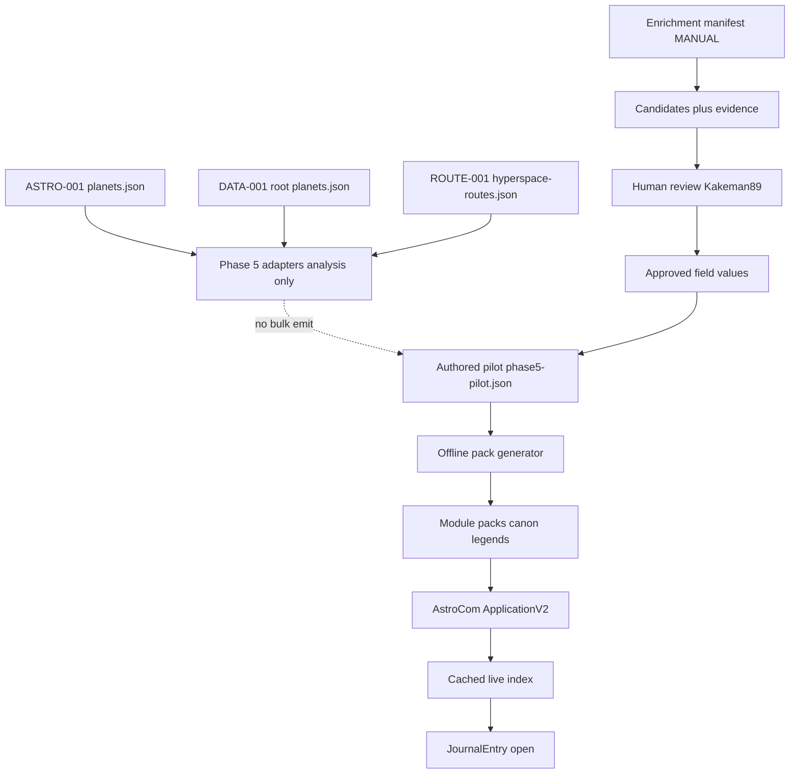

# Kakeman89's Datacron — Phase 6 AstroCom Minimum Viable Feature Plan

- **Document title:** Kakeman89's Datacron — Phase 6 AstroCom MVP Implementation Plan
- **Date:** 2026-08-17
- **Actual current local date:** 2026-08-17
- **Status:** Phase 6 implementation authorized and in progress / planning document retained as execution baseline
- **Authoritative inputs:** [KAKEMAN89S_DATACRON_ROADMAP.md](KAKEMAN89S_DATACRON_ROADMAP.md), [KAKEMAN89S_DATACRON_PHASE_4_ASTROCOM_POC.md](KAKEMAN89S_DATACRON_PHASE_4_ASTROCOM_POC.md), [KAKEMAN89S_DATACRON_PHASE_5_CONTENT_PIPELINE.md](KAKEMAN89S_DATACRON_PHASE_5_CONTENT_PIPELINE.md)
- **Implementation branch:** `v.next` at `27ea2d65c99c710eefd0b8ce726760642061fd72`
- **Reviewer attribution:** Kakeman89 only
- **Git operations during planning:** None required for this document’s creation. Implementation commits remain maintainer-gated.

SESSION DOCUMENT PROTECTION: This file is a **new** Phase 6 planning record under `docs/`. Files under `ai/sessions/**` were not modified. Phase 0–5 reports were not modified. No Cursor plan under `.cursor/plans/` was edited.

---

## 1. Planning-only status superseded

Earlier Phase 6 work produced a planning-only Cursor plan and deferred repository product changes. **That planning-only status is superseded.**

On 2026-08-17 the maintainer authorized implementation of this plan as the execution baseline for Phase 6 AstroCom MVP. This document remains the durable, append-only execution baseline. Product changes proceed under slices 6.0–6.10 with the defaults recorded below. The optional automated offline parser remains **unauthorized** until a separate gate.

---

## 2. Repository state (2026-08-17)

| Item | Value |
| --- | --- |
| Branch | `v.next` tracking `origin/v.next` |
| HEAD | `27ea2d65c99c710eefd0b8ce726760642061fd72` |
| Ahead of remote | Ahead of `origin/v.next` by **1** commit |
| Phase docs location | Under `docs/` (relocation committed in HEAD) |
| `.cursor/` | Gitignored; not part of product history |
| Bulk auth artifact | **ABSENT** — `kakeman89s-datacron/data/sources/astrocom/review/BULK_INGEST_AUTHORIZED.md` does not exist |
| Worktree delta | LevelDB churn in `packs/astrocom-canon` and `packs/astrocom-legends` (deleted prior logs/manifests; changed `CURRENT`/logs; new `000011.log` / `MANIFEST-000010`). Treat as unexpected post–Phase 5 pack state; do not normalize during planning; rebuild only under authorized slices |

Historical note: Phase 5 report still records implementation against HEAD `a01c1d7` with an uncommitted working tree. That historical statement is retained in the Phase 5 report. Current Git state supersedes it for Phase 6 execution: Phase 4/5 artifacts are committed at `27ea2d6`.

Node test status for Phase 6 baseline planning: **Phase 5 historical result 32/32**. This plan does **not** claim a fresh `npm test` re-run.

---

## 3. Accepted Phase 4 and Phase 5 baseline

### Phase 4 (accepted)

- Synthetic-fixture AstroCom PoC: schema `astrocom-source.v1`, ApplicationV2 browser, folder model Region → Sector → System (depth 3), Journal generation, live index query.
- NavComputer and Droid Ally left unmodified; Advanced calculation remains disabled; no Shipyard.
- `featureAstroCom` registered (PoC default true).
- Historical Foundry PoC world evidence exists separately; Phase 6 uses a **new** disposable world.

### Phase 5 (accepted)

- Intermediate schema, adapters for ASTRO-001 / DATA-001 / ROUTE-001, conflict/quarantine/review artifacts, dual bulk gate.
- Authored pilot: **27** approved records (14 Canon / 13 Legends), including `ac:canon:alderaan`.
- Module packs `astrocom-canon` / `astrocom-legends` generated offline; registered in `module.json`.
- System field: ASTRO-001 has no system property; adapter hard-codes `{ presence: "missing" }`; Journals/folders display **not documented**.
- Foundry gates executed in disposable world `datacron-phase5-pilot` (45 gates historically recorded).
- Full-dataset pack emit **not** performed; bulk auth **absent**.
- Node tests historically **32/32** (Phase 4 PoC 14 + Phase 5 18).

Phase 6 builds on this pilot MVP; it does not reopen Phase 4/5 disposition, licensing veto debates, or bulk ingest.

---

## 4. Scope

Ship a **GM-usable AstroCom MVP** on Foundry VTT v13 / dnd5e 5.2.5 / SW5e 1.4.2 using the approved pilot set:

1. Correct **source incompleteness** presentation and enrichment workflow (System and related astrography) without inventing values.
2. Schema/cardinality support: primary Region + `regionClassifications`; singular Sector/System/Grid display; multi routes.
3. Manifest-led, review-gated enrichment (**MANUAL first**).
4. In-place **Alderaan** System correction pilot (`ac:canon:alderaan`).
5. Production-quality browser UX, permissions, localization/accessibility.
6. **Option A** immutable module packs for normal play.
7. `featureAstroCom` default **true** with `requiresReload`.
8. Completeness reporting, Node regressions, performance budgets, Foundry gates in `datacron-phase6-mvp`.
9. Documentation deliverables under `docs/`.

---

## 5. Explicit non-goals

Phase 6 does **not**:

| Non-goal | Reason |
| --- | --- |
| Full 2029-record pack emit | Bulk gate remains dual; auth file absent |
| Create `BULK_INGEST_AUTHORIZED.md` | Separate maintainer authorization |
| Wookieepedia / web scrape | Licensing and provenance policy |
| Image fetch or packaging | Phase 2/5 artwork quarantine |
| NavComputer calculator changes | Domain isolation |
| Droid Ally pricing changes | Domain isolation |
| Shipyard work | Phase 7+ |
| Advanced hyperspace mode enablement | Deferred |
| Public package / release | Separate phase |
| Phase 7 start | Explicitly gated after Phase 6 closeout |
| Automated offline parser in this execution | Separate authorization gate |
| Rewrite Phase 0–5 reports | Append-only / historical protection |
| Edit `.cursor/plans/*` | Ignored planning artifacts; this docs file is authoritative |

---

## 6. Source-completeness correction

**Problem class:** incompleteness of local private sources and adapters, not proof that a field is authoritatively empty in lore.

- ASTRO-001 (`kakeman89s-datacron/data/planets.json`) has no `system` property.
- DATA-001 (repo-root `planets.json`) supplies Region/Sector/Grid and physical fields; it does **not** supply a System field used by the Phase 5 adapter.
- Phase 5 correctly recorded System as `missing` and displayed **not documented** rather than inventing text.
- Phase 6 must enrich missing fields only via **reviewed evidence** (manual first), preserve presence vocabulary, and never silently overwrite approved values.

Completeness reporting (Slice 6.1) measures gaps; enrichment (6.3–6.4) closes only allowlisted gaps.

---

## 7. Screenshot-derived factual example

Maintainer-supplied screenshot facts for **Alderaan** (Canon continuity scope for the correction pilot). Record as source evidence candidates; do not invent additional fields:

| Field | Evidence value |
| --- | --- |
| Region classifications | `Core Worlds`, `The Interior` |
| Sector | `Alderaan sector` |
| System | `Alderaan system` |
| Grid | `M-10` |

Notes:

- Existing pilot ASTRO-001 primary region text is `Core` (singular folder/routing value). Phase 6 keeps a **primary** Region for folders while storing reviewed classifications including `Core Worlds` and `The Interior`.
- Sector casing/normalization follows existing review rules (`Alderaan Sector` vs `Alderaan sector`); approved display is singular after human review.
- System correction target: set `astrography.system` from `missing` → present `Alderaan system` only after review approval.
- Grid `M-10` already present on `ac:canon:alderaan`; retain unless review finds conflict.

---

## 8. Current pipeline gap

| Layer | Behavior today |
| --- | --- |
| ASTRO-001 | No `system` field on planet objects |
| DATA-001 overlay | No System mapped into intermediate astrography |
| `adapter-astro.js` | Hard-codes `system: { presence: "missing" }` + `missing-system` info flag |
| Release converter | Preserves missing System |
| Journal / folder | Displays / labels **not documented** |
| Browser index | System `null`; System filter cannot match real systems |
| Pilot record `ac:canon:alderaan` | Approved; System still `missing` |

Phase 6 closes this gap for the correction pilot via authored enrichment + offline regen, not by inventing System from planet name in the adapter.

---

## 9. Astrography cardinality decision

| Field | Cardinality | Decision |
| --- | --- | --- |
| Region (legacy primary) | Singular | Keep `astrography.region` as primary routing/folder value; no mass migration of the 27-record pilot IDs |
| Region classifications | Multi | Add ordered, review-gated `regionClassifications` with relation (`primary`, `subregion`, `alternate`) and per-value evidence; derive legacy primary from the entry marked `primary` |
| Sector | Singular approved display | Competing candidates stay in field provenance, not multi display arrays |
| System | Singular approved display | Same |
| Grid | Singular approved display | Same |
| Routes | Multi | Unchanged |

Canon and Legends remain separate continuity records. Do not merge continuities into one display value.

---

## 10. Enrichment-option comparison and recommendation

| # | Option | Pros | Cons | Phase 6 fit |
| --- | --- | --- | --- | --- |
| 1 | Individual manual transcription into authored pilot | Full control; no network; clear provenance | Slow; easy to skip evidence artifacts | Good for tiny pilot |
| 2 | Manually authored URL/page allowlist (manifest) | Explicit scope; audit trail; scalable to small set | Requires discipline; no automation | Strong |
| 3 | GM-initiated import from clipboard/file in Foundry | Convenient at table | Risk of unreviewed overwrite; runtime complexity | Defer |
| 4 | Bounded fetch/parser offline | Faster fill of candidates | Terms-of-use risk; layout drift; separate auth needed | Optional later gate only |
| 5 | Reusable structured-source adapter | Clean if a rights-cleared dump exists | No approved structured System dump today | Not primary |
| 6 | Local supplemental datasets only | Offline; controllable | Still needs review; may lack System | Complementary |
| 7 | Hybrid (manifest + manual capture + optional later parser) | Matches policy; grows safely | More moving parts | **Recommended** |

**Recommendation:** manifest-led hybrid. **MANUAL first** for the Alderaan System correction and any other allowlisted fields. Optional offline parser is **NOT authorized** in this execution; it requires a separate maintainer gate.

---

## 11. Recommended enrichment architecture

1. **Manifest** lists stableId + allowed field keys + optional page references (no crawl).
2. **Manual capture** writes candidate values + immutable evidence stubs (source locator, captured text/hash, method=`manual`, reviewer=`Kakeman89`, timestamp).
3. **Review gate** promotes candidates to approved field values; never auto-approve; never overwrite without explicit override linkage.
4. **Offline regenerate** pilot module packs from authored sources only.
5. **Runtime** reads immutable packs; no network; no enrichment UI that mutates packs in play.
6. Optional parser (future): same manifest allowlist, offline CLI only, cache raw responses outside packs, produce candidates only.

Proposed authored paths (finalize in Slice 6.3):

- `kakeman89s-datacron/data/sources/astrocom/enrichment/manifest.v1.json`
- `kakeman89s-datacron/data/sources/astrocom/enrichment/candidates/`
- `kakeman89s-datacron/data/sources/astrocom/enrichment/evidence/`

---

## 12. Field-level provenance (hybrid)

| Layer | Content |
| --- | --- |
| Record-level | Existing `sourceMetadata`, `adapterSources`, `rawSourceReferences`, continuity hint (hint only) |
| Field-level (authored/review) | Compact provenance array per mutable display field: source reference, locator, normalization rule, extraction/manual method, candidate value, reviewer (`Kakeman89`), review status, continuity/era scope, conflict/override linkage |
| Generated Journal flags | Query/display fields + compact approved source summary only |
| Full audit | Remains in local authored/review/enrichment artifacts; not duplicated into every Journal page HTML |

---

## 13. Missing-value presentation

| Presence / state | User-facing presentation | Notes |
| --- | --- | --- |
| `missing` | **not yet sourced** (Phase 6 product string) | Replaces “not documented” for incompleteness that enrichment may later fill |
| `unknown` | keep **unknown** | Reviewer-asserted |
| `notApplicable` | keep **not applicable** | Reviewer-asserted |
| `omitted` | keep **intentionally omitted** | Reviewer-asserted |
| pending review | distinct **pending review** | Candidate exists; not approved |
| conflicting | distinct **conflicting** | Blocking or warning per severity; no silent pick |

Do not invent lore text. Do not map null identically for every field. Localization keys under `KAKEMAN89SDATACRON.AstroCom.*`.

---

## 14. MVP UX specification

- Separate ApplicationV2 AstroCom browser (not a NavComputer screen).
- Discover Canon/Legends **module packs** durably (not Phase-5-world-only branch).
- Build cached live index; model explicit states: loading, empty, partial, unavailable-pack, index-error, stale-index, Journal-resolution failure.
- Continuity selection; case-insensitive name/alias search; filters for primary Region, Sector, System, Grid, Route, and region classifications; result count; deterministic sort; clear filters.
- Multi-region filter matches any approved classification; folders remain primary Region only.
- Open canonical Journal; related-continuity navigation when linked.
- Journal hierarchy: identity → astrography → other sections. No source-page visual clone; no images.
- Localized native controls; visible focus; keyboard traversal; search caret retention; responsive one-column fallback; `aria-live` status.
- No explanatory helper text unless separately approved.
- When `featureAstroCom` disabled: no entry point, no app open, no index load, no rebuild affordance.
- When enabled but packs unavailable: controlled unavailable state without startup spam.

---

## 15. Permission model

| Role | Browse / search / open player-visible Journals | GM source / conflict / review detail | Approve enrichment | Dev rebuild / pack tooling | Change production feature settings |
| --- | --- | --- | --- | --- | --- |
| Gamemaster (full GM) | Yes | Yes | Yes | Yes | Yes |
| Assistant GM | Yes | Yes | No | No | No |
| Trusted Player | Yes (player-visible only) | No | No | No | No |
| Player | Yes (player-visible only) | No | No | No | No |
| Observer / Limited | No AstroCom entry point | No | No | No | No |

Direct Journal access otherwise follows Foundry ownership/permissions. No socket protocol required for MVP.

---

## 16. Pack production model — Option A (immutable module packs)

- Generate packs **offline** from reviewed authored sources.
- Ship as module packs `astrocom-canon` / `astrocom-legends`.
- During normal play: packs locked / read-only; no routine in-world module-pack mutation.
- Remove gameplay rebuild that mutates installed module packs from the MVP path.
- Development-only source→pack generation remains an explicit offline CLI/workflow, not a player control.
- Stable document IDs derive from `stableId`; folder placement may move after reviewed primary System correction; updates/removals are source-driven.
- Do not hand-edit LevelDB pack contents.

---

## 17. `featureAstroCom` setting

| Property | Phase 6 decision |
| --- | --- |
| Default | `true` (private-use worlds) |
| Scope | World |
| `requiresReload` | **true** |
| Disabled behavior | No scene-control entry, no app, no index load, no rebuild affordance |

---

## 18. Controlled System correction pilot — Alderaan

| Item | Value |
| --- | --- |
| Record | `ac:canon:alderaan` |
| Status | **Already in** Phase 5 authored pilot (approved) |
| Method | **In-place correction** of the approved authored record + field provenance |
| System today | `presence: "missing"` |
| System target | present `Alderaan system` after review |
| Region evidence | Classifications `Core Worlds`, `The Interior`; keep singular primary for folders (reviewed) |
| Sector / Grid | Align to reviewed singular display; Grid already `M-10` |
| Continuity | Canon only for this pilot row; do not invent Legends twin |
| Pack effect | Offline regenerate pilot packs only; prove stable ID/UUID; System folder moves; no duplicate Journal |
| Attribution | Kakeman89 |

---

## 19. Data-flow diagram

Bulk path remains blocked without `BULK_INGEST_AUTHORIZED.md` **and** `--bulk`.

---

## 20. Component architecture

| Component | Responsibility |
| --- | --- |
| Completeness reporter | Deterministic gap counts from intermediate-like / pilot records |
| Schema + validation | Presence, cardinality, provenance, v1 compatibility |
| Enrichment workflow | Manifest, candidates, evidence, review promotion |
| Conflict / quarantine | Existing Phase 5 rules + enrichment conflicts |
| Offline generator | Journals, folders, index, summary; dual bulk guard |
| Pack writer | Deterministic LevelDB emit for module packs |
| Runtime loader | Discover packs; build cache; named failure states |
| Index query | Filters including classifications and System |
| AstroComApp | ApplicationV2 UI; permissions-aware actions |
| Settings / main | Feature flag, scene control, opener guards |
| Localization / CSS | Product strings and accessible layout |

Domains isolated: NavComputer, Droid Ally, Shipyard, Advanced routing untouched.

---

## 21. Files proposed for creation

| Path | Purpose |
| --- | --- |
| `docs/KAKEMAN89S_DATACRON_PHASE_6_ASTROCOM_MVP_PLAN.md` | This plan (execution baseline) |
| `docs/KAKEMAN89S_DATACRON_PHASE_6_ASTROCOM_MVP.md` | Closeout report (Slice 6.10) |
| `docs/astrocom-gm-guide.md` | GM usage |
| `docs/astrocom-content-review-workflow.md` | Review workflow |
| `docs/astrocom-source-enrichment-guide.md` | Enrichment / provenance |
| `docs/astrocom-pack-generation-guide.md` | Offline pack generation |
| `docs/astrocom-player-guide.md` | Only if player browse ships as approved |
| `kakeman89s-datacron/scripts/astrocom/pipeline/completeness-report.js` | Completeness analysis |
| `kakeman89s-datacron/scripts/astrocom/pipeline/cli-completeness.js` | Completeness CLI |
| `kakeman89s-datacron/data/sources/astrocom/schema/*` additive/v2 pieces | Cardinality + provenance |
| `kakeman89s-datacron/data/sources/astrocom/enrichment/manifest.v1.json` | Allowlist |
| `kakeman89s-datacron/data/sources/astrocom/enrichment/candidates/**` | Candidates |
| `kakeman89s-datacron/data/sources/astrocom/enrichment/evidence/**` | Evidence |
| `kakeman89s-datacron/scripts/astrocom/pipeline/*enrichment*` | Workflow helpers |
| `kakeman89s-datacron/scripts/astrocom/tests/*phase6*` | Phase 6 tests |
| `kakeman89s-datacron/data/sources/astrocom/review/completeness-*.json` | Generated report artifacts (non-production) |
| Benchmark fixtures under `scripts/astrocom/tests/` or `data/sources/astrocom/fixtures/` | Performance (non-production) |

Exact filenames for schema/helpers may be refined during implementation without expanding scope.

---

## 22. Files proposed for modification

| Path | Change class |
| --- | --- |
| `kakeman89s-datacron/data/sources/astrocom/pilot/phase5-pilot.json` | In-place Alderaan correction + provenance |
| `kakeman89s-datacron/scripts/astrocom/pipeline/*` | Validation, convert, conflict, orchestrate exposure |
| `kakeman89s-datacron/scripts/astrocom/journal.js` | Presence display; provenance summary |
| `kakeman89s-datacron/scripts/astrocom/folders.js` | System segment after correction |
| `kakeman89s-datacron/scripts/astrocom/index-query.js` | Classification / System filters |
| `kakeman89s-datacron/scripts/astrocom/rebuild.js` | Immutable pack load path; remove gameplay pack mutation |
| `kakeman89s-datacron/scripts/astrocom/astrocom-app.js` | MVP states, filters, permissions |
| `kakeman89s-datacron/templates/astrocom/browser.hbs` | UX states |
| `kakeman89s-datacron/styles/astrocom.css` | Accessibility / layout |
| `kakeman89s-datacron/lang/en.json` | New strings (not yet sourced, etc.) |
| `kakeman89s-datacron/scripts/settings.js` | `requiresReload` on `featureAstroCom` |
| `kakeman89s-datacron/scripts/main.js` | Opener / role guards |
| `kakeman89s-datacron/module.json` | Only if pack labels or styles require approved updates |
| Generated pilot packs / `data/generated/astrocom/pilot/**` | Offline regen after correction |
| `docs/KAKEMAN89S_DATACRON_ROADMAP.md` | Append-only Phase 6 addendum at closeout |

**Do not modify:** Phase 0–5 report bodies (except roadmap addendum), SW5e repo, NavComputer/Droid calculators, Advanced enablement, bulk auth file (do not create).

---

## 23. Tests

### Automated (Node)

- Retain Phase 4/5 suites; historical baseline 32/32 must remain green after additive work.
- Completeness report schema and fixture counts.
- Cardinality / `regionClassifications` / singular Sector-System-Grid.
- Provenance no-overwrite; presence vocabulary including pending/conflict.
- Enrichment allowlist enforcement; no image acceptance; no runtime network.
- Alderaan correction: System present; stable ID/UUID; folder move; no duplicate; idempotent second gen.
- Bulk dual-gate refusal still hard-fails.
- Index filters: System, multi-region classification, alias, grid, route.
- Permission predicates; feature disabled behavior.
- Immutable pack / no gameplay mutation guards.
- Attribution remains Kakeman89; no personal maintainer name in product strings.

### Foundry

See §26. Node success does not substitute for Foundry gates.

---

## 24. Foundry runtime gates (`datacron-phase6-mvp`)

Create and use only a **new** disposable world `datacron-phase6-mvp`. Do not open or mutate `datacron-phase4-poc` or `datacron-phase5-pilot` for Phase 6 evidence.

Gates (each recorded PASS / FAIL / BLOCKED / NOT RUN):

1. Locked runtime: Foundry 13.x, dnd5e 5.2.5, SW5e 1.4.2 verified.
2. Datacron and SW5e junctions correct.
3. New disposable world only; minimum modules.
4. Datacron startup; AstroCom no crash.
5. Pack discovery Canon/Legends; approved pilot counts.
6. Alderaan System present in Journal and System filter; folder under System segment; no duplicate.
7. Multi-region / classification filter behavior.
8. Missing fields show **not yet sourced** (or other approved presence strings); no invented text.
9. Permission matrix: GM / Assistant / Trusted / Player / Observer as specified.
10. Feature disabled: no entry / load / rebuild after reload.
11. Unavailable-pack, index-error, empty, stale, Journal-resolution states.
12. No network/image activity from AstroCom.
13. Immutable packs during normal play (no gameplay mutation).
14. ID/UUID stability and second-open idempotency.
15. NavComputer / Droid / Shipyard / Advanced isolation (no side effects).
16. Accessibility: keyboard, focus, `aria-live`, narrow viewport.
17. Localization keys resolve.
18. World safety: other worlds untouched.

---

## 25. Performance gates

Measure and record baselines before claiming pass:

| Scenario | Measure |
| --- | --- |
| 27 pilot records | Index load, filter each dimension, Journal open, rerender |
| Medium synthetic/intermediate batch | Same metrics; threshold vs baseline |
| Metadata-only 2000+ index (no full Journal pack emit) | Index load / cache invalidation only |

Also measure: alias query, multi-region filter, grid/route filters, offline rebuild generation time for pilot.

Foundry timing confirmation is a separate gate from Node benchmarks.

---

## 26. Documentation deliverables under `docs/`

| Deliverable | When |
| --- | --- |
| This plan | Slice 6.0 (now) |
| `KAKEMAN89S_DATACRON_PHASE_6_ASTROCOM_MVP.md` | Slice 6.10 closeout |
| `astrocom-gm-guide.md` | 6.10 |
| `astrocom-content-review-workflow.md` | 6.10 |
| `astrocom-source-enrichment-guide.md` | 6.10 |
| `astrocom-pack-generation-guide.md` | 6.10 |
| Player guide | Only if player access ships |
| Roadmap append-only addendum | 6.10 |

---

## 27. Risks

| Risk | Mitigation |
| --- | --- |
| LevelDB pack worktree churn | Rebuild only under authorized slice; avoid casual normalize |
| Source-page layout / terms drift | Manual-first; parser gated separately |
| Continuity mixing | Separate Canon/Legends records; evidence scoped |
| Silent overwrite | Review gate + provenance override linkage |
| World-specific loader leftover | Durable module-pack discovery |
| Index scale | Perf budgets; no full 2029 pack |
| Role semantics mismatch | Explicit Foundry role gates |
| Player over-exposure of provenance | GM-only detail panels |
| “not documented” vs “not yet sourced” migration | Coordinated localization + tests |

---

## 28. Blockers

| Blocker | Status |
| --- | --- |
| Bulk ingest desire | Blocked by absent auth file — intentional |
| Automated parser | Unauthorized until separate gate |
| Unapproved external pages beyond allowlist | Blocked |
| Campaign-world Foundry use | Blocked — disposable world only |
| Phase 7 | Blocked until Phase 6 closeout acceptance |

---

## 29. Dependencies

- Local Phase 5 authored pilot and generation tooling.
- Foundry 13.351 (or verified 13.x), dnd5e 5.2.5, SW5e 1.4.2 junctions.
- New disposable world `datacron-phase6-mvp`.
- Dual bulk gate remains enforced.
- Maintainer review attribution Kakeman89 for approvals.

---

## 30. Slice 6.0 — Repository and documentation alignment

- **Entry:** Maintainer accepts Phase 6 plan defaults; `docs/` organization already committed.
- **Deliverables:** This document at `docs/KAKEMAN89S_DATACRON_PHASE_6_ASTROCOM_MVP_PLAN.md`; pack-worktree caveat recorded; Phase 5 historical 32/32 cited without claiming re-run.
- **Automated:** Path/link review only.
- **Foundry:** None.
- **Exit:** Plan present and cited as execution baseline.
- **Rollback:** Delete only this new plan file if abandoned before product changes.
- **Approval:** Plan acceptance / implementation authorization recorded in §1.

---

## 31. Slice 6.1 — Completeness analysis and report

- **Entry:** Local pipeline + sources available; bulk auth absent.
- **Deliverables:** `completeness-report.js`, `cli-completeness.js`, generated review counts for missing region/sector/system/grid/description/physical/societal/economics/continuity/provenance; pending review; geography conflicts; unresolved routes; duplicate names; alias conflicts.
- **Automated:** Fixtures + schema tests; Phase 4/5 suites still pass.
- **Foundry:** None.
- **Exit:** Reproducible report from local data.
- **Rollback:** Remove report feature + generated report artifacts; keep Phase 5 analysis history.
- **Approval:** Report ≠ authority to approve more records.

---

## 32. Slice 6.2 — Cardinality and field provenance

- **Entry:** Cardinality decision in §9 accepted.
- **Deliverables:** Schema additive/v2 pieces; validation/convert/conflict/index helpers; distinct presence/pending/conflict states.
- **Automated:** Schema, cardinality, continuity separation, provenance, no-overwrite, v1 pilot compatibility.
- **Foundry:** Deferred until corrected pilot content.
- **Exit:** Readers accept v1; writers can emit classification + field provenance.
- **Rollback:** Disable v2 emission; preserve original pilot source.
- **Approval:** Sign-off before changing authored pilot data (covered by Phase 6 implementation auth with defaults).

---

## 33. Slice 6.3 — Controlled enrichment workflow

- **Entry:** Small allowlist including Alderaan System (and related classification evidence as needed).
- **Deliverables:** Manifest/candidate/evidence schemas; offline workflow; no-image guard; adapters accept candidates without auto-approve.
- **Automated:** Allowlist enforcement; no unlisted retrieval; review gate; no runtime network; no images.
- **Foundry:** None.
- **Exit:** Manual candidates can be reviewed into approved fields.
- **Rollback:** Delete unapproved candidates only; retain review history; packs untouched until 6.4 regen.
- **Approval:** Manual path authorized with Phase 6; **parser remains unauthorized**.

---

## 34. Slice 6.4 — Reviewed System correction pilot (Alderaan)

- **Entry:** `ac:canon:alderaan` approved with missing System; enrichment evidence reviewed.
- **Deliverables:** In-place authored correction; provenance; offline regenerated pilot packs; System folder placement; no duplicate Journal.
- **Automated:** First/second generation compare IDs/UUIDs; System query; approved-only; bulk guard.
- **Foundry:** Corrected Journal + System filter in `datacron-phase6-mvp` (may share session with 6.9).
- **Exit:** System present and queryable; idempotent regen.
- **Rollback:** Append-only correction/review undo entry + regenerate pilot packs; no hand-edit of LevelDB.
- **Approval:** Human approval of each field change (Kakeman89).

---

## 35. Slice 6.5 — Production browser and Journal presentation

- **Entry:** Reviewed pilot metadata available; packs present.
- **Deliverables:** Robust pack discovery; named UI states; filters including classifications; Journal hierarchy; presence strings.
- **Automated:** Index/browser-state unit tests; no remote fetch.
- **Foundry:** Interaction, keyboard, focus, pack-missing, errors (with 6.9).
- **Exit:** MVP browser usable on pilot packs.
- **Rollback:** Feature flag hides entry; packs remain directory-browsable.
- **Approval:** Helper text needs separate decision (default: none).

---

## 36. Slice 6.6 — Permissions, setting, localization, accessibility

- **Entry:** Browser action inventory complete.
- **Deliverables:** Role matrix enforcement; `featureAstroCom` `requiresReload`; localization completeness; a11y markup.
- **Automated:** Role predicates; enabled/disabled; i18n key coverage.
- **Foundry:** GM/Assistant/Trusted/Player/Observer gates.
- **Exit:** Matrix matches §15; reload required for setting change.
- **Rollback:** Prior setting defaults/actions restored.
- **Approval:** Widening player provenance/source access needs sign-off (default: no widen).

---

## 37. Slice 6.7 — Pack production and rebuild behavior

- **Entry:** Option A accepted.
- **Deliverables:** No normal-play module-pack mutation; offline generation docs/guards; stable ID/folder update logic retained offline.
- **Automated:** Locked-pack behavior; deterministic offline gen; unavailable-pack UI; no startup rebuild.
- **Foundry:** Confirm read-only packs in play.
- **Exit:** Gameplay cannot rewrite packs.
- **Rollback:** Disable dev workflow; retain shipped packs.
- **Approval:** Visible “Pilot” labeling optional; confirm wording if used.

---

## 38. Slice 6.8 — Automated regression and performance validation

- **Entry:** 6.1–6.7 code complete.
- **Deliverables:** Phase 6 Node tests; benchmarks for 27 / medium / 2000+ metadata index; thresholds recorded.
- **Automated:** Full suite green; perf thresholds met or BLOCKED with evidence.
- **Foundry:** Perf confirmation separate.
- **Exit:** Regressions blocked; budgets documented.
- **Rollback:** Test-only removal; packs unchanged.
- **Approval:** Threshold numbers may lock with execution prompt.

---

## 39. Slice 6.9 — Foundry v13 validation

- **Entry:** Node green; pilot packs offline-generated; no campaign world.
- **Deliverables:** Evidence for §24 gates in `datacron-phase6-mvp`.
- **Automated:** N/A (runtime).
- **Foundry:** Full gate matrix with PASS/FAIL/BLOCKED/NOT RUN; failures retained with retest notes.
- **Exit:** MVP validated or blocked with explicit failures.
- **Rollback:** Close disposable world; leave Phase 4/5 worlds untouched.
- **Approval:** Foundry session authorized as part of Phase 6 execution (separate from parser).

---

## 40. Slice 6.10 — Documentation and closeout

- **Entry:** Automated + Foundry evidence complete or explicitly marked.
- **Deliverables:** Phase 6 MVP report + guides; roadmap append-only addendum; known limitations; Phase 7 gate statement.
- **Automated:** Link/path review; append-only check; final git status note.
- **Foundry:** None beyond citing 6.9.
- **Exit:** Closeout docs present; Phase 7 not started.
- **Rollback:** Remove only new Phase 6 deliverables if abandoned; never erase failures or Phase 0–5 history.
- **Approval:** Closeout ≠ Phase 7 / bulk / release authorization.

---

## 41. Whole-phase Definition of Done

Phase 6 is done only when all of the following have documented evidence:

1. Completeness report reproducible from local sources.
2. Cardinality + field provenance implemented without silent overwrite.
3. Manifest-led **manual** enrichment path works; parser still unauthorized or separately gated.
4. Alderaan in-place System correction regenerated into immutable pilot packs with ID/UUID/folder proofs.
5. Production browser states, filters, localization, and accessibility meet §14–§15.
6. Option A immutable packs; no gameplay pack mutation.
7. `featureAstroCom` default true + `requiresReload`.
8. Node regressions green (Phase 4/5 retained + Phase 6 additions); performance budgets recorded.
9. Foundry gates in `datacron-phase6-mvp` recorded.
10. Docs deliverables under `docs/`; roadmap addendum only; bulk auth still absent; Phase 7 not started.

---

## 42. Phase 7 prerequisites

Before Phase 7 (Shipyard workbook analysis) may start:

1. Phase 6 DoD accepted by maintainer.
2. AstroCom MVP remains isolated (no Shipyard code started in Phase 6).
3. Phase 2 workbook rights / Phase 1 Actor schema evidence still available.
4. Explicit new authorization for Phase 7 investigation (read-only workbook analysis).

Phase 6 closeout does **not** authorize Phase 7.

---

## 43. Decisions requiring maintainer approval

Implementation **proceeds with the plan defaults** below. Outstanding items remain explicit:

| # | Decision | Plan default | Notes |
| --- | --- | --- | --- |
| 1 | Enrichment approach | Manifest-led hybrid, **MANUAL first** | Proceeding |
| 2 | Automated offline parser | **Unauthorized** | Separate gate required |
| 3 | Region model | Primary Region + `regionClassifications` | Proceeding |
| 4 | Pack model | Option A immutable module packs | Proceeding |
| 5 | Feature flag | Default true + `requiresReload` | Proceeding |
| 6 | Role matrix | §15 | Proceeding |
| 7 | Missing presentation | `missing` → **not yet sourced** | Proceeding |
| 8 | Alderaan pilot | In-place correction of `ac:canon:alderaan` | Proceeding |
| 9 | Visible “Pilot” pack labels | Optional; keep current labels unless approved | Confirm if wording desired |
| 10 | Helper text / player source links | None / no widen | Separate if desired |
| 11 | Bulk ingest / full 2029 packs | Not in Phase 6 | Auth file remains absent |
| 12 | Public release | Not in Phase 6 | Separate |

---

## 44. Exact recommended next implementation action

1. Treat this document as the locked execution baseline (Slice 6.0 complete upon creation).
2. Begin **Slice 6.1**: implement `completeness-report.js` + CLI + fixtures/tests against the authored pilot and intermediate-like inputs; do **not** create `BULK_INGEST_AUTHORIZED.md`; do **not** enable a parser; do **not** scrape or fetch images.
3. Proceed sequentially through 6.2 → 6.4 for schema/provenance, manual enrichment allowlist, and **Alderaan** in-place System correction with offline pilot pack regen.
4. Then 6.5–6.8 (browser, permissions, immutable packs, tests/perf), then 6.9 Foundry in `datacron-phase6-mvp`, then 6.10 docs closeout.

Do not start Phase 7. Do not emit a full-dataset pack.

---

## 45. Status

**PHASE 6 IMPLEMENTATION AUTHORIZED AND IN PROGRESS.** This planning document is retained as the execution baseline. Automated parser unauthorized. Bulk auth absent. Phase 5 historical Node result 32/32 recorded without claiming a fresh re-run.
