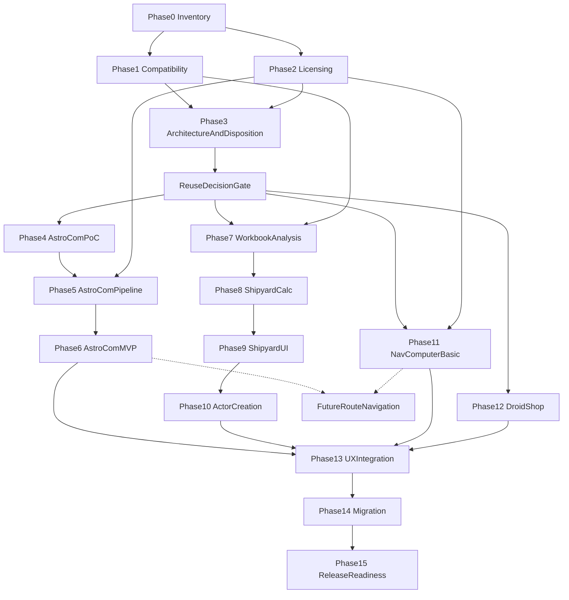

# Kakeman89's Datacron — Authoritative Project Roadmap

- **Document title:** Kakeman89's Datacron — Authoritative Project Roadmap
- **Creation date:** 2026-08-14
- **Status:** Planning baseline
- **Target versions (initial locked compatibility baseline):** Foundry Virtual Tabletop v13; dnd5e system v5.2.5; SW5e v1.4.2 (identity, package type, and exact APIs remain investigation items until Phase 1 verifies them in the live target)
- **Repository branch observed:** `main` (tracks `origin/main`)
- **Candidate implementation baseline:** `origin/v.next` (approved as a candidate baseline only; not an approved architecture, and not code that must be preserved)
- **Planning-only statement:** This document is a planning and investigation baseline. It does not authorize implementation, content ingestion, packaging, or distribution.
- **Scope summary:** One Foundry module named Kakeman89's Datacron, containing four related but isolated feature areas — AstroCom, Shipyard, NavComputer, and Droid Shop — plus shared platform services. Future route-based navigation and other enhancements are recorded as uncommitted backlog.
- **Implementation authorization:** Implementation has **not** been authorized. No phase below authorizes commits, pushes, pull requests, merges, tags, packages, or releases without a later explicit approval.
- **Evidence policy:** Uncertain findings are investigation items, not facts. Verified repository evidence, working assumptions, and open questions are recorded in separate sections.
- **Git constraint for this planning assignment:** No Git operations and no working-tree changes other than creating `KAKEMAN89S_DATACRON_ROADMAP.md`.
- **Creator attribution:** Use only **Kakeman89** where creator attribution is needed. Do not use the maintainer's personal name in module content, metadata, documentation, attribution, fixtures, examples, or test data.

---

## 1. How to read this document

This file is the single authoritative roadmap for Kakeman89's Datacron as of 2026-08-14. No competing roadmap was found in the repository.

- **Verified facts** are observations from the current checkout, Git history, or `origin/v.next` file contents inspected without checking out that branch.
- **Working assumptions** are planning hypotheses that remain unproven.
- **Investigation gates** are questions that must be answered with evidence before implementation may proceed.
- **Proposed** architecture is not accepted architecture.
- **Disposition labels** (RETAIN / REVISE / REPLACE / REMOVE / QUARANTINE / DEFER) are the audit vocabulary for later phases. This roadmap does **not** assign final dispositions to existing `v.next` components.

If a later decision supersedes content in this file, append a dated addendum. Do not silently rewrite historical gates, failures, or decisions.

---

## 2. Product decisions recorded on 2026-08-14

### 2.1 Accepted for planning (not implementation)

1. Kakeman89's Datacron is one Foundry module with four feature areas: AstroCom, Shipyard, NavComputer, and Droid Shop.
2. Target compatibility baseline is Foundry v13, dnd5e v5.2.5, and SW5e v1.4.2, pending live verification.
3. The module must not modify Foundry core, dnd5e core, or SW5e core files.
4. JavaScript is the default runtime language unless later evidence justifies another standard. `origin/v.next` already uses JavaScript ES modules.
5. Helper text, instructional tooltips, and extra UI explanations are not authorized unless later identified as a proposed feature requiring explicit approval.
6. Third-party text, images, maps, logos, trade dress, and other intellectual property may not be copied, redistributed, or packaged without verified permission.
7. `origin/v.next` may be used as the **candidate implementation baseline**.
8. Future implementation should proceed from `v.next` only after this roadmap and the required audit gates are approved.
9. This planning assignment must not check out, modify, merge, rebase, or commit to `v.next`.
10. `main` remains the currently observed checkout.
11. Decision 7 does **not** authorize implementation or any Git operation.
12. Decision 7 does **not** approve the existing `v.next` architecture, implementation, calculations, datasets, assets, or behavior.
13. Every component currently present on `v.next` remains unaccepted until independently verified.
14. Selective salvage, substantial replacement, or a clean rebuild remain permitted outcomes of the Phase 3 reuse decision gate.

### 2.2 Explicitly not decided

Do not describe `v.next` as the approved architecture. Do not describe `v.next` code as something that must be preserved. Reuse is conditional on later audit evidence.

---

## 3. Scope summary

### 3.1 In scope for the initial-release *plan*

- AstroCom: GM planetary and hyperspace reference, with JournalEntry investigation and a content-policy gate.
- Shipyard: guided SW5e starship construction from a verified workbook, collaborative GM/player visibility, and gated Actor creation.
- NavComputer: basic region-to-region hyperspace calculator using the exact supplied matrix, plus verified fuel and supplies calculations.
- Droid Shop: companion pricing using verified Tier I–VI chassis, 10 percent class markup, and condition rules. Pricing only.
- Shared platform: manifest, settings, feature isolation, localization, logging, permissions, security, tests, and release readiness.
- A mandatory audit of everything on `origin/v.next` before feature implementation.

### 3.2 Out of scope unless separately approved

- Route-based hyperspace navigation as an initial-release feature.
- AstroCom visual map.
- Droid Actor creation, merchant workflows, or character-sheet integration.
- Automated Wookieepedia scraping or image ingestion.
- Modifying Foundry, dnd5e, or SW5e core files.
- Public distribution before legal review and release gates.
- Commits, pushes, pull requests, merges, tags, packages, or releases.

### 3.3 Isolation requirement

The four feature areas are related products inside one module. Their data models, services, applications, permissions, tests, and implementation phases must remain sufficiently isolated that one unfinished feature cannot destabilize the others.

---

## 4. Repository and environment investigation

Inspection date: 2026-08-14. Inspection method: current working tree plus read-only `git show` / `git ls-tree` of `origin/v.next`. `v.next` was **not** checked out.

### 4.1 Verified — current checkout

| Item | Finding | Status |
| --- | --- | --- |
| Repository root | `C:\Users\ckauble\OneDrive - Riverside Bank of Dublin\Documents\GitHub\Kakeman89s_Datacron` | Verified |
| Current directory | Same as repository root | Verified |
| Current branch | `main` | Verified |
| Tracking | `main...origin/main` | Verified |
| Local branches | `main` | Verified |
| Remote branches observed | `origin/main`, `origin/v.next` | Verified |
| HEAD | `49244ad` Initial commit (2026-04-09) | Verified |
| Tracked files on `main` | `LICENSE`, `README.md` | Verified |
| README on `main` | `# NaviComputer` | Verified |
| LICENSE | GNU GPL v3 stock text | Verified |
| `module.json` on `main` | Absent | Verified |
| `package.json` | Absent | Verified |
| Tests / lint / CI | Absent | Verified |
| `ai/` | Absent | Verified |
| `docs/` on `main` | Absent | Verified |
| Existing Datacron roadmap | None found | Verified |
| Untracked tree | `.cursor/` (ECC/Cursor install; pre-existing; not created by this assignment) | Verified |
| Repository classification on `main` | Empty product checkout, not a Foundry scaffold | Verified |

### 4.2 Verified — relevant local and remote branches

- `main` / `origin/main`: empty product tree plus LICENSE and one-line README.
- `origin/v.next` at `a01c1d7` ("Changed Direction", 2026-04-28): existing Foundry module codebase.
- `v.next` history observed: `49244ad` initial commit → `e8fe50f` scaffold → `5e1b967` v1.0.0 → `7ed65e7` Advanced Routes → `a01c1d7` rename to Kakeman89s Datacron and droid app.

### 4.3 Verified — `origin/v.next` exists as an existing codebase

`origin/v.next` is not empty and is not a blank scaffold. It contains an installable module directory `kakeman89s-datacron/` plus data pipelines, docs, and assets. That fact does **not** make the implementation accepted.

### 4.4 Verified — `origin/v.next` top-level inventory

Tracked paths observed on `origin/v.next`:

- `.cursor/rules/SHARED-MASTER-CONTEXT.mdc`
- `.cursor/rules/karpathy-guidelines.mdc`
- `.gitignore`
- `CHANGELOG.md`
- `Galactic Map.jpg`
- `LICENSE`
- `README.md`
- `Star Wars Galaxy Map Grid Coordinates.xlsx`
- `StarWarsMap/map_api/data/grid_db.json`
- `StarWarsMap/map_api/data/hyperlanes_db.json`
- `StarWarsMap/map_api/data/regions_db.json`
- `docs/compatibility-notes.md`
- `docs/droid-allies-sw5e.md`
- `docs/hyperspace-coordinate-transform.md`
- `hyperspace_singlepart_new.json`
- `kakeman89s-datacron/` (module)
- `planets.json`
- `scripts/` (Python pipelines, debug inspector, output artifacts, accidental `__pycache__`)

Module runtime paths observed under `kakeman89s-datacron/`:

- `module.json`
- `scripts/main.js`, `datacron-app.js`, `droid-ally-app.js`, `droid-ally-pricing.js`, `route-calculator.js`, `travel-calculator.js`, `hyperspace-routes.js`, `planet-data.js`, `planet-combo.js`, `actor-helpers.js`, `piloting-roll.js`, `settings.js`, `logger.js`, `time-display.js`
- `templates/datacron.hbs`, `templates/droid-ally-pricing.hbs`
- `styles/datacron.css`
- `lang/en.json`
- `docs/compatibility-notes.md`
- `data/` planet, route, StarWarsMap, and random-event JSON files

### 4.5 Verified — module manifest on `origin/v.next`

From `kakeman89s-datacron/module.json`:

- `id`: `kakeman89s-datacron`
- `title`: Kakeman89s Datacron
- `version`: `1.0.1`
- Foundry compatibility minimum/verified: `13`
- System relationship: `dnd5e` minimum/verified `5.2.5`
- Recommends: `sw5e` and `sw5e-module` as modules
- `esmodules`: `scripts/main.js`
- `styles`: `styles/datacron.css`
- `languages`: English `lang/en.json`
- `socket`: `true`
- `url`: placeholder GitHub URL
- Authors field: contains a personal name rather than Kakeman89
- No `packs` array
- No `download` / `manifest` release URLs
- No module-local LICENSE file inside `kakeman89s-datacron/`

### 4.6 Verified — language, build, tests, localization, licensing on `origin/v.next`

- Runtime language: JavaScript ES modules with JSDoc. No TypeScript. No `package.json`.
- Templates: Handlebars. Styles: CSS.
- Data tooling: Python 3 scripts.
- Localization: Foundry `languages` array; English only; namespace `KAKEMAN89SDATACRON.*`. Some hardcoded English leftovers exist (example: travel calculator unit strings).
- Automated JS tests: none found.
- Python validation exists for hyperspace graph connectivity (`scripts/validate-hyperspace-routes.py`).
- Repo `LICENSE`: GNU GPL v3. Product attribution and third-party dataset licenses are not settled by that file alone.
- Compendium packs: none.
- Socket handlers: none found, despite `"socket": true`.

### 4.7 Verified — existing feature coverage on `origin/v.next`

| Feature area | Present on `v.next`? | Notes |
| --- | --- | --- |
| NavComputer / hyperspace calculator | Yes, under Datacron naming | Basic region matrix is live. Advanced graph UI is disabled. |
| Droid pricing | Yes, as Droid Ally | GM-only. Formula is not the requested Droid Shop model. |
| AstroCom JournalEntry compendium | No | Planet JSON and selection UI exist instead. |
| Shipyard | No | No ship-builder workbook. No ship-construction UI. Actor helpers exist for selecting existing starship actors. |
| Route-based navigation | Partial / disabled | Graph data and Dijkstra/A* code exist; UI path is disabled. |

### 4.8 Verified — assets and datasets on `origin/v.next`

| Asset or dataset | Observation | Provenance / license |
| --- | --- | --- |
| `Galactic Map.jpg` | Large raster backdrop | Not verified as licensed for redistribution |
| `Star Wars Galaxy Map Grid Coordinates.xlsx` | Geography workbook, sheet `planets` | Not the SW5e ship-builder workbook; redistribution rights unverified |
| `kakeman89s-datacron/data/planets.json` | Runtime planet list (~2029 worlds) | Derived merge; source licenses unverified |
| Root `planets.json` | Broader dump (~5444 records) | Provenance unverified |
| `hyperspace_singlepart_new.json` | GeoJSON hyperlanes | Provenance unverified |
| `StarWarsMap/` JSON | Vendored map API data | README cites Wason1797/StarWarsMap; license compliance not verified here |
| Route graph JSON | Generated and hand-curated | Derived; provenance mixed |
| `random-events.json` | Placeholder | Feature reserved |
| Module icon / Foundry media pack | Absent | — |

Prior inclusion in the repository is **not** licensing evidence.

### 4.9 Verified — existing planning and architecture files

No Datacron roadmap existed before this file.

Closest substitutes on `origin/v.next`, which this roadmap does not overwrite:

- `README.md` and `CHANGELOG.md`
- `docs/compatibility-notes.md`
- `docs/droid-allies-sw5e.md`
- `docs/hyperspace-coordinate-transform.md`
- `.cursor/rules/SHARED-MASTER-CONTEXT.mdc` (older "SW5e Nav Computer" product spec)
- Python audit outputs under `scripts/output/`

`ai/` and `ai/sessions/` do not exist. `docs/adr/` does not exist.

### 4.10 Verified — Cursor rules, ECC, and agent instructions

Observed on the current checkout (untracked `.cursor/` tree):

- Always-on Foundry/SW5e rules `00`–`05`, copied with **SW5e-module identity**, which is incorrect for this repository.
- ECC common rules (testing 80%, TDD, REST/repository patterns, immutability) that conflict with Foundry module realities if applied blindly.
- ECC 2.1.0 installed as a Cursor project copy; install state still points at a sibling `sw5e-module` path.
- No `CLAUDE.md`, `AGENTS.md`, or `.claude/` directory in this repository.
- Session-document protection exists as a user rule, not as `.cursor/rules/session-document-protection.mdc`.
- No Foundry-specific skill. Planner/architect agents are read-oriented and usable for later investigation if they remain read-only.

Repository-local Foundry constraints that govern later work:

- Target Foundry v13.x and dnd5e 5.2.5.
- Do not use Foundry v14-only APIs or dnd5e 5.3+ behavior without approval.
- Do not reproduce copyrighted sourcebook text.
- Prefer soft validation over hard RAW blockers.
- After code changes, provide Foundry v13 / dnd5e 5.2.5 manual verification steps.
- Do not invent test commands.
- Wait for approval before migrations, compendium changes, or package-metadata changes.

ECC patterns that must **not** override repository-local governance:

- Mandatory Playwright E2E and 80% coverage as a substitute for Foundry gates.
- Never-mutate-objects applied to Foundry document preparation.
- REST envelope / skeleton-clone architecture for a Foundry module.
- Writing plans under `.claude/plans` instead of the location required by this assignment.
- Auto-implementation after a plan-canvas approve.

### 4.11 Classification

| Layer | Classification |
| --- | --- |
| Observed checkout `main` | Empty product tree |
| `origin/v.next` | Existing candidate codebase containing potentially reusable prior work |
| This roadmap | First authoritative planning baseline |

---

## 5. Candidate baseline: `origin/v.next`

### 5.1 Decision

`origin/v.next` is approved as the **candidate implementation baseline** for Kakeman89's Datacron.

Meaning:

- Later implementation work, if authorized, should start from `v.next` rather than treating `main` as a fresh scaffold by default.
- The branch may contain reusable files, patterns, data, or lessons.
- Nothing on the branch is accepted until independently verified against the target environment and this four-feature vision.

Meaning it does **not** have:

- Approval of the existing architecture.
- A preservation mandate for existing code, datasets, assets, calculations, or UX.
- Permission to check out, modify, merge, rebase, or commit to `v.next` during this planning assignment.
- Permission to skip audit gates because a feature "already exists."

### 5.2 Existing behavior that must be independently verified

The following are observations of current `v.next` behavior. They are not accepted rules.

**NavComputer / Datacron app**

- ApplicationV2 + Handlebars window opened from a GM scene-control button.
- Basic mode uses `REGION_TRAVEL_MATRIX` whose values match the matrix supplied for this roadmap.
- Advanced lane-graph routing exists in code and data but is disabled in the Foundry UI.
- Fuel, food, and supplies are computed from world settings and heuristics, not from a cited SW5e rule page.
- Optional ship actor supplies crew size and hyperdrive class using SW5e flag/path assumptions from an earlier compatibility note.
- Piloting rolls are private GM rolls.

**Droid Ally app**

- Separate GM-only ApplicationV2.
- Class I–V / tracker / custom presets.
- Chassis cost = class rank × 1000, plus several adders, then `finalCost = floor(subtotal / 2)`.
- This is not the requested Tier I–VI + 10 percent class markup + condition model.

**AstroCom-related prior work**

- Planet JSON with `name`, `grid`, `sector`, `region`, and some enriched fields.
- No Canon/Legends split.
- No JournalEntry compendium.
- No Journal folder hierarchy.
- No per-entry attribution/provenance model of the kind AstroCom requires.

**Shipyard**

- No shipyard implementation was found.
- Absence is confirmed by inventory, not inferred from Actor helper utilities.
- `actor-helpers.js` selects existing starship actors for navigation estimates. That is not Shipyard.

**Integration assumptions that may be stale**

- SW5e accessed as module `sw5e-module` or `sw5e`, not as a Foundry system.
- Starships often represented as `character` actors with `flags.sw5e.starshipCharacter.enabled === true`.
- Compatibility notes on `v.next` record a local SW5e checkout around `1.2.9-9-g9a54d53f4`, not 1.4.2.
- Public `sw5e-foundry/sw5e-module` latest release observed during planning was 1.2.5 and declared dnd5e 4.3.x compatibility. That conflicts with the locked 1.4.2 / dnd5e 5.2.5 baseline and is an investigation item.

---

## 6. Mandatory `v.next` disposition audit

### 6.1 Purpose

Before any feature implementation, perform an investigation-only audit of everything on `origin/v.next`. The audit exists because the existing implementation may be incomplete, inaccurate, poorly structured, unsupported by the target versions, unlicensed, or inconsistent with the four-feature vision.

This roadmap defines the method and gates. It does **not** assign final RETAIN / REVISE / REPLACE / REMOVE / QUARANTINE / DEFER outcomes.

### 6.2 Disposition vocabulary

For every relevant component, file group, dataset, asset, calculation, setting, application, template, style, hook, manifest entry, and disabled feature, assign exactly one **proposed** disposition:

1. **RETAIN** — Verified as correct, compatible, maintainable, licensed, secure, and aligned with the roadmap.
2. **REVISE** — Fundamentally useful but requires identifiable changes before acceptance.
3. **REPLACE** — The requirement is valid, but the current implementation should be rebuilt using a verified design.
4. **REMOVE** — Obsolete, duplicated, unsafe, unsupported, unlicensed, misleading, or outside approved scope.
5. **QUARANTINE** — Potentially useful, but cannot be accepted until licensing, provenance, rules, compatibility, or security evidence is obtained.
6. **DEFER** — Valid possible future work that is not part of the approved initial release.

Proposed dispositions from Phase 3 are not final until the reuse decision gate is approved.

### 6.3 Required citation fields for every audited component

Each audit record must explain:

- What the component currently does
- Which requirement it appears intended to satisfy
- Whether it actually satisfies that requirement
- Compatibility with Foundry v13
- Compatibility with dnd5e 5.2.5
- Compatibility with the verified SW5e 1.4.2 target
- Rules accuracy
- Data provenance
- Licensing status
- Security and permission behavior
- Migration implications
- Test coverage
- Maintainability
- Dependencies
- Recommended disposition
- Required validation before implementation
- Whether removal would affect another component

Evidence must cite repository paths, manifest fields, runtime observations, or the absence of evidence. "It already exists" is not sufficient.

### 6.4 Required audit areas

#### 6.4.1 Repository and packaging

- Module directory structure
- `module.json`
- Module identifier and versioning
- Compatibility declarations
- Socket declaration
- Styles, templates, scripts, and language files
- Build and packaging assumptions
- Absence of an npm or automated test toolchain
- Existing licensing files and package metadata
- Authors field (must become Kakeman89 if retained)
- Placeholder GitHub URL
- Duplicate docs under repo `docs/` and `kakeman89s-datacron/docs/`
- Accidental `__pycache__` and backup artifacts

#### 6.4.2 NavComputer

- Existing ApplicationV2 application
- Basic region matrix
- Every matrix value
- Direction-sensitive behavior
- Hyperdrive calculations
- Fuel calculation
- Food calculation
- Supplies calculation
- World settings
- Input validation
- Output explanations
- Permissions
- Disabled Advanced graph interface
- Planet selection
- Route calculation
- Route graph data
- Any map integration
- Any naming mismatch between Datacron and NavComputer

#### 6.4.3 Droid functionality

- Existing GM-only droid pricing application
- Current chassis-rank calculation
- Current adders and modifiers
- Current subtotal behavior
- Current floor or division behavior
- Permissions
- UI and data model
- Whether any portion can support the requested Droid Shop
- Comparison against the required Tier I–VI chassis, 10 percent class markup, and condition model

#### 6.4.4 AstroCom-related prior work

- Planet JSON
- Region, grid, sector, and other geography fields
- Existing search or selection logic
- Existing route and lane relationships
- Missing Canon/Legends distinction
- Missing JournalEntry compendium
- Missing Journal structure
- Missing attribution and provenance
- Whether existing data can be normalized into the future AstroCom schema

#### 6.4.5 Route and map assets

- `Galactic Map.jpg`
- StarWarsMap-related JSON
- Planet datasets
- Lane datasets
- Geography workbook
- Any embedded coordinates
- Any derived data
- Source and license for every asset and dataset
- Whether each item must be quarantined or removed before distribution

#### 6.4.6 Shipyard

- Confirm that no Shipyard implementation currently exists
- Confirm that absence rather than inferring partial support from unrelated Actor code
- Identify any generic utilities that might be reusable only after verification
- Do not treat the lack of Shipyard code as a reason to force Shipyard into an existing application

#### 6.4.7 Foundry and SW5e integration

- Existing hooks
- Settings registration
- Application registration
- Actor assumptions
- Character plus `flags.sw5e.starshipCharacter.enabled` behavior
- Whether that remains correct for the actual SW5e 1.4.2 target
- Document creation behavior
- Ownership
- Socket expectations
- Migration/version flags
- Startup behavior
- Error handling

#### 6.4.8 Quality and safety

- Dead code
- Disabled code
- Duplicate logic
- Hardcoded rules
- Hardcoded paths
- Unsafe HTML
- Unsafe URLs
- Unvalidated socket messages
- Hidden network activity
- Destructive migration behavior
- Catch-and-continue failures
- Misleading success notifications
- Missing tests
- Missing provenance
- Performance concerns
- Accessibility concerns
- Localization readiness

### 6.5 Audit method

1. Inventory every file and runtime entry point on `origin/v.next` without modifying the branch.
2. Map each item to one or more requirement IDs, or to "no mapped requirement."
3. Verify behavior against Foundry v13, dnd5e 5.2.5, and the actual SW5e 1.4.2 package once identified.
4. Verify rules against authorized SW5e sources. If no source is available, mark rules accuracy as unverified.
5. Verify provenance and license independently of repository history.
6. Classify security, permissions, sockets, HTML, and URL handling.
7. Record test coverage as present, partial, or absent.
8. Assign a proposed disposition with alternatives considered.
9. Identify removal blast radius.
10. Feed the proposed dispositions into the Phase 3 reuse decision gate.

### 6.6 Audit acceptance gates

The audit is not complete until:

- Every required audit area has a written record.
- No component is marked RETAIN without compatibility, rules, license, and security evidence.
- Unlicensed or unprovenanced assets are QUARANTINE or REMOVE, not RETAIN by inertia.
- Disabled Advanced routing is explicitly DEFER, QUARANTINE, REPLACE, or REMOVE — not silently left in the UI.
- Shipyard absence is recorded as absence.
- The reuse decision gate has a compared set of options A–D and a maintainer approval.

---

## 7. Project vision and modular isolation

Kakeman89's Datacron is a GM-and-table aid for SW5e play in Foundry v13.

Recommended planning preference, not authorization to create directories now:

- `astrocom` domain
- `shipyard` domain
- `navcomputer` domain
- `droid-shop` domain
- shared platform services

Investigate whether the following are appropriate, then decide in Phase 3:

- Modular internal architecture
- Shared service layer for logging, permissions, notifications, settings, and document operations
- Feature enable/disable flags
- Independently testable feature slices

Do not put all four features into one application by default. Existing `v.next` already uses two ApplicationV2 windows plus scene-control buttons. That pattern is evidence, not an accepted UX.

---

## 8. Feature area 1 — AstroCom

### 8.1 Purpose

AstroCom will provide a fast planetary and hyperspace reference for a Game Master, especially while characters travel by starship or plan hyperspace jumps.

### 8.2 Requested content storage

One JournalEntry compendium containing planetary reference material.

Requested top-level organization:

- Canon
- Legends
- Grid

Use the spelling **Canon**, never "Cannon."

### 8.3 Requested Canon and Legends hierarchy

Canon or Legends → Region → Sector → System → Planetary Journal Entries, plus Hyperspace Lanes/Routes organization.

The original requirement describes a folder for each Region, Sector, and System, and a folder for Hyperspace Lanes/Routes.

**Do not assume Foundry v13 compendium folder nesting can represent this hierarchy exactly.** Phase 4 must prove:

- Maximum supported compendium folder depth
- JournalEntry compendium folder behavior in Foundry v13
- Whether folders can be reliably shipped and rebuilt with the module
- Whether one JournalEntry can have only one folder location
- Whether the requested hierarchy exceeds supported folder depth
- Whether the Hyperspace Lanes/Routes folder should be placed at Region, Sector, System, or another level
- Whether metadata, tags, flags, JournalEntry pages, or a custom AstroCom browser should supplement or replace deeply nested physical folders
- Whether Canon and Legends references should be separate JournalEntries or linked variants
- Whether routes should be JournalEntries, structured records, or a separate data type
- Whether duplicate visible organization can be generated without duplicating authoritative content

### 8.4 Grid hierarchy and the one-folder problem

Grid folders are intended to be based on galactic grid coordinates. Each grid coordinate must provide access to:

- Canon planets in that grid
- Legends planets in that grid
- Hyperspace lanes or routes crossing that grid

A single JournalEntry normally has one physical folder assignment. Placing the same planet under both Canon/Legends geography and Grid geography is a major structural issue. Candidate designs to compare in ADR and Phase 4, without choosing one now:

- Canonical JournalEntry plus UUID links or lightweight index entries
- A custom AstroCom browsing interface
- Generated aliases or link-only Journals
- Structured metadata and filters
- Intentional data duplication with a synchronization pipeline
- Another Foundry v13-compatible design discovered during investigation

### 8.5 Journal naming

Convention:

- `Planet Name (Canon)`
- `Planet Name (Legends)`

The roadmap must address, and later implementation must not invent answers for:

- Planets with both Canon and Legends material
- Planets with identical names
- Moons, asteroids, stations, artificial worlds, and other celestial bodies
- Systems containing multiple bodies with the same common label
- Aliases and renamed planets
- Canon/Legends conflicts
- Entries whose grid, sector, system, or region is unknown
- Entries associated with multiple routes
- Stable source IDs independent of display name
- Duplicate detection
- Slug generation
- Sorting rules
- Search indexing

### 8.6 Journal content

Each planetary JournalEntry must provide a concise GM snapshot containing, **when reliably available**:

1. Description, with era-specific changes labeled; do not merge incompatible Canon and Legends claims.
2. Astrographical information: region, sector, system, grid coordinate, relevant hyperspace lanes/routes, other supported navigation facts.
3. Physical information: classification, climate, terrain, atmosphere, gravity, diameter or size, orbital data, moons, other supported physical facts.
4. Societal information: native or major species, population, government, major settlements, languages, cultural or political notes, era-dependent changes.
5. Planetary economics: major imports and exports, trade goods, industries, resources, economic notes, era-dependent changes.

Fields are not mandatory. Omit the field or use an explicit "not documented" policy. Do not invent information.

Distinguish:

- Concise original GM snapshot
- Licensed source text
- Direct quotation
- External links
- Source attribution
- Images or media
- Original module metadata

Every JournalEntry must include an external link that can open the relevant source page for a GM. Phase 1/4 must investigate safe URL rendering in Foundry v13: external-link behavior, HTML sanitization, target handling, and protection against unsafe or malformed URLs.

### 8.7 Content sourcing and legal gate

Wookieepedia may be used as a research and source reference. Do not assume every element on Wookieepedia can be redistributed.

Phase 2 is mandatory and covers:

- License applying to Wookieepedia text
- Attribution requirements
- Share-alike implications
- Attribution at the individual JournalEntry level
- Attribution at the module level
- Source-page URL and access/retrieval date
- Revision or provenance tracking
- Whether adapted summaries are derivative content
- Separation of factual metadata from copied prose
- Avoidance of unverifiable statements
- Media licensing on a file-by-file basis
- Prohibition against packaging fair-use or unlicensed images merely because they are displayed on Wookieepedia
- Star Wars and Lucasfilm intellectual property and trademark considerations
- SW5e licensing and redistribution considerations
- Foundry package listing and distribution considerations
- A documented content takedown and correction process

Plan for original or separately licensed artwork only. Do not plan automated Wookieepedia image ingestion.

This roadmap recommends legal review before public distribution. That recommendation is not legal advice and is not a verified legal conclusion.

### 8.8 Content ingestion

Do not assume scraping will be authorized or reliable. Phase 5 must investigate:

- Wookieepedia terms and technical restrictions
- API availability and permitted use
- Rate limits
- Canon and Legends page distinctions
- Page redirects and aliases
- Disambiguation pages
- Template parsing
- Infobox extraction
- Section extraction
- Missing or contradictory data
- HTML cleanup and sanitization
- Citation and attribution generation
- Manual review workflow
- Incremental updates
- Source change detection
- Duplicate handling
- Failed-record quarantine
- Reproducible compendium builds
- Human approval before content enters a release
- Removal of source content when licensing or provenance is uncertain

The pipeline must preserve source data separately from generated Foundry documents and produce reproducible output. Investigate a schema-validated intermediate format such as JSON, YAML, or another repository-standard format. Do not select the format merely by preference.

Existing `v.next` planet JSON is a candidate input for normalization only after provenance and schema audit. It is not an AstroCom compendium.

### 8.9 Relation to `v.next`

Begin AstroCom phases by applying the approved disposition plan. Do not carry planet JSON, map images, or lane datasets forward merely to avoid rewriting them.

---

## 9. Feature area 2 — Shipyard

### 9.1 Purpose

Shipyard will provide a guided starship builder based on the official SW5e ship-building Excel workbook. The Game Master will assist a player through construction. Players must be able to observe the build. The builder must calculate final construction cost. After completion, an authorized user should be able to create the completed ship as a Starship Actor in the Actors directory.

### 9.2 Current repository evidence

- No Shipyard implementation exists on `main` or `origin/v.next`.
- The only Excel workbook found is `Star Wars Galaxy Map Grid Coordinates.xlsx`, which is a geography workbook, not the ship-builder.
- `actor-helpers.js` and travel-calculator crew/hyperdrive helpers operate on **existing** actors. They are not a builder.

Do not force Shipyard into the existing Datacron application because no Shipyard UI exists.

### 9.3 Mandatory workbook analysis

Do not guess formulas, lookup tables, hidden sheets, named ranges, validations, macros, data relationships, or rule assumptions.

Phase 7 must cover:

- Workbook provenance and redistribution permission
- Workbook version
- Sheet inventory
- Named ranges
- Tables
- Formulas
- Data validation
- Hidden sheets and columns
- Protected content
- Macros, if any
- Inputs and outputs
- Cost rules
- Size and tier rules
- Modification constraints
- Equipment rules
- Deployment or crew rules
- Validation messages
- Rounding
- Dependencies among choices
- Any calculation that cannot be reproduced from published SW5e rules

Stop if the workbook is unavailable or authorization is uncertain.

### 9.4 System integration investigation

Phase 1 and Phase 10 must inspect the actual SW5e 1.4.2 Starship Actor schema and determine:

- Exact Actor type identifier for starships
- Required and optional fields
- Starship-specific embedded Item types
- Whether dnd5e Activities are available and appropriate
- Constructor/create APIs
- Actor ownership
- Folder selection
- Image defaults
- Token defaults
- Effects, resources, movement, defenses, equipment, and deployment data
- Whether generated ships remain editable with the native SW5e sheet
- Whether module-specific flags are needed
- How provenance and builder version are stored
- How to avoid overwriting existing Actors
- How duplicate ship names are handled
- Whether creation is GM-only
- Whether a preview should be generated before Actor creation
- Whether an undo or rollback path is required

Do not assume `v.next` starship detection (`character` + `flags.sw5e.starshipCharacter.enabled`, legacy vehicle, or `type === "starship"`) remains correct for SW5e 1.4.2.

### 9.5 Player visibility

Plan a secure collaborative workflow where players can see the build without necessarily receiving permission to:

- Change authoritative configuration
- Create Actors
- Modify pricing rules
- Access GM-only data
- Execute privileged document operations

Compare, without selecting until permissions and socket ownership are verified:

- One authoritative GM-controlled application with synchronized read-only player views
- A shared draft document
- Socket-based state synchronization
- Another Foundry v13-compatible method

Existing `"socket": true` without handlers is not a synchronization design.

---

## 10. Feature area 3 — NavComputer

Use the feature name **NavComputer** consistently in this roadmap and in future product copy, even if older `v.next` files use Datacron window titles.

### 10.1 Purpose

NavComputer will first calculate basic hyperspace travel between galactic regions. It will also calculate:

- Estimated hyperspace travel time
- Fuel consumption
- Supplies required, expressed as food portions or the applicable SW5e resource unit

A later phase may provide actual route-based navigation through hyperspace lanes. Use neutral feature terminology. Do not imitate another product's copyrighted UI or branding.

### 10.2 Base hyperspace travel matrix

Title to preserve: **BASE HYPERSPACE TRAVEL TIMES (HOURS)**

Rows represent "Region Traveling from." Columns represent "Region Traveling to."

Columns: Deep Core, Core, Colonies, Inner Rim, Expansion Region, Mid Rim, Outer Rim, Wild Space, Unknown Regions.

Matrix values, preserved exactly as supplied. Do not correct, normalize, symmetrize, extrapolate, or replace any value. Several directions have different travel times. Treat that as potentially intentional unless verified otherwise.

| From / To | Deep Core | Core | Colonies | Inner Rim | Expansion Region | Mid Rim | Outer Rim | Wild Space | Unknown Regions |
| --- | ---: | ---: | ---: | ---: | ---: | ---: | ---: | ---: | ---: |
| Deep Core | 12 | 18 | 24 | 48 | 72 | 96 | 120 | 144 | 168 |
| Core | 24 | 6 | 24 | 36 | 60 | 84 | 96 | 120 | 144 |
| Colonies | 48 | 24 | 12 | 24 | 48 | 72 | 96 | 120 | 96 |
| Inner Rim | 72 | 36 | 24 | 18 | 24 | 48 | 72 | 96 | 72 |
| Expansion Region | 96 | 60 | 48 | 24 | 24 | 24 | 48 | 72 | 96 |
| Mid Rim | 120 | 84 | 72 | 48 | 24 | 36 | 24 | 48 | 72 |
| Outer Rim | 144 | 96 | 96 | 72 | 48 | 24 | 48 | 24 | 60 |
| Wild Space | 168 | 120 | 120 | 96 | 72 | 48 | 24 | 12 | 120 |
| Unknown Regions | 192 | 144 | 96 | 72 | 60 | 72 | 96 | 120 | 48 |

### 10.3 Matrix observations that are not corrections

- The matrix is direction-sensitive. Example: Deep Core → Core is 18; Core → Deep Core is 24.
- Same-region values are not uniform (Core 6, Colonies 12, Unknown Regions 48, and others).
- `origin/v.next` `REGION_TRAVEL_MATRIX` matches these values exactly. Matching code is not source verification.

Required later:

- Source verification
- Rule-version verification
- Unit verification
- Boundary and region-definition verification
- Tests for every matrix cell
- Direction-sensitive tests
- Same-region tests
- Invalid-input handling
- A data-driven matrix rather than hardcoded UI condition chains

### 10.4 Basic navigation calculation — inputs to verify, not invent

Identify and verify all input variables, including:

- Origin region
- Destination region
- Hyperdrive class or multiplier
- Ship size or tier if relevant
- Route modifiers
- Navigation checks
- Travel hazards
- Fuel consumption rules
- Crew/passenger count
- Travel duration
- Supplies consumption interval
- Food portion rules
- Rounding rules
- Minimum consumption
- Whether reserve fuel or supplies are included
- Relevant SW5e rules editions and optional rules

Do not invent formulas. Every formula must be traceable to an authorized rule source or explicitly labeled as a house-rule setting.

Plan for a calculation breakdown that shows the GM why a result was produced rather than returning only a final number.

### 10.5 Existing `v.next` calculations — unverified heuristics

Observed in `travel-calculator.js` and `settings.js`:

- `fuelRequired = ceil(hours * fuelPerHour)` with setting default 1
- `foodRequired = ceil((hours / 24) * crewSize * foodPerCrewPerDay)` with setting default 1
- `suppliesRequired = ceil(foodRequired * 0.5)`
- Units hardcoded as "Fuel Cells" and "Ration Packs"
- Default crew size 4 when ship crew cannot be resolved
- Hyperdrive multiplier used in Advanced mode; Basic matrix hours are used directly

These are **not** accepted SW5e formulas. Phase 11 may retain them only if verified, or must replace them with sourced rules or labeled house-rule settings.

### 10.6 Future route-based navigation

This is a later phase and must not block the basic calculator. Investigate later:

- Planet and system nodes
- Hyperspace lane segments as edges
- Directional routes
- Route travel weights
- Grid-square intersections
- Route aliases
- Canon and Legends route separation
- Era-specific route availability
- Route closures or hazards
- Unknown or incomplete route segments
- Entry and exit points
- Transfers between routes
- Off-route travel
- Heuristic choice
- Shortest-time, lowest-fuel, safest, or configurable routing
- Deterministic route results
- Route explanation
- Manual GM overrides
- Cached graph data
- Graph versioning
- Route provenance
- Visual route display as a separate optional phase
- Performance with a large graph
- Tests using small known route fixtures
- Avoidance of map or UI assets without verified distribution permission

Existing disabled Advanced graph code is candidate audit material. It is not an approved future-phase design and is not part of the initial-release commitment.

---

## 11. Feature area 4 — Droid Shop

### 11.1 Purpose

Droid Shop will price a droid companion using:

- Tier I through Tier VI chassis
- A 10 percent class markup
- Condition

Do not invent chassis prices, classes, condition modifiers, stacking order, or rounding rules.

### 11.2 Initial approved scope

Pricing a companion.

Do not automatically expand into full Actor creation, inventory purchasing, merchant transactions, or character-sheet integration. List those only as possible future enhancements requiring separate approval.

### 11.3 Mandatory rules verification

Phase 12, after Phase 1/2 source collection, must cover:

- Exact source rules
- Tier I through VI base prices
- Available droid classes
- Meaning of the 10 percent class markup
- Whether markup is applied before or after condition
- Available condition categories
- Condition multipliers or adjustments
- Rounding
- Minimum price
- Additional equipment
- Premium features
- Optional upgrades
- Currency display
- GM overrides
- House-rule settings
- Validation for incomplete selections

### 11.4 Existing `v.next` droid app — not the requested model

Observed in `droid-ally-pricing.js` and `docs/droid-allies-sw5e.md`:

- Class I–V, tracker, and custom presets
- `baseChassisCost = chassisCostRank * 1000`
- Adders for systems, ability modifiers, traits/protocols, skills/tools, feats/upgrades, and companion level
- `finalCost = floor(subtotal / 2)`
- GM-only UI
- Documentation describes a Saga Edition-inspired estimate, not a claim that this is the SW5e Tier I–VI shop

The audit must compare this against the required Droid Shop model and may propose RETAIN (unlikely without evidence), REVISE, REPLACE, REMOVE, QUARANTINE, or DEFER. This roadmap does not choose.

---

## 12. Cross-feature architecture

Investigate and propose boundaries for:

- Module manifest
- Initialization and lifecycle hooks
- Settings
- Feature enable/disable controls
- Applications and ApplicationV2 compatibility
- Templates
- Styles
- Localization
- Compendium packs
- Source content
- Build scripts
- Shared data schemas
- Calculation services
- Document creation services
- Permission services
- Socket communication
- Logging
- Notifications
- Error handling
- Migration/versioning
- Tests
- Development fixtures
- Documentation
- Attribution and licensing
- Accessibility
- Performance
- Security
- Release packaging

Planning preference: AstroCom, Shipyard, NavComputer, and Droid Shop domains plus shared platform services. This is not authorization to create those directories now.

Phase 3 must compare that preference against `v.next`'s actual `kakeman89s-datacron/scripts/` layout and may recommend rebuild if reuse is not justified.

---

## 13. Module UI and entry points

Investigate appropriate Foundry v13 entry points, such as:

- Module settings
- Scene controls
- Sidebar buttons
- Header buttons
- Actor sheet integrations
- Journal links
- Macro/API entry points
- Dedicated module applications

Do not assume all features belong in one large application.

For every proposed UI entry point, document:

- Intended users
- Required permission level
- Visibility
- Ownership
- Keyboard accessibility
- Responsive behavior
- Error and empty states
- Whether the UI is essential or optional
- Whether ApplicationV2 is required or merely preferred in the verified target

Existing `v.next` entry points to audit, not copy by default:

- GM-only scene-control tools on token controls (`fa-route`, `fa-robot`)
- Hyperspace ApplicationV2
- Droid Ally ApplicationV2
- Module settings for fuel, food, piloting fallback, debug, and reserved random events

Do not add helper text or instructional tooltips unless later approved as a feature.

---

## 14. Security and data safety

Mandatory gates:

- GM-authoritative operations
- Player permissions
- Socket sender validation
- Document ownership
- HTML sanitization
- External URL validation
- No arbitrary script execution from imported content
- No secrets in the client bundle
- No silent external network requests during gameplay
- No automatic scraping during world startup
- No destructive migration behavior
- Backup instructions before migrations
- Idempotent migrations
- Migration completion tracking
- Interrupted-migration recovery
- Clear failure reporting
- No wiping or replacing Actor, Token, Journal, or artwork fields
- No catch-and-continue behavior that falsely reports a successful migration
- Explicit differentiation between warnings, recoverable record failures, and migration-blocking failures

Existing `v.next` notes for the later audit: socket flag without handlers; runtime JSON loads from module data; README claims no external calls at runtime; Journal HTML/URL sanitization is unbuilt because AstroCom journals do not exist yet.

---

## 15. Testing strategy

Define and apply, at the appropriate phases:

- Static validation
- Linting
- Unit testing
- Schema validation
- Fixture testing
- Calculation table tests
- Permission tests
- Socket tests
- Document creation tests
- Compendium build tests
- Duplicate detection tests
- Link validation
- Attribution validation
- Content sanitization tests
- Migration tests
- Foundry runtime tests
- dnd5e 5.2.5 compatibility tests
- SW5e 1.4.2 compatibility tests
- GM and player multi-client tests
- Clean-world tests
- Existing-world tests
- Installation tests
- Upgrade tests
- Packaging tests
- Manual acceptance gates

Repository-local rule `05-testing-verification` governs code-change reports. Do not invent test commands. If no automated test exists yet, provide manual Foundry v13 / dnd5e 5.2.5 steps.

ECC 80% coverage and Playwright-by-default do not replace Foundry gates. A JS test toolchain may be proposed in Phase 3 because none exists today.

Additional testing rules from the reuse decision:

- Require regression tests for behavior approved for retention.
- Require replacement tests where old behavior is intentionally removed.
- Do not treat "it loaded" as compatibility proof.

---

## 16. Phased plan

Phase numbers 0–15 are preserved. Content is revised to include the `v.next` inventory, verification, and reuse gates.

Implementation tasks in later phases are **planned** tasks. They are not authorized by this document.

Every implementation-bearing phase ends at an explicit maintainer approval gate. No phase authorizes Git operations, publishing, or irreversible repository changes without that later approval.

---

### Phase 0 — Repository, Governance, and `v.next` Baseline Inventory

**Purpose.** Establish the planning baseline, inventory `origin/v.next` without changing branches, and record that reuse is conditional.

**Scope.** Read-only repository and governance work. No implementation, deletion, rewrite, or cleanup.

**Prerequisites.** This roadmap reviewed.

**Investigation tasks.**

- Record `main` as the observed checkout.
- Record `v.next` as the approved candidate baseline.
- Inventory `v.next` files, apps, datasets, assets, hooks, settings, and disabled features without checking out or modifying the branch unless a later approved inventory pass explicitly allows a read-only checkout.
- Establish the disposition framework from Section 6.
- Confirm ECC vs repository-local governance conflicts.
- Confirm no implementation authorization.

**Implementation tasks.** None.

**Deliverables.**

- Component inventory sufficient for the later disposition audit.
- Governance notes (author field, module id, incorrect SW5e-module Cursor identity, missing `ai/` tree).
- Confirmation that `main` was not treated as a blank-slate product decision.

**Automated validation.** None required beyond read-only Git inspection.

**Manual Foundry validation.** None.

**Exit criteria.** Inventory complete; disposition vocabulary accepted; no files changed except any later-approved inventory artifact; no Git operations unless separately approved.

**Blockers.** Inability to read `origin/v.next`; missing remote.

**Rollback.** Not applicable; read-only.

**Approval gate.** Maintainer accepts the inventory as the input to Phase 1–3 audits. Phase 0 must not implement, delete, rewrite, or clean up anything.

---

### Phase 1 — Compatibility, API, and Existing-Code Verification

**Purpose.** Verify exact package APIs, document schemas, Actor types, item structures, Activities support, hooks, sheet classes, and system compatibility before implementation starts. Audit existing `v.next` assumptions against those verified targets.

**Scope.** Live Foundry v13 + dnd5e 5.2.5 + actual SW5e 1.4.2 target. Read-only runtime inspection and written findings.

**Prerequisites.** Phase 0 inventory.

**Investigation tasks.**

- Identify what "SW5e v1.4.2" refers to: Foundry module, discontinued system, local fork, or rules-edition label.
- Capture `game.version`, `game.system.id`, `game.system.version`, and `game.modules.get(...)` for `sw5e`, `sw5e-module`, and any 1.4.2 package.
- Verify Actor types, starship representation, Activities, sheet classes, JournalEntry/compendium folder APIs, ApplicationV2 requirements, socket APIs, and document create APIs.
- Audit `v.next` actor helpers, hyperdrive paths, crew paths, hooks, and settings against live schemas.
- Produce a component-level compatibility report.
- Prevent reuse of a component merely because it loads successfully.

**Implementation tasks.** None, except optional non-production inspection helpers if absolutely necessary and separately approved. Prefer Foundry console inspection over new files.

**Deliverables.** Compatibility findings; blockers; mapping of `v.next` assumptions to verified or refuted status.

**Automated validation.** Schema snapshots if a safe export method exists; otherwise manual capture.

**Manual Foundry validation.**

- Launch a clean world on Foundry v13 / dnd5e 5.2.5 with the verified SW5e 1.4.2 package.
- Record actor types, sample starship documents, Journal folder depth experiments deferred to Phase 4 except for API availability checks.
- Confirm module load of current `v.next` code is not treated as proof of correctness.

**Exit criteria.** Written compatibility report. Unresolved APIs remain investigation blockers, not guessed implementations.

**Blockers.** SW5e 1.4.2 package not found; runtime not available; schema contradicts `v.next` assumptions.

**Rollback.** Discard any temporary inspector; do not leave debug hooks in production paths.

**Approval gate.** Maintainer accepts the compatibility report before architecture or feature work.

---

### Phase 2 — Licensing, Provenance, and Existing-Asset Audit

**Purpose.** Establish content policy and quarantine anything without sufficient rights.

**Scope.** Wookieepedia text licensing; media restrictions; SW5e workbook provenance; Star Wars IP risk; attribution model; takedown process; distribution constraints; **all existing `v.next` datasets and assets**.

**Prerequisites.** Phase 0 inventory. Phase 1 may run in parallel for APIs, but no production ingestion.

**Investigation tasks.**

- Audit every `v.next` dataset and asset listed in Sections 4.8 and 6.4.5.
- Quarantine anything without sufficient provenance or redistribution rights.
- Do not allow prior inclusion in the repository to count as licensing evidence.
- Investigate Wookieepedia license, attribution, share-alike, and scraping terms.
- Investigate SW5e ship-builder workbook redistribution permission.
- Record Star Wars / Lucasfilm trademark and Foundry listing considerations as questions for legal review, not as conclusions.

**Implementation tasks.** None for content packaging. A quarantine list is a planning artifact.

**Deliverables.** Provenance register; quarantine list; attribution model proposal; takedown process draft; statement that no production ingestion is authorized.

**Automated validation.** None.

**Manual Foundry validation.** None.

**Exit criteria.** Every existing asset has a license/provenance status of verified, quarantined, or recommended for removal. Legal review is recommended before public distribution.

**Blockers.** Missing licenses; unknown map artist; workbook redistribution unclear; Wookieepedia terms prohibit intended use.

**Rollback.** If ingestion later begins and must stop, delete generated content and restore quarantine. Not applicable in this phase.

**Approval gate.** Maintainer accepts the quarantine list. No production ingestion before this gate passes.

---

### Phase 3 — Shared Architecture and `v.next` Disposition Plan

**Purpose.** Propose the modular architecture and an evidence-backed disposition plan. Identify whether reuse, salvage, or rebuild is justified.

**Scope.** Repository structure proposal, manifest plan, feature isolation, settings, localization, build/test strategy, logging, security, migration/versioning, and comparison against existing `v.next` implementation.

**Prerequisites.** Phase 0 inventory; Phase 1 compatibility report; Phase 2 provenance/quarantine status at least in draft.

**Investigation tasks.**

- Compare the desired modular architecture against the existing implementation.
- Produce evidence-backed **proposed** dispositions for every audited component.
- Identify safe reusable foundations.
- Identify technical debt.
- Identify components for replacement or removal.
- Explicitly allow a recommendation to rebuild the module if reuse is not justified.
- Propose JavaScript ES module layout, test harness, and feature flags without creating directories yet.

**Implementation tasks.** None.

**Deliverables.** Architecture proposal; disposition plan; ADR drafts still in Proposed/Investigating status; input to the reuse decision gate.

**Automated validation.** None.

**Manual Foundry validation.** None beyond citing Phase 1 evidence.

**Exit criteria.** Disposition plan complete enough to choose reuse option A, B, C, or D. No feature implementation.

**Blockers.** Incomplete Phase 1 or 2; unresolved SW5e identity; unlicensed assets still unmarked.

**Rollback.** Not applicable.

**Approval gate.** **V.NEXT REUSE DECISION GATE** (Section 18). No feature implementation before architecture approval and this gate.

---

### Phase 4 — AstroCom Data Model Proof of Concept

**Purpose.** Prove a Foundry-compatible planetary data model with a tiny fixture. No mass ingestion.

**Scope.** Planetary schema; Canon/Legends distinction; geography hierarchy; grid indexing; route representation; folder-depth test; duplicate-versus-link architecture comparison.

**Prerequisites.** Phase 3 reuse decision; Phase 1 Journal APIs; Phase 2 policy for fixtures (synthetic or independently authored only).

**Investigation tasks.** Folder-depth PoC; one-folder constraint; Grid dual-index options; whether `v.next` planet JSON can be normalized.

**Implementation tasks.** Only if authorized after this phase's design approval: small synthetic fixture, not production content. Begin by applying the approved disposition plan. Preserve only verified reusable behavior.

**Deliverables.** Schema proposal; PoC notes; ADR updates still awaiting acceptance.

**Automated validation.** Schema tests on the fixture if a test harness was approved in Phase 3.

**Manual Foundry validation.** Create a throwaway world; import the tiny fixture; record actual folder depth, journal location, and link behavior.

**Exit criteria.** Hierarchy feasibility known; dual-index options compared; no Wookieepedia ingestion.

**Blockers.** Folder depth insufficient; Journal APIs incompatible; provenance of any reused JSON still quarantined.

**Rollback.** Delete the fixture world; do not ship the PoC pack.

**Approval gate.** Maintainer chooses a candidate data-model path or requests another PoC.

---

### Phase 5 — AstroCom Content Pipeline

**Purpose.** Design a reproducible, human-reviewed pipeline. No production ingestion before Phase 2 remains passed.

**Scope.** Source acquisition policy; structured intermediate data; transformation; sanitization; attribution; schema validation; human review; deterministic compendium generation; failed-record quarantine; incremental updates.

**Prerequisites.** Phase 2 passed; Phase 4 data model candidate.

**Investigation tasks.** API vs manual entry; intermediate format comparison; sanitization; source-change detection.

**Implementation tasks.** Only after approval: pipeline scaffolding using quarantined or independently authored samples. Do not carry old datasets forward merely to avoid rewriting them.

**Deliverables.** Pipeline design; validation rules; review checklist.

**Automated validation.** Schema validation; duplicate detection; attribution presence checks; sanitization tests.

**Manual Foundry validation.** Build a tiny pack from approved sample records; confirm journals render and links open safely.

**Exit criteria.** Pipeline cannot emit a release record without human approval and provenance fields.

**Blockers.** Scraping prohibited; license share-alike incompatible with chosen module license; no approved sample sources.

**Rollback.** Discard generated packs; keep source and quarantine.

**Approval gate.** Maintainer approves pipeline design before any bulk generation.

---

### Phase 6 — AstroCom Minimum Viable Feature

**Purpose.** Ship a GM-usable reference slice, not a full galaxy dump.

**Scope.** Journal compendium; search/browse plan; basic folder or index organization; external source links; GM snapshot; permissions; manual Foundry validation.

**Prerequisites.** Phases 4–5; approved fixture or small approved content set.

**Investigation tasks.** UI entry point; GM-only vs observer visibility; search approach.

**Implementation tasks.** After approval: MVP using only approved content. Apply disposition plan. Regression tests if any planet-selection behavior is retained from `v.next`. Replacement tests if old JSON-only UX is removed.

**Deliverables.** MVP AstroCom usable in Foundry with a small approved set.

**Automated validation.** Pack build tests; link validation; attribution validation; sanitization tests.

**Manual Foundry validation.** GM opens AstroCom or journal pack; finds a Canon-named entry; opens source URL; confirms missing fields show "not documented" rather than invented text; player permissions do not allow unauthorized edits.

**Exit criteria.** MVP works on Foundry v13 / dnd5e 5.2.5 / verified SW5e 1.4.2. No unlicensed images.

**Blockers.** Unapproved content; unsafe HTML; folder model failure.

**Rollback.** Disable feature flag; leave other domains unaffected.

**Approval gate.** Maintainer accepts AstroCom MVP or returns it for revision.

---

### Phase 7 — Shipyard Workbook Analysis

**Purpose.** Inspect the actual SW5e ship-builder workbook before any builder logic is implemented.

**Scope.** Provenance, sheets, formulas, validations, cost rules, and mapping to verified SW5e Actor schema.

**Prerequisites.** Phase 1 Actor schema; Phase 2 workbook rights.

**Investigation tasks.** Full workbook analysis from Section 9.3. Confirm no Shipyard code exists. Identify generic `v.next` utilities that might be reusable only after verification.

**Implementation tasks.** None.

**Deliverables.** Formula mapping; redistribution restrictions; gaps that cannot be reproduced from published rules.

**Automated validation.** None unless a later approved extractor is used on an authorized local workbook copy.

**Manual Foundry validation.** None in this phase.

**Exit criteria.** Verified mapping exists, or work stops because the workbook is unavailable or unauthorized.

**Blockers.** Workbook missing; license unclear; macros unreadable; formulas contradict published rules.

**Rollback.** Do not copy workbook contents into the repo if redistribution is not permitted. Cite locally.

**Approval gate.** Maintainer accepts the mapping or stops Shipyard.

---

### Phase 8 — Shipyard Calculation Engine

**Purpose.** Data-driven verified calculations only. No Actor creation.

**Scope.** Validation, reproducible test vectors, cost output, constraint checking.

**Prerequisites.** Phase 7 passed.

**Investigation tasks.** Rounding, dependency order, house-rule hooks.

**Implementation tasks.** After approval: calculation module isolated from UI and Actor creation. Do not reuse unrelated travel or droid math.

**Deliverables.** Calculation engine with test vectors.

**Automated validation.** Table tests from the workbook; invalid-input tests.

**Manual Foundry validation.** Calculation-only gate: GM enters a known workbook scenario; module output matches the workbook within documented rounding.

**Exit criteria.** Engine matches verified vectors. No Actor writes.

**Blockers.** Vector mismatch; missing workbook cases.

**Rollback.** Feature flag off; no documents changed.

**Approval gate.** Calculation-only manual gate passed.

---

### Phase 9 — Shipyard Collaborative UI

**Purpose.** GM-controlled builder with player-visible build state. No privileged player operations.

**Scope.** Permissions, multi-client testing, synchronization design chosen from Phase 1 evidence.

**Prerequisites.** Phase 8; Phase 1 socket/permission verification; Phase 3 architecture.

**Investigation tasks.** Choose sync design only after verification. Accessibility and empty states.

**Implementation tasks.** After approval: GM app plus player view. Do not force this UI into the NavComputer window unless the reuse gate explicitly retained a shared shell.

**Deliverables.** Collaborative UI.

**Automated validation.** Permission tests; socket sender validation tests.

**Manual Foundry validation.** Two clients: GM builds, player observes, player cannot create Actors or edit pricing. Keyboard access and error states checked.

**Exit criteria.** Players can observe; cannot escalate.

**Blockers.** Socket ownership unclear; ApplicationV2 player-view limitations.

**Rollback.** Disable Shipyard flag.

**Approval gate.** Multi-client permission gate.

---

### Phase 10 — Shipyard Starship Actor Creation

**Purpose.** Create-new Starship Actor from a completed, authorized build.

**Scope.** Preview; verified schema mapping; GM authorization; duplicate handling; provenance flags; native sheet compatibility; rollback/error behavior.

**Prerequisites.** Phase 1 schema verification; Phases 8–9.

**Investigation tasks.** Confirm create APIs, ownership, folder selection, image/token defaults, Activities, and no overwrite of existing Actors.

**Implementation tasks.** After approval: create-new only. Store builder version and provenance. Do not wipe unrelated fields.

**Deliverables.** Actor creation path with preview and failure reporting.

**Automated validation.** Document creation tests; duplicate-name tests; permission tests.

**Manual Foundry validation.** GM previews; creates a new starship; opens native SW5e sheet; confirms editability; player cannot click-create; failed create reports failure, not success.

**Exit criteria.** Created actor matches verified schema subset; native sheet works; no overwrite.

**Blockers.** Schema mismatch; Activities incompatibility; missing required items.

**Rollback.** Do not delete user actors automatically. Provide guidance to delete the created test actor.

**Approval gate.** Maintainer accepts Actor creation behavior.

---

### Phase 11 — NavComputer Basic Calculator

**Purpose.** Basic region calculator using the exact supplied matrix, plus verified travel time, fuel, and supplies, with explanation.

**Scope.** Direction-sensitive tests; invalid inputs; house-rule settings where rules are missing. Not route-based navigation.

**Prerequisites.** Phase 1; Phase 2 if any dataset is reused; Phase 3 disposition for existing Datacron/NavComputer code.

**Investigation tasks.** Source-verify matrix, units, hyperdrive, fuel, food, supplies. Begin by applying the approved disposition plan. Do not keep old calculations merely to avoid rewriting them.

**Implementation tasks.** After approval: data-driven matrix; calculation breakdown; feature naming NavComputer. If existing matrix code is retained, add regression tests for every cell. If replaced, add replacement tests proving old heuristics are gone.

**Deliverables.** Basic NavComputer.

**Automated validation.** All 81 matrix cells; direction-sensitive pairs; same-region cells; invalid region handling; fuel/supplies tests against verified formulas or labeled settings.

**Manual Foundry validation.** GM and player: select regions or worlds; confirm asymmetric times (Deep Core→Core 18 vs Core→Deep Core 24); confirm breakdown visibility; confirm permissions.

**Exit criteria.** Matrix exact; formulas sourced or labeled house rules; Advanced routing still not required for release.

**Blockers.** No rule source for fuel/supplies; region boundary definitions unknown.

**Rollback.** Feature flag; do not re-enable disabled Advanced UI as a fallback.

**Approval gate.** Manual GM/player validation.

---

### Phase 12 — Droid Shop Calculator

**Purpose.** Pricing-only companion calculator from verified Tier I–VI, 10 percent class markup, and condition rules.

**Scope.** Rounding, validation, GM override or house-rule strategy. No Actor creation.

**Prerequisites.** Phase 1; sourced rules; Phase 3 disposition for Droid Ally app.

**Investigation tasks.** Compare existing chassis-rank / floor-half formula to the required model. Do not treat Saga-inspired docs as SW5e shop rules.

**Implementation tasks.** After approval: implement the verified model only. Preserve reusable UI chrome only if disposition is RETAIN or REVISE with listed changes.

**Deliverables.** Droid Shop pricing UI and engine.

**Automated validation.** Tier table tests; markup-before-vs-after-condition tests once the rule is known; incomplete selection validation.

**Manual Foundry validation.** GM prices a known example; player visibility policy as approved; no Actor created.

**Exit criteria.** Prices match sourced rules or labeled house rules. Scope remains pricing-only.

**Blockers.** Missing Tier I–VI prices or condition table.

**Rollback.** Disable Droid Shop flag; do not leave the old formula labeled as the new shop if it was replaced.

**Approval gate.** Maintainer accepts pricing-only MVP.

---

### Phase 13 — Cross-Feature Integration and UX

**Purpose.** Shared navigation and consistent permissions without tight coupling.

**Scope.** Shared styles without coupling; accessibility; performance; localization; error states; feature enable/disable behavior.

**Prerequisites.** Feature MVPs that are in initial-release scope.

**Investigation tasks.** Entry-point consistency; disable flags; English localization completeness; no unauthorized helper tooltips.

**Implementation tasks.** After approval: integration only. Isolated domain failures must not crash other domains.

**Deliverables.** Consistent GM entry; independent feature flags.

**Automated validation.** Localization key coverage; flag tests.

**Manual Foundry validation.** Enable/disable each feature; keyboard paths; empty and error states; GM vs player.

**Exit criteria.** One unfinished feature can be disabled without breaking others.

**Blockers.** Shared singleton coupling inherited from `v.next`.

**Rollback.** Revert integration; keep domain flags.

**Approval gate.** UX/accessibility review.

---

### Phase 14 — Migration, Upgrade, and Existing-World Safety

**Purpose.** Make upgrades safe for worlds that may already contain `kakeman89s-datacron` 1.0.x data.

**Scope.** Version flags; idempotency; interrupted-migration recovery; no image-field destruction; no unrelated document changes; backup and rollback guidance; compatibility upgrade policy.

**Prerequisites.** Phase 3 versioning model; knowledge of existing `v.next` settings keys and JSON caches.

**Investigation tasks.** Identify existing world settings and any documents already created by users. Plan migrations that never report success on partial failure.

**Implementation tasks.** After approval: idempotent migrations with completion tracking.

**Deliverables.** Migration design; backup instructions; failure taxonomy.

**Automated validation.** Migration tests; interrupted-recovery tests; no-op second-run tests.

**Manual Foundry validation.** Upgrade an existing world copy; clean install; confirm journals/actors/tokens/artwork untouched unless explicitly in scope; failed record does not look like success.

**Exit criteria.** Upgrade and clean install both documented and tested.

**Blockers.** Unknown existing-world data; destructive legacy scripts.

**Rollback.** Document restore-from-backup. Migrations must be reversible or safely skippable.

**Approval gate.** Maintainer accepts upgrade policy.

---

### Phase 15 — Packaging, Documentation, and Release Readiness

**Purpose.** Release checklist only. Publishing is not authorized by completing the draft checklist.

**Scope.** User guide; GM guide; contributor documentation; attribution; license notices; manifest validation; package contents; clean installation; upgrade installation; release checklist; explicit approval before publishing.

**Prerequisites.** Required initial-release features accepted; legal review recommended; security and migration gates passed.

**Investigation tasks.** Package listing constraints; attribution completeness; Kakeman89-only authorship.

**Implementation tasks.** After approval: docs and package metadata. Still no publish without explicit approval.

**Deliverables.** Release candidate checklist; attribution file; license notices.

**Automated validation.** Manifest validation; package contents test; no secrets; no quarantined assets.

**Manual Foundry validation.** Clean install; upgrade install; all required features; disabled deferred features.

**Exit criteria.** Checklist complete. Maintainer still must explicitly approve publish.

**Blockers.** Quarantined assets still in the package; personal name in metadata; placeholder URLs.

**Rollback.** Do not publish. Keep candidate unpublished.

**Approval gate.** Explicit approval before publishing. This phase does not itself authorize Git operations or a Foundry package release.

---

## 17. Future work (not committed scope)

### Future Phase — Route-Based Hyperspace Navigation

Graph architecture; AstroCom route integration; era-aware routing; time/fuel/safety objectives; route explanation; optional visualization. Must remain separate from the initial release unless explicitly approved.

Existing disabled Advanced graph on `v.next` is audit material for this future phase. It must not block Phase 11.

### Future enhancements backlog

- AstroCom visual map
- Advanced planetary filtering
- Era selector
- Route hazards
- Shipyard saved drafts
- Ship templates
- Droid Actor creation
- Merchant workflows
- Import/export
- Additional Foundry compatibility
- Additional SW5e compatibility

Do not treat future enhancements as committed scope.

---

## 18. V.NEXT REUSE DECISION GATE

This gate occurs after Phase 3. Do not assign an outcome in this roadmap.

### Possible outcomes

**A. REUSE AS PRIMARY FOUNDATION**  
Most shared infrastructure is verified and suitable. Continue through controlled revisions.

**B. SELECTIVE SALVAGE**  
Create the approved implementation from `v.next` while retaining only specifically verified components and replacing the rest.

**C. REBUILD FEATURE DOMAINS**  
Retain only basic module identity or packaging elements while rebuilding AstroCom, Shipyard, NavComputer, and Droid Shop independently.

**D. CLEAN REBUILD**  
The existing implementation introduces more risk than value. Preserve the audit record, then rebuild from an approved clean structure.

### Comparison criteria

- Verified reusable value
- Remediation effort
- Replacement effort
- Compatibility risk
- Rules risk
- Licensing risk
- Migration risk
- Security risk
- Testability
- Maintainability
- Effect on initial-release scope

No outcome is selected until Phase 3 evidence exists and the maintainer approves.

---

## 19. Dependency map

Repository and compatibility research precede implementation.  
Licensing approval precedes content ingestion and public distribution.  
AstroCom data modeling precedes mass content creation.  
Workbook analysis precedes Shipyard calculation implementation.  
SW5e Actor schema verification precedes Actor creation.  
Basic NavComputer precedes route-based navigation.  
AstroCom route data is a dependency for route-based NavComputer.  
Droid Shop rules verification precedes pricing code.  
Every implementation phase ends at a manual approval gate.  
Release requires all required compatibility, licensing, security, migration, and packaging gates.  
The Phase 3 reuse decision gate precedes feature implementation phases 4–12.  
Feature phases begin by applying the approved disposition plan.

---

## 20. Required architecture decision records

Do not write final ADR decisions unless verified repository or API evidence supports them. Status values: Proposed, Investigating, Accepted, Superseded, or Deferred.

| ADR | Topic | Status | Notes |
| --- | --- | --- | --- |
| ADR-001 | One Journal compendium versus multiple compendiums | Investigating | Phase 4 PoC |
| ADR-002 | Physical folders versus metadata-driven browser | Investigating | Folder-depth unknown |
| ADR-003 | Grid aliases versus duplicate documents versus custom indexing | Investigating | One-folder constraint |
| ADR-004 | Planetary source schema format | Investigating | JSON vs YAML vs other; do not pick by preference |
| ADR-005 | Hyperspace route data model | Investigating | Journals vs structured records |
| ADR-006 | Content ingestion method | Investigating | No scrape authorization assumed |
| ADR-007 | Attribution storage and rendering | Investigating | Per-journal and module-level |
| ADR-008 | ApplicationV2 strategy | Investigating | Required vs preferred after live check |
| ADR-009 | GM/player synchronization | Investigating | Sockets vs shared draft vs read-only view |
| ADR-010 | Shipyard calculation representation | Investigating | Blocked on workbook |
| ADR-011 | SW5e Actor creation mapping | Investigating | Blocked on SW5e 1.4.2 schema |
| ADR-012 | Module settings and house rules | Investigating | Existing fuel/food settings are unverified |
| ADR-013 | Migration strategy | Investigating | Existing 1.0.x worlds possible |
| ADR-014 | Release and licensing model | Investigating | GPL-3 code license is not a content license |
| ADR-015 | `v.next` reuse outcome A/B/C/D | Investigating | Phase 3 gate; not selected |
| ADR-016 | NavComputer product name vs Datacron app naming | Investigating | Roadmap uses NavComputer consistently |
| ADR-017 | Disposition of existing Droid Ally formula | Investigating | Not the requested shop model |
| ADR-018 | Disposition of map and StarWarsMap assets | Investigating | Default toward quarantine until licensed |

ADR files under `docs/adr/` must not be created until a later approved documentation pass. This section is the register only.

Accepted planning decision that is **not** an architecture ADR: `origin/v.next` is the candidate implementation baseline (Section 2.1). That decision does not accept existing architecture.

---

## 21. Risk register

Likelihood and impact are planning assessments, not measurements. Owner is a placeholder.

| Risk | Feature area | Likelihood | Impact | Evidence | Mitigation | Detection | Contingency | Owner | Status |
| --- | --- | --- | --- | --- | --- | --- | --- | --- | --- |
| Wookieepedia text licensing compliance | AstroCom / Legal | High | High | No license verification performed | Phase 2 gate; no ingestion before pass | Legal/provenance review | Original summaries only or omit prose | Maintainer | Open |
| Unlicensed images/media | AstroCom / Legal | High | High | `Galactic Map.jpg` and wiki images unprovenanced | No wiki image ingestion; quarantine existing rasters | File-by-file audit | Remove from package | Maintainer | Open |
| Star Wars intellectual property | Shared / Legal | High | High | Names, maps, trade dress in datasets | Legal review; original artwork; limited factual metadata | Pre-release review | Reduce content to original GM notes | Maintainer | Open |
| SW5e workbook redistribution | Shipyard / Legal | High | High | Workbook absent; rights unknown | Analyze locally; do not commit if forbidden | Phase 7 | Delay Shipyard | Maintainer | Open |
| Wookieepedia scraping restrictions | AstroCom | High | High | Scraping not authorized | Manual or permitted API only | Terms review | Manual entry | Maintainer | Open |
| Source-page layout changes | AstroCom | Medium | Medium | Infoboxes change | Schema + quarantine + human review | Change detection | Fail closed | Maintainer | Open |
| Incorrect Canon/Legends classification | AstroCom | Medium | High | No Canon field in current JSON | Explicit continuity field; human review | Duplicate/conflict tests | Quarantine record | Maintainer | Open |
| Folder-depth limitations | AstroCom | High | High | Nesting not verified in Foundry v13 | Phase 4 PoC; metadata browser option | PoC | Custom browser | Maintainer | Open |
| Duplicate content drift | AstroCom | Medium | High | Dual geography indexes | Stable IDs; no silent duplication | Duplicate detection | Link-only indexes | Maintainer | Open |
| Unsupported SW5e Actor fields | Shipyard | High | High | `v.next` notes predate 1.4.2 verification | Phase 1 schema gate | Create tests | Delay Actor creation | Maintainer | Open |
| Ship cost calculation errors | Shipyard | High | High | Workbook unread | Workbook vectors | Table tests | Block create button | Maintainer | Open |
| Player privilege escalation | Shipyard / Shared | Medium | High | No socket validation today | Sender checks; GM-only writes | Permission tests | Disable collab | Maintainer | Open |
| Socket desynchronization | Shipyard | Medium | Medium | `socket: true` unused | Verified design before use | Multi-client tests | GM-only UI | Maintainer | Open |
| Incorrect fuel or supplies formulas | NavComputer | High | High | Current code is settings/heuristics | Source rules or label house rules | Calculation tests | Settings-only mode | Maintainer | Open |
| Directional matrix errors | NavComputer | Medium | High | Asymmetry is real in supplied data | Cell tests; no symmetrize | 81-cell tests | Freeze matrix data file | Maintainer | Open |
| Route-graph performance | Future NavComputer | Medium | Medium | Large JSON already in `v.next` | Future phase; fixtures first | Profiling | Keep basic calculator | Maintainer | Open |
| Destructive migration behavior | Shared | Medium | High | No migration framework yet | Idempotent design; no artwork wipes | Migration tests | Backup + halt | Maintainer | Open |
| Foundry/dnd5e/SW5e version incompatibility | Shared | High | High | Public SW5e module 1.2.5 vs requested 1.4.2 | Phase 1 | Runtime capture | Stop implementation | Maintainer | Open |
| Module startup performance | Shared | Medium | Medium | Large planet/route JSON | Lazy load; feature flags | Startup timing | Split packs | Maintainer | Open |
| Compendium size | AstroCom | Medium | Medium | Thousands of worlds possible | Incremental content; MVP small | Pack size check | Ship indexes first | Maintainer | Open |
| Broken external links | AstroCom | Medium | Low | URLs will rot | Validation; retrieval dates | Link tests | Show URL text if blocked | Maintainer | Open |
| Insufficient provenance | Shared | High | High | Existing datasets lack citations | Phase 2 register | Attribution tests | Quarantine | Maintainer | Open |
| Scope expansion | Shared | High | High | Disabled Advanced routes and droid Actor ideas exist | Backlog only; flags | Phase reviews | Cut to MVP | Maintainer | Open |
| Reusing incorrect `v.next` code | Shared | High | High | Candidate baseline contains unverified math and assets | Disposition audit; reuse gate | Phase 3 | Options C or D rebuild | Maintainer | Open |
| Incorrect Cursor/ECC identity | Governance | Medium | Medium | Rules say this is the SW5e module | Ignore for product identity | Phase 0 | Correct rules later with approval | Maintainer | Open |

---

## 22. Requirements traceability

Status values: Planned, Investigating, Blocked, or Accepted-for-planning. No implementation status is claimed.

Proposed disposition values in this matrix are **blank / Investigating** unless a later audit fills them. This roadmap does not assign RETAIN/REVISE/REPLACE/REMOVE/QUARANTINE/DEFER as final outcomes.

### 22.1 AstroCom

| ID | Feature | Requirement | Source | Proposed phase | Dependency | Verification | Status | Open question | Existing `v.next` component | Existing behavior | Verification state | Proposed disposition | Evidence required | Replacement requirement | Regression test requirement |
| --- | --- | --- | --- | --- | --- | --- | --- | --- | --- | --- | --- | --- | --- | --- | --- |
| ASTRO-001 | AstroCom | GM planetary/hyperspace reference | Assignment | 4–6 | Phase 1–3 | Foundry GM workflow | Planned | Browser vs journals | Planet combo + JSON | Name search for travel, not a gazetteer | Unverified vs vision | Investigating | Phase 4 PoC | Likely new UI | If any selector retained, regress search |
| ASTRO-002 | AstroCom | One JournalEntry compendium | Assignment | 4–6 | Folder APIs | Pack load | Investigating | One vs many packs | None | No packs | Absent | Investigating | Foundry pack APIs | Create pack pipeline | Pack build tests |
| ASTRO-003 | AstroCom | Top-level Canon / Legends / Grid | Assignment | 4 | Folder depth | PoC | Investigating | Depth limits | Planet JSON `region`/`grid` | No continuity split | Missing Canon/Legends | Investigating | Schema + PoC | Add continuity model | Classification tests |
| ASTRO-004 | AstroCom | Region/sector/system folder hierarchy | Assignment | 4 | ASTRO-002 | Folder PoC | Investigating | Max depth | JSON fields only | Flat records | Unverified | Investigating | Folder PoC | Metadata browser possible | Folder export/import |
| ASTRO-005 | AstroCom | Hyperspace lanes/routes organization | Assignment | 4–5, future | Route model ADR | PoC | Investigating | Folder level | Route JSON + GeoJSON | Graph for Advanced mode | Unverified / UI disabled | Investigating | License + model | Structured routes vs journals | If retained, graph tests |
| ASTRO-006 | AstroCom | Grid access to Canon, Legends, routes | Assignment | 4 | One-folder issue | PoC comparison | Investigating | Dual index design | `grid` field | Single geography field | Incomplete | Investigating | ADR-003 | Index vs aliases | Dual-index tests |
| ASTRO-007 | AstroCom | Naming `Planet Name (Canon/Legends)` | Assignment | 4–6 | Stable IDs | Duplicate tests | Planned | Identical names | `name` only | Display name is identity | Insufficient | Investigating | ID scheme | Separate slug/ID | Duplicate detection |
| ASTRO-008 | AstroCom | GM snapshot fields when available | Assignment | 5–6 | Provenance | Content review | Planned | Not-documented policy wording | Some `description` fields | Incomplete vs required sections | Incomplete | Investigating | Schema | Snapshot templates | Missing-field tests |
| ASTRO-009 | AstroCom | No invented facts | Assignment | 5–6 | Legal | Review | Planned | — | Dataset completeness unknown | Unknown | Unverified | Investigating | Review workflow | Omit vs "not documented" | False-completeness tests |
| ASTRO-010 | AstroCom | External source link per journal | Assignment | 5–6 | URL safety | Link tests | Planned | Safe HTML | None | No journal links | Absent | Investigating | URL policy | New field | Sanitization tests |
| ASTRO-011 | AstroCom | Distinguish snapshot vs licensed text vs quotes vs media | Assignment | 2, 5 | Legal | Attribution tests | Investigating | Derivative summaries | Mixed undocumented data | Unclear | Unverified | Investigating | Provenance model | New metadata | Attribution tests |
| ASTRO-012 | AstroCom | Moons, stations, aliases, unknown geography | Assignment | 4–5 | Schema | Fixtures | Planned | Body types | Planet-centric JSON | Planets only | Incomplete | Investigating | Schema | Body-type field | Fixture tests |
| ASTRO-013 | AstroCom | Stable source IDs, slugs, search, sort | Assignment | 4–6 | Schema | Unit tests | Planned | Slug rules | Name keys | Name identity | Fragile | Investigating | ID design | Replace name keys | Search tests |
| ASTRO-014 | AstroCom | Folder-depth / shipping folders PoC | Assignment | 4 | Foundry APIs | Manual PoC | Investigating | Rebuild reliability | None | No packs | Absent | Investigating | v13 APIs | Custom browser | Pack round-trip |
| ASTRO-015 | AstroCom | Existing JSON normalization candidate | Investigation | 3–5 | Phase 2 | Schema mapping | Investigating | License of JSON | `planets.json` | ~2029 worlds | Provenance unverified | Investigating | Provenance | May quarantine | Mapping tests if reused |

### 22.2 Shipyard

| ID | Feature | Requirement | Source | Proposed phase | Dependency | Verification | Status | Open question | Existing `v.next` component | Existing behavior | Verification state | Proposed disposition | Evidence required | Replacement requirement | Regression test requirement |
| --- | --- | --- | --- | --- | --- | --- | --- | --- | --- | --- | --- | --- | --- | --- | --- |
| SHIP-001 | Shipyard | Guided builder from official workbook | Assignment | 7–9 | Workbook | Workbook vectors | Blocked | Workbook location/rights | None | Absent | Confirmed absent | Investigating | Obtain workbook | New domain | N/A until built |
| SHIP-002 | Shipyard | GM assists player; player can observe | Assignment | 9 | Permissions | Multi-client | Planned | Sync design | None | N/A | Absent | Investigating | Socket/doc APIs | New UI | Permission tests |
| SHIP-003 | Shipyard | Calculate final construction cost | Assignment | 8 | SHIP-001 | Table tests | Blocked | Rounding | None | N/A | Absent | Investigating | Workbook | New engine | Vector tests |
| SHIP-004 | Shipyard | Button creates Starship Actor | Assignment | 10 | Schema 1.4.2 | Create tests | Blocked | Actor type id | `actor-helpers.js` | Selects existing ships | Not a builder | Investigating | Live schema | New create service | Must not overwrite actors |
| SHIP-005 | Shipyard | Players cannot configure, price-edit, or create | Assignment | 9–10 | SHIP-002 | Permission tests | Planned | — | N/A | N/A | Absent | Investigating | ACL design | GM-authoritative writes | Escalation tests |
| SHIP-006 | Shipyard | Preview, duplicates, provenance, native sheet, rollback | Assignment | 10 | SHIP-004 | Manual sheet | Investigating | Undo path | None | N/A | Absent | Investigating | Sheet APIs | Flags for builder version | Sheet edit test |
| SHIP-007 | Shipyard | Do not infer Shipyard from Actor helpers | Assignment / audit | 0, 7 | — | Inventory | Planned | — | `actor-helpers.js` | Travel ship picker | Not Shipyard | Investigating | Code reading | Keep only if NavComputer needs it | If retained, picker tests |

### 22.3 NavComputer

| ID | Feature | Requirement | Source | Proposed phase | Dependency | Verification | Status | Open question | Existing `v.next` component | Existing behavior | Verification state | Proposed disposition | Evidence required | Replacement requirement | Regression test requirement |
| --- | --- | --- | --- | --- | --- | --- | --- | --- | --- | --- | --- | --- | --- | --- | --- |
| NAV-001 | NavComputer | Basic region travel calculator | Assignment | 11 | Matrix | 81-cell tests | Planned | Source of matrix | `route-calculator.js` | Basic matrix live | Values match supplied matrix; source unverified | Investigating | Rule source | Data file vs code | Every cell if retained |
| NAV-002 | NavComputer | Preserve exact matrix values | Assignment | 11 | NAV-001 | Direction tests | Planned | Intentional asymmetry | `REGION_TRAVEL_MATRIX` | Matches table | Match verified; rules unverified | Investigating | Source | Do not "fix" values | Asymmetric pair tests |
| NAV-003 | NavComputer | Travel time, fuel, supplies | Assignment | 11 | Rules | Formula tests | Investigating | SW5e units | `travel-calculator.js` | Settings + 0.5 supplies heuristic | Unverified | Investigating | Rule pages | Replace or label house rules | If replaced, prove old heuristic gone |
| NAV-004 | NavComputer | Hyperdrive and other inputs verified, not invented | Assignment | 1, 11 | Schema | Source trace | Investigating | Size/tier relevance | `getHyperdriveMultiplierFromShipActor` | Class as multiplier in Advanced | Unverified for 1.4.2 | Investigating | Live schema + rules | May replace path | Multiplier tests if retained |
| NAV-005 | NavComputer | Calculation breakdown for GM | Assignment | 11 | NAV-003 | UI review | Planned | How much detail | Narrative route string | Partial explanation | Incomplete | Investigating | UX | Breakdown component | Snapshot tests |
| NAV-006 | NavComputer | Invalid input handling | Assignment | 11 | NAV-001 | Unit tests | Planned | — | Basic mode warnings | Missing region warnings | Partial | Investigating | Full matrix of failures | Harden validation | Invalid-input tests |
| NAV-007 | NavComputer | Data-driven matrix | Assignment | 11 | NAV-002 | Code review | Planned | Storage format | Hardcoded JS object | Not a separate data file | Partial | Investigating | ADR | Extract data | Load tests |
| NAV-008 | NavComputer | Route-based navigation later only | Assignment | Future | AstroCom routes | Future gates | Deferred | Graph quality | Advanced graph + disabled UI | Dijkstra/A*; UI off | Unverified; not initial release | Investigating | License + tests | Future phase | Must not re-enable accidentally |
| NAV-009 | NavComputer | Consistent feature name NavComputer | Assignment | 3, 11, 13 | Localization | Copy review | Planned | Datacron vs NavComputer | App title Datacron | Mixed naming | Mismatch | Investigating | Product copy | Rename UI strings | i18n tests |
| NAV-010 | NavComputer | Existing planet picker may be unrelated to AstroCom MVP | Audit | 3, 11 | Disposition | UX | Investigating | Keep for calculator? | `planet-combo.js` | Combobox | Unverified | Investigating | UX + data license | May replace | If retained, combo tests |

### 22.4 Droid Shop

| ID | Feature | Requirement | Source | Proposed phase | Dependency | Verification | Status | Open question | Existing `v.next` component | Existing behavior | Verification state | Proposed disposition | Evidence required | Replacement requirement | Regression test requirement |
| --- | --- | --- | --- | --- | --- | --- | --- | --- | --- | --- | --- | --- | --- | --- | --- |
| DROID-001 | Droid Shop | Price companion with Tier I–VI chassis | Assignment | 12 | Rules | Table tests | Blocked | Prices | Droid Ally class ranks I–V | Rank × 1000 | Different model | Investigating | SW5e source | New price table | If old formula removed, replacement tests |
| DROID-002 | Droid Shop | 10 percent class markup | Assignment | 12 | DROID-001 | Order tests | Blocked | Before/after condition | None | Not implemented | Absent | Investigating | Source | New math | Markup tests |
| DROID-003 | Droid Shop | Condition modifiers | Assignment | 12 | DROID-001 | Table tests | Blocked | Categories | None | Not implemented | Absent | Investigating | Source | New math | Condition tests |
| DROID-004 | Droid Shop | No invented rounding/stacking | Assignment | 12 | Source | Traceability | Investigating | — | `floor(subtotal / 2)` | Halving | Unverified vs shop rules | Investigating | Source | Replace if not the rule | Prove removal if replaced |
| DROID-005 | Droid Shop | Pricing-only initial scope | Assignment | 12 | — | Code review | Planned | — | Pricing-only today | No Actor create | Matches scope | Investigating | Keep scope | Do not add Actor create | Scope tests |
| DROID-006 | Droid Shop | GM override / house rules / incomplete validation | Assignment | 12 | Settings | UI tests | Planned | — | GM-entered systems cost | Partial | Incomplete | Investigating | Settings ADR | Validation | Incomplete-selection tests |
| DROID-007 | Droid Shop | Existing GM-only app permissions | Audit | 3, 12 | Product | Permission tests | Investigating | Player visibility desired? | `DroidAllyApp` GM-only | Players cannot open | Unverified vs new UX | Investigating | Product decision | May revise visibility | Permission tests |

### 22.5 Shared, legal, migration, release

| ID | Feature | Requirement | Source | Proposed phase | Dependency | Verification | Status | Open question | Existing `v.next` component | Existing behavior | Verification state | Proposed disposition | Evidence required | Replacement requirement | Regression test requirement |
| --- | --- | --- | --- | --- | --- | --- | --- | --- | --- | --- | --- | --- | --- | --- | --- |
| SHARED-001 | Shared | One module, isolated domains | Assignment | 3, 13 | Reuse gate | Architecture review | Planned | Rebuild vs salvage | Two apps + shared scripts | Partial isolation | Incomplete | Investigating | Phase 3 | Possible rebuild | Flag tests |
| SHARED-002 | Shared | Feature flags | Assignment | 3, 13 | Settings | Flag tests | Planned | — | Some settings `config: false` | Advanced hidden | Partial | Investigating | Settings plan | Per-domain flags | Disable tests |
| SHARED-003 | Shared | ApplicationV2 compatibility | Assignment | 1, 3 | Live APIs | Runtime | Investigating | Required vs preferred | ApplicationV2 apps | In use | Unverified vs 1.4.2/v13 exact | Investigating | Phase 1 | May revise | Render tests |
| SHARED-004 | Shared | Localization | Assignment | 3, 13 | i18n | Key coverage | Planned | Other languages later | `lang/en.json` | English; some hardcoded | Partial | Investigating | Audit strings | Move leftovers | i18n tests |
| SHARED-005 | Shared | Logging, errors, no silent success | Assignment | 3, 14 | — | Failure tests | Planned | — | `logger.js` | Console prefix | Partial | Investigating | Error policy | User-facing failures | Failure tests |
| SHARED-006 | Shared | Security gates (HTML, URL, sockets, no scrape at startup) | Assignment | 1, 3, 9, 14 | — | Security review | Planned | — | Socket unused; local JSON | README claims no external calls | Unverified | Investigating | Code audit | Validate sockets before use | Security tests |
| SHARED-007 | Shared | Accessibility and no unapproved helper tooltips | Assignment | 13 | UX | Manual a11y | Planned | — | Custom CSS apps | Unknown a11y | Unverified | Investigating | Keyboard audit | Remediate | A11y checks |
| SHARED-008 | Shared | JS default; no core file edits | Assignment | 0–3 | — | Review | Planned | TS later? | JS ESM | JS established | Verified language | Investigating | Keep JS unless justified | — | — |
| SHARED-009 | Shared | Kakeman89 attribution only | Assignment | 0, 15 | Manifest | Metadata grep | Planned | Existing authors field | `module.json` authors | Personal name present | Noncompliant if shipped | Investigating | Replace with Kakeman89 | Metadata fix | Grep test |
| SHARED-010 | Shared | `v.next` candidate baseline; components unaccepted | Maintainer 2026-08-14 | 0–3 | Audit | Disposition records | Accepted-for-planning | Reuse outcome A–D | Entire `v.next` tree | Existing module 1.0.1 | Unaccepted | Investigating | Full audit | Options A–D | Per retained component |
| LEGAL-001 | Legal | Wookieepedia license/attribution/share-alike | Assignment | 2, 5 | — | Legal review | Investigating | Derivative summaries | Not currently ingested | N/A | Unverified | Investigating | License text | Policy | Attribution tests |
| LEGAL-002 | Legal | No unlicensed images; no wiki image ingest | Assignment | 2, 15 | — | Asset audit | Planned | Map.jpg rights | `Galactic Map.jpg` | Present | Unverified | Investigating | License | Quarantine/remove likely | Package exclusion test |
| LEGAL-003 | Legal | SW5e and Foundry distribution constraints | Assignment | 2, 15 | — | Legal review | Investigating | — | README/GPL-3 | Code license only | Incomplete | Investigating | Counsel | Notices | Checklist |
| LEGAL-004 | Legal | Takedown and correction process | Assignment | 2, 15 | — | Process doc | Planned | — | None | None | Absent | Investigating | Draft process | New process | — |
| LEGAL-005 | Legal | Existing datasets not licensed by presence | Audit | 2 | — | Provenance register | Planned | StarWarsMap license | StarWarsMap JSON, planets, lanes | Vendored | Unverified | Investigating | Upstream licenses | Quarantine | Exclusion tests |
| MIG-001 | Migration | Idempotent, tracked, recoverable, non-destructive | Assignment | 14 | Version flags | Migration tests | Planned | Existing 1.0.x worlds | No migrations | Settings only | Absent | Investigating | World samples | New framework | Interrupted-run tests |
| MIG-002 | Migration | No artwork/token/journal wipes; no false success | Assignment | 14 | MIG-001 | Failure tests | Planned | — | None | N/A | Absent | Investigating | Policy | Fail closed | Failure taxonomy tests |
| REL-001 | Release | Guides, attribution, manifest, install/upgrade | Assignment | 15 | All gates | Checklists | Planned | Package URL | README/CHANGELOG | Partial docs | Incomplete | Investigating | Phase 15 | Complete docs | Install tests |
| REL-002 | Release | Explicit approval before publish; no Git ops implied | Assignment | 15 | REL-001 | Maintainer | Planned | — | Placeholder URL | Not publishable | Incomplete | Investigating | Approval | Real URLs | — |
| VNEXT-001 | Audit | Disposition audit of all `v.next` components | Maintainer 2026-08-14 | 0–3 | Inventory | Audit records | Planned | Outcome A–D | All listed audit areas | Mixed | Unverified | Investigating | Section 6 method | Per component | Retention regressions |
| VNEXT-002 | Audit | Reuse decision gate A/B/C/D | Maintainer 2026-08-14 | 3 | VNEXT-001 | Maintainer | Planned | Which outcome | N/A | N/A | Not selected | Investigating | Comparison table | Follow outcome | Depends on outcome |

---

## 23. Definition of done

### 23.1 Per-phase

A phase is done only when its deliverables exist, its automated and manual validations listed above have been performed or explicitly blocked, its exit criteria are met, and its approval gate has a recorded maintainer decision. Investigation-only phases are not done merely because files were listed.

### 23.2 Whole-project initial-release definition of done

**Required initial-release features (plan, not yet built):**

- Compatibility verified for Foundry v13, dnd5e 5.2.5, and the actual SW5e 1.4.2 target
- Legal/provenance gate passed for anything packaged
- Shared architecture and reuse decision approved
- AstroCom MVP with a small approved content set, Canon/Legends naming, source links, and no invented facts
- NavComputer basic calculator with the exact matrix and sourced or labeled fuel/supplies math
- Droid Shop pricing-only calculator from verified Tier I–VI, markup, and condition rules
- Shipyard only if workbook rights and schema mapping pass; otherwise Shipyard may be cut from initial release by explicit decision
- Security, migration, packaging, and Kakeman89-only attribution

**Optional initial-release features:**

- Player-visible Droid Shop (if approved)
- Larger AstroCom content beyond MVP fixture
- Shared visual shell across features

**Deferred:**

- Route-based navigation
- AstroCom visual map
- Droid Actor creation and merchant workflows
- Shipyard drafts/templates
- Additional locales

**Future route-navigation features:** listed in Section 17; not initial release.

**Legal or technical blockers that prevent release:**

- Unverified SW5e 1.4.2 package
- Unlicensed assets still in the package
- Unsourced fuel/droid/ship formulas presented as RAW
- Failed security or migration gates

**Manual approval gates:** every phase gate plus explicit publish approval.

---

## 24. Verified facts

1. Observed checkout is `main`.
2. `origin/v.next` exists and contains an existing Kakeman89s Datacron module.
3. Maintainer decision 2026-08-14: `origin/v.next` is the candidate implementation baseline.
4. That decision does not accept existing architecture, calculations, datasets, assets, or behavior.
5. `main` tracked product files are `LICENSE` (GPL-3) and `README.md` (`# NaviComputer`).
6. No prior Datacron roadmap existed.
7. No `package.json`, JS test harness, or compendium packs exist on `v.next`.
8. `v.next` uses JavaScript ES modules and ApplicationV2.
9. Basic hyperspace matrix in `v.next` matches the supplied matrix exactly.
10. Droid Ally math on `v.next` is not the requested Droid Shop model.
11. No Shipyard implementation and no ship-builder workbook are present.
12. No AstroCom JournalEntry compendium is present.
13. Advanced route UI is disabled on `v.next` while graph data remains.
14. `"socket": true` is declared without handlers found.
15. Local Cursor rules misidentify this repository as the SW5e Foundry conversion module.
16. ECC 2.1.0 is installed in an untracked `.cursor/` tree; install state still references a sibling `sw5e-module` path.
17. Public `sw5e-foundry/sw5e-module` latest release observed during planning was 1.2.5, which does not verify the 1.4.2 target.
18. This planning assignment created `KAKEMAN89S_DATACRON_ROADMAP.md` only.

---

## 25. Working assumptions

1. Later implementation, if authorized, will proceed from `v.next` after audit gates, possibly via salvage or rebuild outcomes.
2. JavaScript remains the runtime language.
3. Feature flags and domain isolation are appropriate; Phase 3 must still prove the folder layout.
4. House-rule settings are acceptable when SW5e rules cannot be sourced, if clearly labeled.
5. Foundry v13 ApplicationV2 will remain the UI baseline unless Phase 1 shows otherwise.
6. English is the first locale.
7. Legal review will be required before public listing; this is a recommendation, not a legal conclusion.
8. ECC planning agents may be used read-only; ECC TDD/REST defaults will not override Foundry gates.

---

## 26. Open technical questions

1. What package is "SW5e v1.4.2" in the live target (module id, version, system vs module)?
2. What is the exact Starship Actor type and schema in that package, including Activities?
3. What is Foundry v13 maximum compendium folder depth and pack rebuild behavior?
4. Can one JournalEntry appear in multiple organizational views without duplication?
5. Are sockets the right GM/player sync mechanism?
6. Is ApplicationV2 required or preferred?
7. Can existing planet JSON be legally and structurally normalized into AstroCom?
8. Are current hyperdrive, crew, and starship-flag paths valid on 1.4.2?
9. Should Advanced graph code be quarantined, deferred, replaced, or removed?
10. What test harness should be introduced given no npm toolchain today?
11. How should existing 1.0.1 worlds be migrated if settings keys or data files change?

---

## 27. Open product decisions

1. Reuse decision gate outcome A, B, C, or D.
2. Whether Shipyard is required for initial release if the workbook cannot be used.
3. AstroCom UI: journals only, custom browser, or both.
4. Player visibility for Droid Shop and NavComputer versus GM-only.
5. House-rule defaults for fuel and supplies if RAW is unavailable.
6. Module display naming: Datacron shell vs NavComputer feature name.
7. How large the first AstroCom content set should be.
8. Whether random-event settings on `v.next` are deferred or removed.

Removed from open product decisions: whether to build on `origin/v.next` or treat `main` as a fresh scaffold. That is now a verified maintainer decision: `origin/v.next` is the candidate implementation baseline; every component remains unaccepted until verified; selective salvage, substantial replacement, or a clean rebuild remain permitted.

---

## 28. Required source materials

Flagged as missing or unverified in this repository:

- Original SW5e ship-builder Excel workbook
- Rules source for the supplied hyperspace matrix
- Rules source for fuel consumption
- Rules source for supplies or food portions
- Rules source for Droid Shop Tier I–VI pricing
- Rules source for the 10 percent class markup
- Rules source for droid condition pricing
- Any approved original or licensed AstroCom artwork
- Any existing planetary or hyperspace-route dataset with verified Canon/Legends provenance and redistribution rights
- The actual SW5e 1.4.2 package and its starship schema
- Licenses for `Galactic Map.jpg`, StarWarsMap JSON, GeoJSON lanes, and merged planet dumps

---

## 29. Licensing questions

These are questions, not legal advice:

1. What license covers Wookieepedia text, and does share-alike conflict with GPL-3 module code plus Foundry distribution?
2. Are adapted GM snapshots derivative works of wiki prose?
3. What license covers StarWarsMap data and the galactic map raster?
4. May the SW5e ship-builder workbook be reproduced, translated into code, or distributed?
5. What SW5e fan-content or Foundry listing rules apply?
6. What Star Wars/Lucasfilm trademark constraints apply to names, maps, and UI trade dress?
7. Does GPL-3 on `LICENSE` cover only code, and what license covers data/content?
8. What attribution is required per journal and at module level?

---

## 30. Current blockers

1. Implementation is not authorized.
2. SW5e 1.4.2 target package is unverified.
3. Ship-builder workbook is absent and rights unknown.
4. Droid Shop source prices/markup/condition rules are absent.
5. Fuel/supplies RAW source is absent.
6. Matrix rule source is absent (values exist; authority does not).
7. Existing `v.next` assets lack proven redistribution rights.
8. Foundry folder-depth and Journal dual-index design are unproven.
9. This assignment must not check out or modify `v.next`.
10. Incorrect local Cursor identity (SW5e conversion module) could mislead later agents if not treated as non-authoritative for product scope.

---

## 31. Decisions requiring explicit maintainer approval

1. Any implementation phase start.
2. Reuse decision gate outcome A/B/C/D.
3. Any Git operation (commit, push, merge, rebase, checkout of `v.next` for editing, tag, PR).
4. Any production content ingestion.
5. Any packaging or public release.
6. Any helper tooltip / instructional UI copy.
7. Any expansion of Droid Shop beyond pricing.
8. Including route-based navigation in initial release.
9. Shipping or removing quarantined assets.
10. Changing module id, compatibility declarations, or license.
11. Creating ADR files, `ai/` session records, or additional planning documents.
12. Checking out `v.next` even for a later inventory pass if that pass would change the working tree.

---

## 32. Suggested next planning action

**Approve and execute Phase 0 as a read-only repository and `v.next` baseline inventory, producing the component inventory needed for the later disposition audit.**

Phase 0 must not implement, delete, rewrite, or clean up anything.

---

## 33. Planning assignment validation (2026-08-14)

1. All four feature areas are covered.
2. Exact target versions are recorded as Foundry v13, dnd5e 5.2.5, SW5e v1.4.2 pending verification.
3. The supplied NavComputer matrix is transcribed exactly.
4. No matrix value was normalized or symmetrized.
5. Canon is spelled correctly.
6. Journal naming `Planet Name (Canon)` / `Planet Name (Legends)` is recorded.
7. Legal and provenance gates are present, including existing-asset audit.
8. Player visibility and GM authority are both addressed.
9. Starship Actor creation is gated behind actual schema verification.
10. Route-based navigation is deferred from the basic calculator.
11. No third-party image ingestion is authorized.
12. No application implementation occurred in this assignment.
13. This document states: no Git operations and no working-tree changes other than creating this file.
14. Phase-specific deliverables, tests, exit criteria, blockers, and approval gates are present.
15. `origin/v.next` is recorded as candidate baseline, not approved architecture, and not a preservation mandate.
16. The reuse decision gate is present without a selected outcome.

---

## Addendum — 2026-08-14 — Phase 0 inventory executed

### Reason

Phase 0 was executed as a read-only investigation. The planning-assignment git constraint in the document header applied to creation of this roadmap only. Phase 0 authorized a second documentation artifact. Additional `origin/v.next` measurements were obtained without checking out that branch.

The superseded header git constraint and the working-tree notes in Section 4.1 / verified fact 18 above are retained as historical evidence of the planning assignment and must not be deleted.

### Supersedes

- Header bullet “Git constraint for this planning assignment: No Git operations and no working-tree changes other than creating `KAKEMAN89S_DATACRON_ROADMAP.md`.”
- Section 4.1 untracked-tree row that listed only `.cursor/` (true before this roadmap existed).
- Verified fact 18, which described the planning assignment’s single created file.

### Revised decision or behavior

- Phase 0 inventory file: `KAKEMAN89S_DATACRON_PHASE_0_BASELINE_INVENTORY.md` at the repository root.
- No Git operations. No checkout of `origin/v.next`. No tracked product files modified. `.cursor/` not modified.
- Programmatic comparison of `REGION_TRAVEL_MATRIX` to the supplied 81-cell table: 0 mismatches.
- Tracked file count on `origin/v.next`: 62.
- Module `planets.json` contains region strings outside `REGION_ORDER`, including `Hutt Space` and typographical variants. That does not change the matrix values.

### Implementation impact

None. Investigation artifact only. All `v.next` components remain UNASSESSED. Reuse gate A–D remains unselected.

### Validation impact

Phase 0 exit criteria and approval gate in this roadmap remain in force. Phase 1 remains unauthorized until the maintainer accepts the inventory.

### Status

Implemented as investigation. Awaiting Foundry / Phase 1 authorization. Not Closed.

---

## Addendum — 2026-08-14 — Phase 1 static compatibility verification

### Reason

Phase 0 was accepted and Phase 1 was executed as a read-only investigation. Live Foundry v13 / dnd5e 5.2.5 inspection could not be performed safely. Several planning uncertainties about SW5e identity and the currently installed host are now evidenced.

The superseded statements above are retained as historical planning baseline and must not be deleted.

### Supersedes

- Header and §2.1 item 2 language that SW5e v1.4.2 identity, package type, and exact APIs “remain investigation items until Phase 1 verifies them in the live target,” insofar as **package type** and **local git identity** are now known. Live-target API verification remains incomplete.
- Planning observation that public `sw5e-foundry/sw5e-module` latest release was 1.2.5, as the **local** installed checkout is git tag **1.4.2**. That public-release note remains historically true of the planning search; it is not the package found on this machine.
- Phase 0 addendum status line “Phase 1 remains unauthorized until the maintainer accepts the inventory,” which applied before Phase 0 acceptance.

Does **not** supersede the locked compatibility *intent* of Foundry v13 / dnd5e 5.2.5. Those remain the roadmap target until the maintainer explicitly retargets.

### Revised decision or behavior

- Phase 1 report: `KAKEMAN89S_DATACRON_PHASE_1_COMPATIBILITY_VERIFICATION.md`.
- Observed host: Foundry **14.365.0**; dnd5e **5.3.3**; no Foundry v13 application and no dnd5e 5.2.5 system files.
- SW5e **1.4.2** is present as Foundry **module** `sw5e-module` (official repo checkout, `HEAD` = tag 1.4.2). Manifest `version` is unsubstituted `#{VERSION}#`. It is not a game system.
- Starship current representation in that source: `vehicle` + `flags.sw5e.legacyStarshipActor.type === "starship"`. Character + `starshipCharacter.enabled` is treated as legacy input to normalize.
- No world was opened. Existing worlds on core 13.351 must not be opened on this v14 host.
- All `v.next` components remain UNASSESSED. Reuse gate A–D remains unselected.

### Implementation impact

None. Investigation artifact only.

### Validation impact

Phase 1 live-world capture remains open. Phase 2 licensing may proceed after maintainer approval of this report. Phase 3 reuse gate remains blocked in part by missing Foundry v13 / dnd5e 5.2.5 runtime evidence.

### Status

Implemented as static investigation. Awaiting maintainer approval. Not Closed. Foundry v13 / dnd5e 5.2.5 runtime still Awaiting Foundry.

---

## Addendum — 2026-08-14 — Foundry v13 installation located

### Reason

The maintainer supplied the Foundry v13 executable path after the first Phase 1 pass concluded that v13 was not installed. That earlier host observation remains true of the Foundry **v14** Program Files / AppData environment. It is not true of the separate portable tree.

The superseded statements above are retained as historical evidence and must not be deleted.

### Supersedes

- Phase 1 report finding and Phase 1 roadmap addendum language that there was “no Foundry v13 application and no dnd5e 5.2.5 system files,” **as a machine-wide statement**. Those files were absent from the v14 User Data path; they are present in the V13 portable tree.
- Phase 1 matrix row treating Foundry v13 as absent.

Does **not** supersede the locked compatibility intent of Foundry v13 / dnd5e 5.2.5 / SW5e 1.4.2. Does **not** authorize Phase 2, architecture, dispositions, or the reuse gate.

### Revised decision or behavior

- Executable: `C:\Foundry\V13\App\Foundry Virtual Tabletop.exe`
- Exact build: Foundry **13.351.0** (generation 13, build 351, stable)
- V13 User Data: `C:\Foundry\V13` (`Config\options.json` `dataPath` `".."` plus portable layout). This is **not** `C:\Users\ckauble\AppData\Local\FoundryVTT`.
- dnd5e **5.2.5** is installed under `C:\Foundry\V13\Data\systems\dnd5e`.
- V13 `Data\modules\sw5e-module` is a junction to `sw5e-module-1.4.1-remediation-runtime` with manifest version **`1.4.1-remediation-test`**, not SW5e 1.4.2.
- SW5e 1.4.2 remains a separate git-tag checkout used by the v14 AppData junction.
- No world was opened. No Foundry launch. No safe Datacron disposable world was identified.
- Details: `KAKEMAN89S_DATACRON_PHASE_1_COMPATIBILITY_VERIFICATION.md` addendum “Foundry V13 Target Installation Continuation.”

### Implementation impact

None.

### Validation impact

Foundry v13 and dnd5e 5.2.5 static API/schema blockers are closed for the V13 tree. Combined V13 + SW5e **1.4.2** runtime and prepared starship `actor.system` questions remain open. Phase 2 remains unauthorized until explicit maintainer approval.

### Status

Implemented as investigation continuation. Not Closed. Combined 1.4.2-on-V13 runtime still Awaiting Foundry.

---

## Addendum — 2026-08-14 — Phase 2 licensing and provenance investigation executed

### Reason

Phase 2 was explicitly authorized and executed as a read-only investigation. Several roadmap statements are now factually incomplete or superseded by evidence recorded in the Phase 2 report. Routine Phase 2 findings are not duplicated here.

### Supersedes

- The Foundry v13 continuation addendum statement that “Phase 2 remains unauthorized until explicit maintainer approval.” Phase 2 was subsequently authorized and completed as investigation only.
- The Phase 2 section instruction to “Investigate Wookieepedia license…” as an open investigation item, to the extent Phase 2 has now recorded the evidence that was reachable on 2026-08-14.
- The implication in `origin/v.next` documentation (quoted in Phase 0/2) that redistributors should “comply with that repository’s license” for Wason1797/StarWarsMap, insofar as that wording assumes a published license exists. GitHub API metadata for that repository reports `"license": null`.
- The Phase 2 exit-criteria sentence in this roadmap that every existing asset would leave Phase 2 as “verified, quarantined, or recommended for removal.” Authorized Phase 2 assigned **evidence states only**. No component disposition (RETAIN / REVISE / REPLACE / REMOVE / QUARANTINE / DEFER) was assigned.

The superseded content above is retained as historical evidence and must not be deleted.

### Revised decision or behavior

- Phase 2 report: `KAKEMAN89S_DATACRON_PHASE_2_LICENSING_PROVENANCE_AUDIT.md`.
- Wookieepedia **text** is named CC BY-SA 3.0 Unported on FAQ/About pages; **media** is file-specific and is not treated as the text license. Fandom Terms of Use restrict scraping. The Copyrights page itself was not fully fetched (timeout). This is evidence, not legal advice.
- Creative Commons lists GPLv3 as compatible with CC BY-SA **4.0** (one-way), not as a designated compatible license for BY-SA **3.0**. Combining adapted wiki text with GPL-3 code requires further review.
- No directly applicable Star Wars fan-content permission was located. Public listing requires legal or platform review.
- `Galactic Map.jpg`, planet JSON corpora, the geography workbook, StarWarsMap JSON, GeoJSON lanes (`cartodb_id` on all 1574 features; Wikia `link` URLs), the 9×9 matrix, fuel/food/supplies formulas, requested Droid Shop RAW tables, and the ship-builder workbook remain uncleared for public packaging. The matrix classification remains **SOURCE UNKNOWN, RULE AUTHORITY UNVERIFIED**.
- All `v.next` components remain **UNASSESSED**. Reuse gate A–D remains unselected. Phase 3 is not authorized by this addendum.

### Implementation impact

None. Investigation artifact only. No runtime, pack, test, localization, or module files were modified.

### Validation impact

Phase 2 public-release gate A–F is recorded in the Phase 2 report. Phase 3 must consume those evidence states. Combined V13 + SW5e 1.4.2 runtime remains open. No world was opened.

### Status

Implemented as read-only investigation. Awaiting maintainer approval of the Phase 2 report. Phase 3 not started. Not Closed.

---

## Addendum — 2026-08-14 — Phase 2 accepted; private-use policy; Phase 3 authorized

### Reason

The maintainer accepted Phase 2 as the licensing and provenance evidence baseline, recorded an explicit private-use / noncommercial risk decision, supplied the authoritative SW5e 1.4.2 repository path, and authorized Phase 3 architecture and disposition planning.

### Supersedes

- Phase 2 report status of “awaiting maintainer approval” and this roadmap’s Phase 2 addendum line that “Phase 3 is not authorized by this addendum.”
- Treatment of licensing/provenance **unknown** states as implementation or architecture blockers for private development.
- Treatment of Phase 2 public-release blockers as delays on the current private-use roadmap.
- The implication that V13 `Data\modules\sw5e-module` already tracks SW5e 1.4.2. Phase 1 correctly observed a junction to `1.4.1-remediation-test`; the maintainer’s expected target is a different path.

The superseded content above is retained as historical evidence and must not be deleted.

### Revised decision or behavior

- Phase 2 is **accepted**. Preserve the Phase 2 report for tracking, attribution, correction, replacement, takedown response, and any future public-distribution review.
- Kakeman89's Datacron is a **private, noncommercial TTRPG tool for the maintainer’s own use**. The maintainer accepts risk for using material whose redistribution rights are not established.
- Licensing evidence remains an **informational** field. It is not a veto on architecture, local implementation, local conversion, private Foundry use, testing, or selective `v.next` reuse. Do not repeatedly warn about licensing in later phases unless the release profile changes or the maintainer asks about distribution.
- **Public packaging, Foundry listing, and broad redistribution are not in the current release profile.** This is not a finding that material is cleared for public distribution.
- Artwork remains Kakeman89-controlled. Do not generate art, ingest Wookieepedia images, or block calculators on missing art.
- Authoritative SW5e 1.4.2 repository: `C:\Users\ckauble\OneDrive - Riverside Bank of Dublin\Documents\GitHub\sw5e-module` (git tag `1.4.2`, HEAD `294fe31018817dc07f5f38d9a326b8aa3669622b` as of this addendum).
- Expected V13 junction: that repository. Observed Phase 1 / reconfirmed Phase 3 target: `C:\Foundry\investigation-runtime\sw5e-module-1.4.1-remediation-runtime` (manifest `1.4.1-remediation-test`). Junction correction requires **separate explicit authorization**. No live test may claim SW5e 1.4.2 while V13 points at the remediation tree.
- Phase 3 report: `KAKEMAN89S_DATACRON_PHASE_3_ARCHITECTURE_DISPOSITION_PLAN.md`. Phase 3 does not implement code, change the junction, or start Phase 4.
- Takedown need: simple source metadata + identify/replace + append-only history. No complex legal workflow.

### Implementation impact

None in this addendum. Phase 3 is planning only. Proposed dispositions and the reuse-gate recommendation are not implementation authorization.

### Validation impact

Private-use development may proceed after the maintainer accepts the Phase 3 reuse-gate recommendation. Live SW5e 1.4.2 verification and Actor creation remain gated on junction correction and a disposable world.

### Status

Phase 2 Closed as accepted evidence baseline. Phase 3 planning executed; reuse gate awaiting maintainer approval. Phase 4 not started. Junction unchanged.

---

## Addendum — 2026-08-14 — V13 SW5e junction now targets 1.4.2 repository

### Reason

The maintainer authorized and the operator completed a limited junction repair after Foundry V13 was closed. This supersedes the earlier statement that V13 still pointed at the 1.4.1 remediation runtime.

### Supersedes

- Phase 3 / prior addendum language that junction correction requires future authorization and that V13 still targets `sw5e-module-1.4.1-remediation-runtime`.

The superseded content above is retained as historical evidence and must not be deleted.

### Revised decision or behavior

- `C:\Foundry\V13\Data\modules\sw5e-module` is a directory junction to `C:\Users\ckauble\OneDrive - Riverside Bank of Dublin\Documents\GitHub\sw5e-module`.
- Static junction validation passed (same `module.json` through both paths; package id `sw5e-module`; source HEAD `294fe31018817dc07f5f38d9a326b8aa3669622b`, tag `1.4.2`).
- Source `module.json` version field remains unsubstituted `#{VERSION}#`.
- The old remediation tree was left in place and was not modified.
- **Runtime validation has not occurred.** Foundry was not launched. No world was opened. No migration ran.
- A **new empty disposable world** remains required before any live SW5e 1.4.2 validation.
- **Phase 4 has not started.**

### Implementation impact

None on Datacron product files. Environment configuration only.

### Validation impact

Live starship prepare / Actor-creation gates remain open pending a disposable world and Foundry launch under a later authorization.

### Status

Junction repair complete as static configuration. Runtime still Awaiting Foundry. Phase 4 not started.

---

## Addendum — 2026-08-14 — Phase 3 accepted; Phase 4 AstroCom PoC executed

### Reason

The maintainer accepted Phase 3 and authorized Phase 4 implementation for a synthetic AstroCom proof of concept. This addendum records that authorization and the Phase 4 result.

### Supersedes

- Prior addendum status that Phase 4 had not started.
- Phase 3 status that reuse-gate B was awaiting maintainer approval.

The superseded content above is retained as historical evidence and must not be deleted.

### Revised decision or behavior

- Phase 3 reuse outcome **B. SELECTIVE SALVAGE** is approved.
- Phase 4 was authorized and executed on local `v.next` tracking `origin/v.next` at `a01c1d7b46a8ea62a7b1d95e39131aace3f6315b`.
- Planning records remained at the repository root and were not deleted.
- AstroCom PoC architecture: authored source records generate canonical JournalEntries; Canon and Legends stay separate; names are `Name (Canon)` / `Name (Legends)`; grid and route browsing use metadata, not duplicate Journals.
- Recommended pack arrangement from PoC evidence: **separate Canon and Legends Journal packs** with folders `Region → Sector → System` (pack depth 3). Continuity → Region → Sector → System is depth 4 and does not fit a pack.
- Node tests: 13/13 passed. Combined fixture result is truthful **partial** (12 journals, 6 rejected invalid records).
- Foundry runtime gates: **NOT RUN**. The development module is not present in `C:\Foundry\V13\Data\modules`, and no disposable world was created.
- NavComputer, Droid Shop, Shipyard, and Advanced routing were not implemented or enabled.
- No production content, Wookieepedia ingest, or artwork was added.
- No commit, push, merge, rebase, PR, tag, package, or release.
- **Phase 5 was not started.**

### Implementation impact

New AstroCom domain files under `kakeman89s-datacron/scripts/astrocom/`, `data/sources/astrocom/`, `data/generated/astrocom/`, `templates/astrocom/`, and `styles/astrocom.css`. Limited wiring in `main.js`, `settings.js`, `lang/en.json`, and `module.json` styles. Report: `KAKEMAN89S_DATACRON_PHASE_4_ASTROCOM_POC.md`.

### Validation impact

Static/Node validation passed. Live Foundry index, UUID, folder, and browser gates remain open until a disposable world loads the development module.

### Status

Phase 3 accepted. Phase 4 Node/static PoC complete; Foundry gates NOT RUN. Phase 5 not started.

---

## Addendum — 2026-08-14 — Phase 4 Foundry runtime continuation

### Reason

The maintainer authorized the Phase 4 Foundry runtime validation continuation. This addendum records that runtime work. It does not delete the earlier status that Foundry gates had not yet been run.

### Supersedes

- Prior addendum status that Phase 4 Foundry gates were NOT RUN and that the development module was not present in `C:\Foundry\V13\Data\modules`.

The superseded content above is retained as historical evidence and must not be deleted.

### Revised decision or behavior

- Phase 4 runtime continuation was authorized and executed on `v.next` at HEAD `a01c1d7b46a8ea62a7b1d95e39131aace3f6315b`. Nothing was staged, committed, or pushed.
- Disposable world: `datacron-phase4-poc` at `C:\Foundry\V13\Data\worlds\datacron-phase4-poc` (dnd5e 5.2.5, Foundry 13.351). Newly created; not copied. Left on disk.
- Runtime: Foundry V13.351, dnd5e 5.2.5, SW5e source 1.4.2 (`#{VERSION}#` left unchanged), Datacron 1.0.1 via junction, lib-wrapper 1.13.5.1.
- Enabled in that world only: dnd5e, lib-wrapper, sw5e-module, kakeman89s-datacron.
- Gate summary: 30/30 PASS after retest. Four original probe FAILs (Gates 3, 4, 28, 30) are preserved in the Phase 4 report and were PASS on corrected retest. 0 FAIL remaining, 0 BLOCKED, 0 NOT RUN.
- PoC architecture result: separate Canon/Legends world packs (`world.astrocom-poc-canon` 9 journals / 17 folders; `world.astrocom-poc-legends` 3 journals / 7 folders); Region → Sector → System; metadata grid/route browsing; truthful partial rebuild (12 accepted, 6 rejected); live UUIDs resolved; second rebuild idempotent.
- Unresolved gate: none.
- Phase 4 is **runtime complete**. Phase 5 was not started.

### Implementation impact

AstroCom world-ID rebuild guard and empty-index browser behavior remain in the uncommitted working tree. No NavComputer, Droid, Shipyard, Advanced routing, SW5e, or junction-target changes.

### Validation impact

Foundry Gates 1–30 executed in `datacron-phase4-poc`. Node tests 14/14. Deterministic generation `partial`.

### Status

Phase 4 Foundry runtime validation complete. Phase 5 not started.

---

## Addendum — 2026-08-17 — Phase 5 AstroCom content pipeline executed

### Reason

The maintainer authorized Phase 5 execution from the approved content-pipeline spec. This addendum records that work. It does not delete the earlier status that Phase 5 had not started.

### Supersedes

- Prior addendum status that Phase 5 was not started.

The superseded content above is retained as historical evidence and must not be deleted.

### Revised decision or behavior

- Phase 5 was authorized and executed on `v.next` at HEAD `a01c1d7b46a8ea62a7b1d95e39131aace3f6315b`. Nothing was staged, committed, or pushed.
- Intermediate schema `astrocom-intermediate.v1` was added. Release schema `astrocom-source.v1` was preserved.
- Adapters read ASTRO-001 (2029), DATA-001 (5444), and ROUTE-001 (2094 edges) for analysis only. Full pack emit did not occur.
- Reviewer attribution is Kakeman89. Continuity hints never auto-approve.
- Curated pilot: 27 approved records (14 Canon, 13 Legends) plus 2 quarantined `Noe'ha'on` demos outside packs.
- Module packs `astrocom-canon` / `astrocom-legends` are Foundry LevelDB packs discovered as `kakeman89s-datacron.astrocom-canon` (14) and `kakeman89s-datacron.astrocom-legends` (13).
- Dual bulk gate held: `BULK_INGEST_AUTHORIZED.md` remains absent; `--bulk` and Foundry bulk attempt both `refused`.
- Disposable world: `datacron-phase5-pilot`. Phase 4 world `datacron-phase4-poc` was not opened.
- Node tests: 32/32 (Phase 4 14/14 preserved). Foundry gates executed; Gate 43 originally FAIL on locked module packs, PASS after unlock. See `KAKEMAN89S_DATACRON_PHASE_5_CONTENT_PIPELINE.md`.
- Phase 6 was not started.

### Implementation impact

New pipeline under `kakeman89s-datacron/scripts/astrocom/pipeline/`, intermediate/quarantine/review/pilot data, generated `data/generated/astrocom/pilot/`, module packs under `kakeman89s-datacron/packs/`, and `module.json` pack registration. Additive generator/folder/journal/rebuild changes. Report: `KAKEMAN89S_DATACRON_PHASE_5_CONTENT_PIPELINE.md`.

### Validation impact

Existing Phase 4 gates and the Phase 4 report body are retained. Phase 5 Foundry gates 1–45 are recorded in the Phase 5 report, including the locked-pack failure and retest.

### Status

Phase 5 content pipeline complete for the authorized pilot. Full ingest not authorized. Phase 6 not started.
